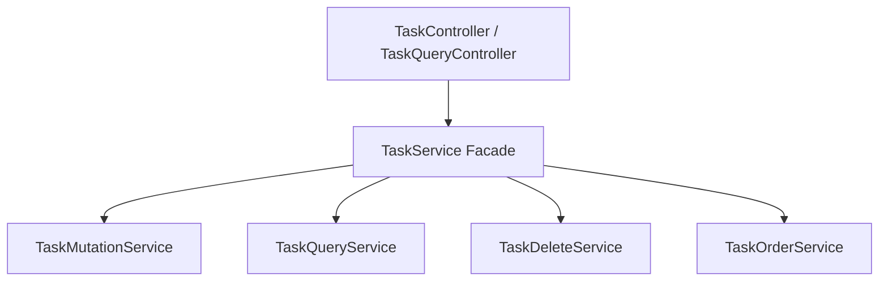

# Design — Tối ưu hóa cấu trúc Task Module phần Backend
**Task ID**: 20260606-130432-t-i--u-h-a-c-u-tr-c-task-module-ph-n-bac  |  **Requirements ref**: .antigravity/context/requirements-20260606-130432-t-i--u-h-a-c-u-tr-c-task-module-ph-n-bac.md  |  Status: APPROVED

---

## 🏗️ Architecture Overview

Sử dụng mô hình Delegate/Facade và Phân tách trách nhiệm (Separation of Concerns):
- `TaskService` hiện tại đang làm quá nhiều việc (truy vấn, đột biến dữ liệu, sắp xếp, xóa).
- Chúng ta sẽ tách thành 4 sub-services độc lập:
  - `TaskQueryService` (Đọc/Tìm kiếm)
  - `TaskMutationService` (Tạo/Cập nhật)
  - `TaskDeleteService` (Xóa đơn/Xóa loạt)
  - `TaskOrderService` (Sắp xếp thứ tự backlog)
- `TaskService` sẽ hoạt động như một **Facade**, tiêm (inject) 4 sub-services này và ủy quyền các lệnh gọi từ Controller đến các sub-services tương ứng. Điều này giúp giữ nguyên tính tương thích ngược cho mọi module khác đang sử dụng `TaskService`.
- Tương tự, `TaskController` sẽ được tách thành `TaskController` (Mutations: Post, Patch, Delete) và `TaskQueryController` (Queries: Get).

## 📊 Data Model
Không thay đổi Schema của cơ sở dữ liệu. Tất cả Entities (`Task`, `Label`, `ProjectMember`, v.v.) giữ nguyên cấu trúc.

## 🔌 API Contracts (nếu có)
Không thay đổi bất kỳ API contract nào. Các API endpoint và kiểu dữ liệu request/response giữ nguyên.

## 📁 File Map

| Action | File Path | Mô tả thay đổi |
|--------|-----------|-----------------|
| [NEW]    | `apps/backend/src/task/task-query.service.ts` | Chứa logic đọc: `findAll`, `findById`, `search`. |
| [NEW]    | `apps/backend/src/task/task-mutation.service.ts` | Chứa logic viết: `create`, `update`, `validateHierarchy` và các kiểm tra ràng buộc nghiệp vụ. |
| [NEW]    | `apps/backend/src/task/task-delete.service.ts` | Chứa logic xóa: `delete`, `bulkDelete`. |
| [NEW]    | `apps/backend/src/task/task-order.service.ts` | Chứa logic sắp xếp: `reorder`, `rebalanceOrder`. |
| [NEW]    | `apps/backend/src/task/task-query.controller.ts` | Controller phụ trách `@Get` endpoints. |
| [MODIFY] | `apps/backend/src/task/task.service.ts` | Chuyển thành Facade delegate gọi sang các sub-services. |
| [MODIFY] | `apps/backend/src/task/task.controller.ts` | Giữ lại các `@Post`, `@Patch`, `@Delete` endpoints. |
| [MODIFY] | `apps/backend/src/task/task.module.ts` | Đăng ký các sub-services mới và `TaskQueryController`. |

## 🧠 Technical Decisions

| Quyết định | Lý do | Phương án thay thế đã cân nhắc |
|------------|-------|-------------------------------|
| Sử dụng Facade Pattern cho `TaskService` | Giúp giữ tương thích ngược hoàn toàn. Các module khác không cần đổi import hay sửa code gọi. | Tiêm trực tiếp các sub-services vào `TaskController` và bỏ `TaskService` cũ (Sẽ làm hỏng các nơi khác sử dụng `TaskService`). |
| Chia đôi Controller theo Query và Mutation | Giúp giảm số lượng dòng code của controller xuống dưới 80 dòng, phân định rõ ràng các GET endpoints. | Gộp chung trong một controller duy nhất (Code controller sẽ vượt quá 80 dòng do số lượng endpoint nhiều). |

## ⚠️ Risks & Mitigation

| Rủi ro | Xác suất | Tác động | Giảm thiểu |
|--------|----------|----------|------------|
| Lỗi Transaction và Locking khi tách service | Thấp | Cao | Sử dụng chung `DataSource` để khởi tạo Transaction giống như thiết kế cũ. Đảm bảo logic locking `pessimistic_write` hoạt động đúng. |
| Lỗi Dependency Circular | Thấp | Trung bình | Đảm bảo các sub-services chỉ phụ thuộc trực tiếp vào TypeORM repositories hoặc các service ngoài như `ActivityService`, `AuditService`; không gọi chéo lẫn nhau. |

## 📊 Progress Log
> Cập nhật sau mỗi step trong execution

| Time | Task | Result | Notes |
|------|------|--------|-------|
| | | | |

---

## 🔏 Approval

| | |
|-----------|-------------------|
| **Approved by** | thanhphan |
| **Approved at** | 2026-06-06 13:06:28 |
| **Notes**       |                   |
