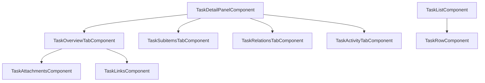

# Design — Tối ưu hóa cấu trúc Task Module phần Frontend
**Task ID**: 20260606-131829-t-i--u-h-a-c-u-tr-c-task-module-ph-n-fro  |  **Requirements ref**: .antigravity/context/requirements-20260606-131829-t-i--u-h-a-c-u-tr-c-task-module-ph-n-fro.md  |  Status: APPROVED

---

## 🏗️ Architecture Overview

Áp dụng mô hình thiết kế **Smart / Dumb Components** (hoặc Container/Presenter Component) và chia tách giao diện thành các thành phần chuyên biệt:
- `TaskDetailPanel` đóng vai trò là **Smart Component** (chứa state và router query params, giao tiếp với `TaskStore`).
- Các tab con (`TaskOverviewTab`, `TaskSubitemsTab`, `TaskRelationsTab`, `TaskActivityTab`) và các widgets con (`TaskAttachments`, `TaskLinks`) là các **Dumb/Presenter Components** (chỉ nhận `@Input` và phát ra các `@Output` sự kiện).
- Tương tự, `TaskListComponent` là Container quản lý danh sách và Drag-Drop CDK, trong khi `TaskRowComponent` là Presenter chịu trách nhiệm kết xuất dòng và định dạng hiển thị.

## 📊 Data Model
Không thay đổi.

## 🔌 API Contracts (nếu có)
Không có.

## 📁 File Map

| Action | File Path | Mô tả thay đổi |
|--------|-----------|-----------------|
| [NEW]    | `apps/frontend/src/app/tasks/components/task-detail-panel/components/task-attachments.component.ts` | Giao diện + logic upload/download attachments |
| [NEW]    | `apps/frontend/src/app/tasks/components/task-detail-panel/components/task-links.component.ts` | Giao diện + logic hiển thị và thêm links |
| [NEW]    | `apps/frontend/src/app/tasks/components/task-detail-panel/components/task-overview-tab.component.ts` | Chứa giao diện tab tổng quan, nhúng Attachments và Links |
| [NEW]    | `apps/frontend/src/app/tasks/components/task-detail-panel/components/task-subitems-tab.component.ts` | Chứa giao diện hiển thị và thêm nhanh sub-items |
| [NEW]    | `apps/frontend/src/app/tasks/components/task-detail-panel/components/task-relations-tab.component.ts` | Chứa giao diện hiển thị và thêm relations |
| [NEW]    | `apps/frontend/src/app/tasks/components/task-detail-panel/components/task-activity-tab.component.ts` | Chứa giao diện activity feed và comments |
| [NEW]    | `apps/frontend/src/app/tasks/pages/backlog/task-list/task-row.component.ts` | Presenter Component kết xuất 1 hàng công việc |
| [MODIFY] | `apps/frontend/src/app/tasks/components/task-detail-panel/task-detail-panel.component.ts` | Cắt giảm code sang các sub-components tab |
| [MODIFY] | `apps/frontend/src/app/tasks/pages/backlog/task-list/task-list.component.ts` | Cắt giảm code sang `TaskRowComponent` |

## 🧠 Technical Decisions

| Quyết định | Lý do | Phương án thay thế đã cân nhắc |
|------------|-------|-------------------------------|
| Sử dụng Signals và Standard inputs/outputs | Đảm bảo tính phản hồi nhanh và phù hợp với Angular 18+ style của dự án. | Sử dụng RxJS Subject cho mọi kết nối (Quá rườm rà và tăng kích thước code). |

## ⚠️ Risks & Mitigation

| Rủi ro | Xác suất | Tác động | Giảm thiểu |
|--------|----------|----------|------------|
| Lỗi luồng dữ liệu (Inputs) không reactive khi store thay đổi | Trung bình | Cao | Đảm bảo sử dụng `computed` signals và truyền trực tiếp kết quả signal của store xuống component con. |

## 🧠 Progress Log
> Cập nhật sau mỗi step trong execution

| Time | Task | Result | Notes |
|------|------|--------|-------|
| 2026-06-06 13:20 | US-1 Tách TaskDetailPanelComponent | Thành công | Tách thành 6 subcomponents con và 1 facade drawer |
| 2026-06-06 13:22 | US-2 Tách TaskListComponent | Thành công | Tách thành TaskRowComponent và cập nhật TaskListComponent |

---

## 🔏 Approval

| | |
|-----------|-------------------|
| **Approved by** | thanhphan |
| **Approved at** | 2026-06-06 13:20:00 |
| **Notes**       |                   |
