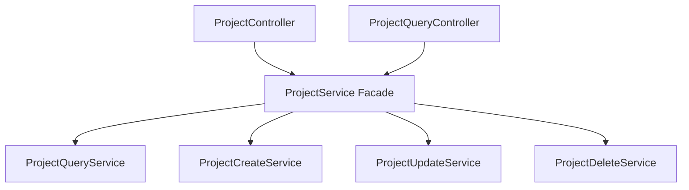

# Design — tối ưu hóa cấu trúc project module phần backend
**Task ID**: 20260606-142413-t-i--u-h-a-c-u-tr-c-project-module-ph-n-  |  **Requirements ref**: .antigravity/context/requirements-20260606-142413-t-i--u-h-a-c-u-tr-c-project-module-ph-n-.md  |  Status: APPROVED

---

## 🏗️ Architecture Overview

Sử dụng design pattern **Facade** cho `ProjectService` và phân tách các endpoints đọc (GET) khỏi các endpoints ghi (POST/PATCH/DELETE) trong `ProjectController`.

## 📊 Data Model
Không thay đổi cấu trúc dữ liệu hoặc thực thể database.

## 🔌 API Contracts (nếu có)
Không thay đổi API contract. Các route hiện tại:
- `POST /api/projects` -> `ProjectController.create`
- `GET /api/projects` -> `ProjectQueryController.findAll`
- `GET /api/projects/by-key/:key` -> `ProjectQueryController.findByKey`
- `GET /api/projects/:projectId` -> `ProjectQueryController.findById`
- `PATCH /api/projects/:projectId` -> `ProjectController.update`
- `PATCH /api/projects/:projectId/archive` -> `ProjectController.archive`
- `DELETE /api/projects/:projectId` -> `ProjectController.delete`
- `DELETE /api/projects` -> `ProjectController.bulkDelete`
- `POST /api/projects/:projectId/join` -> `ProjectController.join`
- `PATCH /api/projects/:projectId/features` -> `ProjectController.updateFeatures`

## 📁 File Map

| Action | File Path | Mô tả thay đổi |
|--------|-----------|-----------------|
| [NEW]  | [project-query.service.ts](file:///Volumes/myssd/Working/github/mpm/apps/backend/src/project/project-query.service.ts) | Chứa findAll, findById, findByKey |
| [NEW]  | [project-create.service.ts](file:///Volumes/myssd/Working/github/mpm/apps/backend/src/project/project-create.service.ts) | Chứa create, DEFAULT_STATES, validateEmoji, validateTimezone |
| [NEW]  | [project-update.service.ts](file:///Volumes/myssd/Working/github/mpm/apps/backend/src/project/project-update.service.ts) | Chứa update, updateFeatures, join, validateLead |
| [NEW]  | [project-delete.service.ts](file:///Volumes/myssd/Working/github/mpm/apps/backend/src/project/project-delete.service.ts) | Chứa delete, bulkDelete, archive |
| [NEW]  | [project-query.controller.ts](file:///Volumes/myssd/Working/github/mpm/apps/backend/src/project/project-query.controller.ts) | Chứa các routes GET |
| [MODIFY] | [project.service.ts](file:///Volumes/myssd/Working/github/mpm/apps/backend/src/project/project.service.ts) | Trở thành Facade ủy quyền cho các sub-services |
| [MODIFY] | [project.controller.ts](file:///Volumes/myssd/Working/github/mpm/apps/backend/src/project/project.controller.ts) | Loại bỏ các routes GET |
| [MODIFY] | [project.module.ts](file:///Volumes/myssd/Working/github/mpm/apps/backend/src/project/project.module.ts) | Đăng ký các controller và sub-services mới |

## 🧠 Technical Decisions

| Quyết định | Lý do | Phương án thay thế đã cân nhắc |
|------------|-------|-------------------------------|
| Sử dụng Facade Pattern | Giữ nguyên khả năng tương thích ngược của `ProjectService` cho các module khác đang inject `ProjectService` (như Task, Audit, Auth) mà không phải thay đổi các injection đó. | Refactor tất cả các class đang dùng `ProjectService` để inject trực tiếp các sub-services mới (tốn nhiều công sức và rủi ro cao). |
| Phân chia Controller thành Query và Mutation | Giảm kích thước file `ProjectController` xuống dưới 80 dòng, phân định rõ ràng trách nhiệm đọc/ghi tương tự cách đã làm với `TaskController`. | Giữ nguyên một file Controller nhưng gộp code tinh giản (vẫn có nguy cơ phình to và vượt 80 dòng). |

## ⚠️ Risks & Mitigation

| Rủi ro | Xác suất | Tác động | Giảm thiểu |
|--------|----------|----------|------------|
| Lỗi thiếu/sai dependencies injection trong NestJS | Thấp | Cao | Đăng ký tất cả các sub-services mới trong `ProjectModule` providers và exports, chạy test suite để phát hiện sớm. |
| Phá vỡ mock trong unit tests | Trung bình | Trung bình | Cập nhật file mock hoặc module mock của `project.service.spec.ts` để bao gồm các sub-services mới. |

## 📊 Progress Log

| Time | Task | Result | Notes |
|------|------|--------|-------|
| 14:30 | US-1 (Sub-services creation) | ✅ Hoàn thành | Tạo project-query, project-create, project-update, project-delete services. Tách mapper, validation, constants. |
| 14:35 | US-1 (Facade integration) | ✅ Hoàn thành | Cập nhật project.service.ts thành Facade delegate gọi. |
| 14:40 | US-2 (Controllers split) | ✅ Hoàn thành | Tạo project-query.controller.ts, rút gọn project.controller.ts. |
| 14:45 | Module Registration & Testing | ✅ Hoàn thành | Đăng ký các providers/controllers trong project.module.ts và cập nhật spec providers. Tests pass 100%. |

---

## 🔏 Approval

| | |
|-|-|
| **Approved by** | thanhphan |
| **Approved at** | 2026-06-06 14:28:13 |
| **Notes** | |
