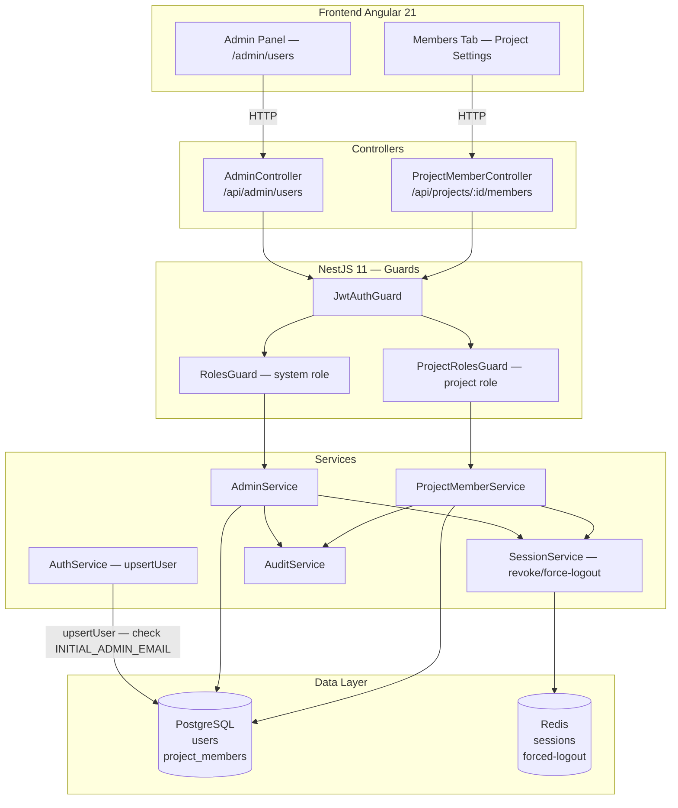

# Design: Member Management & System Admin Bootstrap (Epic D)

## Overview

Tài liệu thiết kế kỹ thuật cho **Epic D — Member Management & System Admin Bootstrap**. Epic này bổ sung cơ chế khởi tạo System Admin đầu tiên qua `INITIAL_ADMIN_EMAIL`, và hoàn thiện giao diện Admin Panel quản lý user cấp hệ thống.

### Quyết định thiết kế chính

| Quyết định | Lựa chọn | Lý do |
|-----------|----------|-------|
| Initial Admin mechanism | `INITIAL_ADMIN_EMAIL` env var | Không cần seed migration, không lộ credential, chỉ áp dụng khi INSERT user mới |
| Role enforcement | `ProjectRolesGuard` + `@ProjectRoles()` decorator | Declarative, reusable; không hardcode logic trong service |
| Force re-login trigger | Revoke Redis sessions + forced-logout list | Hiệu lực ngay lập tức; không cần JWT blacklist toàn bộ |
| Admin bypass | Check `systemRole === 'Admin'` trong Guard | Admin không cần project membership để quản trị |
| Last-admin protection | Application layer check (count Active Admin) | Đơn giản, đủ cho scale hiện tại |
| Member lookup khi thêm | Tìm theo email trong `users` table | Email là identifier visible với người dùng; không lộ UUID |

## Architecture



## Data Model

### Bảng `users` (đã có từ Epic A)

```sql
CREATE TABLE users (
    id            UUID PRIMARY KEY DEFAULT gen_random_uuid(),
    external_id   VARCHAR(255) NOT NULL UNIQUE,  -- Authentik sub claim
    email         VARCHAR(255) NOT NULL UNIQUE,
    display_name  VARCHAR(100) NOT NULL,
    avatar_url    VARCHAR(2048),
    system_role   system_role_enum NOT NULL DEFAULT 'User',  -- 'Admin' | 'User'
    is_active     BOOLEAN NOT NULL DEFAULT true,
    created_at    TIMESTAMPTZ NOT NULL DEFAULT now(),
    updated_at    TIMESTAMPTZ NOT NULL DEFAULT now()
);
```

### Bảng `project_members` (đã có từ Epic A)

```sql
CREATE TABLE project_members (
    id            UUID PRIMARY KEY DEFAULT gen_random_uuid(),
    user_id       UUID NOT NULL REFERENCES users(id) ON DELETE CASCADE,
    project_id    UUID NOT NULL REFERENCES projects(id) ON DELETE CASCADE,
    project_role  project_role_enum NOT NULL,
    created_at    TIMESTAMPTZ NOT NULL DEFAULT now(),
    UNIQUE(user_id, project_id)
);

-- Indexes
CREATE UNIQUE INDEX idx_project_member_unique ON project_members(user_id, project_id);
CREATE INDEX idx_project_member_project ON project_members(project_id);
```

### Enums (đã có)

```sql
CREATE TYPE system_role_enum  AS ENUM ('Admin', 'User');
CREATE TYPE project_role_enum AS ENUM (
    'Scrum_Master', 'Product_Owner', 'Developer', 'QA', 'Stakeholder'
);
```

Không cần migration mới — schema đã đủ. Chỉ cần thay đổi application code.

## API Contracts

### Project Member Endpoints (đã implement)

#### `GET /api/projects/:projectId/members`
**Guards:** `@JwtAuth`, `@ProjectRoles('Scrum_Master', 'Product_Owner', 'Developer', 'QA', 'Stakeholder')`

**Query params:** `?filter=<string>` — filter theo displayName hoặc email (ILIKE)

**Response (200):**
```json
[
  {
    "userId": "uuid",
    "displayName": "Nguyen Van A",
    "email": "a@example.com",
    "avatarUrl": null,
    "projectRole": "Scrum_Master",
    "joinedAt": "2026-01-01T00:00:00Z"
  }
]
```

---

#### `POST /api/projects/:projectId/members`
**Guards:** `@JwtAuth`, `@ProjectRoles('Scrum_Master')`

**Request:**
```json
{ "email": "b@example.com", "projectRole": "Developer" }
```

**Response (201):** `MemberResponse`

**Errors:**
| Code | errorCode | Khi nào |
|------|-----------|---------|
| 404 | USER_NOT_FOUND | Email không tồn tại trong hệ thống |
| 409 | MEMBER_ALREADY_EXISTS | User đã là thành viên của project |

---

#### `PATCH /api/projects/:projectId/members/:userId`
**Guards:** `@JwtAuth`, `@ProjectRoles('Scrum_Master')`

**Request:** `{ "projectRole": "QA" }`

**Response (200):** `MemberResponse`

**Errors:**
| Code | errorCode | Khi nào |
|------|-----------|---------|
| 404 | MEMBER_NOT_FOUND | userId không là member của project |
| 422 | LAST_SCRUM_MASTER | Cố hạ role Scrum_Master duy nhất |

---

#### `DELETE /api/projects/:projectId/members/:userId`
**Guards:** `@JwtAuth`, `@ProjectRoles('Scrum_Master')`

**Response (200):** `{ "removed": true }`

**Errors:**
| Code | errorCode | Khi nào |
|------|-----------|---------|
| 404 | MEMBER_NOT_FOUND | userId không là member của project |
| 422 | LAST_SCRUM_MASTER | Cố xóa Scrum_Master duy nhất |

---

### Admin Endpoints (đã implement)

#### `GET /api/admin/users`
**Guards:** `@JwtAuth`, `@Roles('Admin')`

**Response (200):**
```json
[
  {
    "id": "uuid",
    "email": "admin@example.com",
    "displayName": "Admin",
    "systemRole": "Admin",
    "isActive": true,
    "createdAt": "2026-01-01T00:00:00Z"
  }
]
```

---

#### `PATCH /api/admin/users/:userId/role`
**Guards:** `@JwtAuth`, `@Roles('Admin')`

**Request:** `{ "systemRole": "Admin" }`

**Response (200):** `AdminUserResponse`

**Errors:**
| Code | errorCode | Khi nào |
|------|-----------|---------|
| 404 | USER_NOT_FOUND | userId không tồn tại |
| 400 | LAST_ADMIN_PROTECTION | Cố hạ role Admin duy nhất |

---

#### `PATCH /api/admin/users/:userId/disable`
**Guards:** `@JwtAuth`, `@Roles('Admin')`

**Response (200):** `AdminUserResponse` với `isActive: false`

**Errors:**
| Code | errorCode | Khi nào |
|------|-----------|---------|
| 400 | LAST_ADMIN_PROTECTION | Cố disable Admin duy nhất |

---

## Business Logic

### INITIAL_ADMIN_EMAIL — Bootstrap Flow

Thay đổi duy nhất cần implement trong `AuthService.upsertUser()`:

```typescript
// apps/backend/src/auth/auth.service.ts — trong upsertUser()

private async upsertUser(claims: AuthentikIdTokenClaims): Promise<User> {
  let user = await this.userRepository.findOne({
    where: { externalId: claims.sub },
  });

  if (user) {
    // ... cập nhật email/displayName như cũ
    return user;
  }

  // ── NEW: Kiểm tra INITIAL_ADMIN_EMAIL ──────────────────────────
  const initialAdminEmail = this.configService.get<string>('INITIAL_ADMIN_EMAIL');
  const isInitialAdmin =
    !!initialAdminEmail &&
    initialAdminEmail.trim().toLowerCase() === claims.email.toLowerCase();
  // ───────────────────────────────────────────────────────────────

  const newUser = this.userRepository.create({
    externalId: claims.sub,
    email: claims.email,
    displayName: claims.name || claims.preferred_username || claims.email.split('@')[0],
    systemRole: isInitialAdmin ? 'Admin' : 'User',  // ← thay đổi duy nhất
    isActive: true,
  });

  if (isInitialAdmin) {
    this.logger.log(`[BOOTSTRAP] Initial admin created from INITIAL_ADMIN_EMAIL: ${claims.email}`);
  }

  return this.userRepository.save(newUser);
}
```

**Điều kiện kích hoạt:**
- `INITIAL_ADMIN_EMAIL` phải được set trong env
- User phải đăng nhập lần đầu (chưa có row trong `users` table)
- So sánh email case-insensitive

**Không kích hoạt khi:**
- User đã có row trong DB (dù email khớp)
- `INITIAL_ADMIN_EMAIL` không được set hoặc rỗng

---

### Permission Matrix — Implementation

```typescript
// apps/backend/src/auth/constants/permission-matrix.ts (đã có)
export const PERMISSION_MATRIX = {
  Scrum_Master:   { task: ['create','read','update','delete'], sprint: ['create','read','update','delete'], document: ['create','read','update','delete'], member: ['create','read','update','delete'] },
  Product_Owner:  { task: ['create','read','update','delete'], sprint: ['create','read','update','delete'], document: ['create','read','update','delete'], member: ['read'] },
  Developer:      { task: ['create','read','update'],          sprint: ['read'],                            document: ['create','read','update'],          member: ['read'] },
  QA:             { task: ['create','read','update'],          sprint: ['read'],                            document: ['create','read','update'],          member: ['read'] },
  Stakeholder:    { task: ['read'],                            sprint: ['read'],                            document: ['read'],                            member: ['read'] },
};
```

Guard flow (`ProjectRolesGuard.canActivate()`):
```
1. Đọc requiredRoles từ @ProjectRoles() metadata
2. Nếu không có metadata → allow (public endpoint)
3. user.systemRole === 'Admin' → allow (Admin bypass)
4. Extract projectId từ route params → nếu không có → 400
5. Tìm role trong user.projectRoles (JWT claims)
   → Nếu không tìm thấy → fallback query DB (token stale)
6. requiredRoles.includes(userRole) → allow / deny
7. Deny → log WARNING + throw 403
```

---

### Force Re-Login — Sequence

```
Scrum_Master đổi role member B
│
├─ ProjectMemberService.changeRole()
│    ├─ UPDATE project_members SET project_role = newRole
│    ├─ SessionService.revokeAllSessions(memberB.id)    ← xóa tất cả sessions Redis
│    └─ SessionService.addToForcedLogout(memberB.id)   ← TTL 15 phút
│
└─ Lần sau Member B gọi API với Access_Token cũ:
     ├─ JwtAuthGuard: kiểm tra forced-logout flag trong Redis
     └─ Nếu flag tồn tại → 401 SESSION_REVOKED → Frontend redirect login
```

## Frontend Components

### Members Tab (đã implement)

**File:** `apps/frontend/src/app/projects/pages/project-settings/members-tab/members-tab.component.ts`

**Tính năng đã có:**
- Bảng thành viên với avatar, tên, email, vai trò, ngày tham gia
- Button "Thêm thành viên" (chỉ hiển thị khi Scrum_Master/Admin)
- Dialog thêm mới (nhập email + chọn vai trò)
- Dropdown đổi vai trò inline (ẩn với chính mình)
- Nút xóa với confirmation dialog
- Cảnh báo khi hạ cấp Scrum_Master
- Client-side search theo tên/email
- Read-only mode cho non-Scrum_Master

### Admin Panel (cần implement)

**File:** `apps/frontend/src/app/admin/pages/user-list/user-list.component.ts` (mới)

**Routing:** `/admin/users` — chỉ accessible với `systemRole = 'Admin'`

**Layout:**
```
┌─────────────────────────────────────────────────────┐
│  Quản lý người dùng                                  │
│  Quản lý system role và trạng thái tài khoản         │
├──────────┬──────────┬──────────┬───────┬─────────────┤
│  Email   │  Tên     │  Role    │ Trạng │   Hành động │
│          │          │  Badge   │ thái  │             │
├──────────┼──────────┼──────────┼───────┼─────────────┤
│ a@co.com │ Nguyen A │ [Admin]  │   ●   │ [Role] [Dis]│
│ b@co.com │ Tran B   │ [User]   │   ●   │ [Role] [Dis]│
└──────────┴──────────┴──────────┴───────┴─────────────┘
```

**Guards frontend:** `AdminGuard` kiểm tra `user.systemRole === 'Admin'` trong `AuthStore`; redirect về `/` nếu không phải Admin.

## Security Considerations

- **INITIAL_ADMIN_EMAIL chỉ dùng runtime**: Không persist vào DB, không log giá trị, không expose qua API.
- **Case-insensitive email comparison**: Tránh bypass bằng cách viết hoa email (`Admin@Co.com` vs `admin@co.com`).
- **Last-admin protection tại application layer**: Đủ cho scale hiện tại; không cần DB trigger vì mọi role change đều qua `AdminService`.
- **Force re-login không phụ thuộc Access_Token TTL**: Redis forced-logout flag đảm bảo hiệu lực ngay lập tức, không cần chờ token expire.
- **Admin bypass chỉ áp dụng tại `ProjectRolesGuard`**: Các guard khác (RolesGuard cho admin endpoints) vẫn kiểm tra systemRole.
- **Token stale fallback query DB**: Khi user vừa được thêm vào project, JWT chưa cập nhật → Guard fallback query `project_members` để không deny oan.

## Dependencies

- **Epic A (user-authentication)**: `User` entity, `JwtAuthGuard`, `SessionService`, `TokenService`
- **Epic A+ (project-settings)**: `ProjectMember` entity, `Project` entity (FK), `ProjectRolesGuard`
- **Backend libs**: `@nestjs/config` (đọc `INITIAL_ADMIN_EMAIL`), `TypeORM` (repositories)
- **Frontend libs**: PrimeNG `p-table`, `p-dialog`, `p-select`, `p-avatar`, `p-confirmDialog`
- **Không có migration mới**: Schema đã đủ từ `CreateAuthTables` migration
