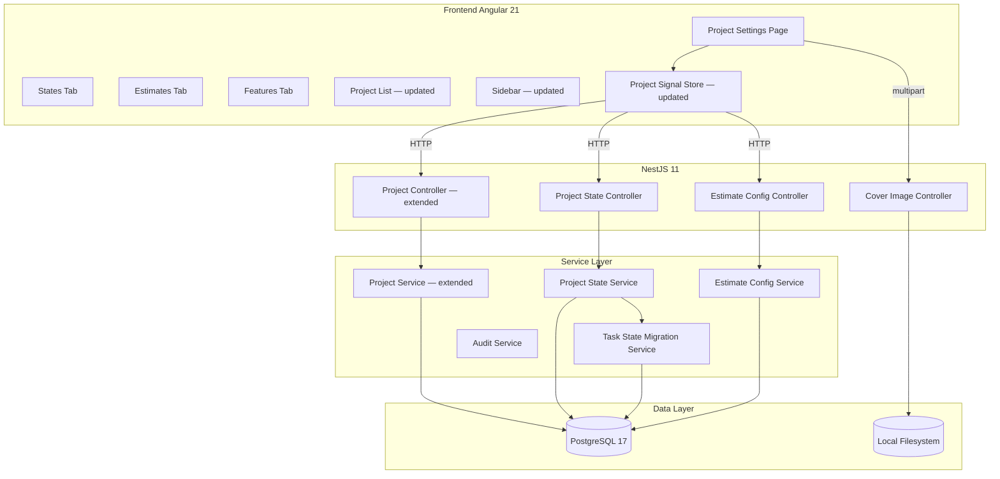

# Design: Project Settings Enhancement (Epic A+)

## Overview

Tài liệu thiết kế kỹ thuật cho **Project Settings Enhancement (Epic A+)**. Epic này bổ sung các properties còn thiếu vào đối tượng Project (emoji, cover, network, lead, timezone, feature flags), thêm Custom States và Estimate Configuration, đồng thời migrate cột `tasks.state` từ hardcoded enum sang FK tới `project_states`.

### Quyết định thiết kế chính

| Quyết định | Lựa chọn | Lý do |
|-----------|----------|-------|
| Custom States storage | Bảng `project_states` riêng | States là per-project, cần customization; enum cứng không đủ linh hoạt |
| `tasks.state` → `tasks.state_id` | UUID FK | Breaking change cần migration; làm trước Epic B để không phá Task schema |
| State deletion guard | Từ chối nếu còn work items | Tránh orphan data; yêu cầu user migrate trước |
| Estimate Config storage | Bảng `project_estimate_configs` | One-to-one với project; JSONB values cho flexibility |
| Feature flags | Columns trong `projects` table | 6 flags boolean đơn giản; không cần bảng riêng |
| Cover image | Local filesystem (resize 1920×384) | MVP; roadmap Phase 3 → S3 |
| Network visibility | Column `network` enum trong `projects` | Đơn giản; không cần bảng ACL riêng |
| Default states on project create | Auto-insert 6 states trong transaction | Mỗi project phải có ít nhất 1 state; không thể để trống |
| Timezone | IANA string lưu trong DB | Standard; validate bằng `Intl.supportedValuesOf('timeZone')` hoặc tz database |

## Architecture

### High-Level Architecture



## Data Model

### Cập nhật bảng `projects`

```sql
-- Thêm các columns mới vào bảng projects đã có
ALTER TABLE projects
    ADD COLUMN emoji            VARCHAR(10),
    ADD COLUMN cover_image_url  VARCHAR(500),
    ADD COLUMN network          VARCHAR(10)  NOT NULL DEFAULT 'secret'
                                CHECK (network IN ('public', 'secret')),
    ADD COLUMN lead_id          UUID REFERENCES users(id) ON DELETE SET NULL,
    ADD COLUMN timezone         VARCHAR(50)  NOT NULL DEFAULT 'Asia/Ho_Chi_Minh',
    ADD COLUMN feature_cycles         BOOLEAN NOT NULL DEFAULT true,
    ADD COLUMN feature_modules        BOOLEAN NOT NULL DEFAULT true,
    ADD COLUMN feature_views          BOOLEAN NOT NULL DEFAULT true,
    ADD COLUMN feature_pages          BOOLEAN NOT NULL DEFAULT true,
    ADD COLUMN feature_intake         BOOLEAN NOT NULL DEFAULT false,
    ADD COLUMN feature_time_tracking  BOOLEAN NOT NULL DEFAULT false;

CREATE INDEX idx_projects_network ON projects(network);
CREATE INDEX idx_projects_lead    ON projects(lead_id);
```

### Bảng `project_states`

```sql
CREATE TYPE state_group_enum AS ENUM (
    'backlog', 'unstarted', 'started', 'completed', 'cancelled'
);

CREATE TABLE project_states (
    id          UUID PRIMARY KEY DEFAULT gen_random_uuid(),
    project_id  UUID         NOT NULL REFERENCES projects(id) ON DELETE CASCADE,
    name        VARCHAR(50)  NOT NULL,
    color       CHAR(7)      NOT NULL DEFAULT '#6B7280',  -- hex #RRGGBB
    "group"     state_group_enum NOT NULL,
    is_default  BOOLEAN      NOT NULL DEFAULT false,
    "order"     SMALLINT     NOT NULL DEFAULT 0,
    created_at  TIMESTAMPTZ  NOT NULL DEFAULT now(),
    updated_at  TIMESTAMPTZ  NOT NULL DEFAULT now(),
    UNIQUE(project_id, name)
);

-- Đảm bảo mỗi project có đúng 1 default state (enforce ở application layer + trigger)
CREATE INDEX idx_project_states_project ON project_states(project_id, "order");
CREATE INDEX idx_project_states_default ON project_states(project_id) WHERE is_default = true;

-- Trigger: enforce đúng 1 default state per project
CREATE OR REPLACE FUNCTION enforce_single_default_state()
RETURNS TRIGGER AS $$
BEGIN
    IF NEW.is_default = true THEN
        UPDATE project_states
        SET is_default = false
        WHERE project_id = NEW.project_id
          AND id <> NEW.id
          AND is_default = true;
    END IF;
    RETURN NEW;
END;
$$ LANGUAGE plpgsql;

CREATE TRIGGER trg_single_default_state
BEFORE INSERT OR UPDATE ON project_states
FOR EACH ROW EXECUTE FUNCTION enforce_single_default_state();
```

### Cập nhật bảng `tasks` (migration tasks.state → tasks.state_id)

```sql
-- Step 1: Thêm cột mới
ALTER TABLE tasks ADD COLUMN state_id UUID;

-- Step 2: Migrate data (map enum string → UUID của state cùng tên trong project)
-- Chạy trong transaction
UPDATE tasks t
SET state_id = ps.id
FROM project_states ps
WHERE ps.project_id = t.project_id
  AND LOWER(ps.name) = LOWER(t.state::text);  -- map 'in_progress' → 'In Progress', etc.

-- Step 3: Set NOT NULL và FK constraint
ALTER TABLE tasks
    ALTER COLUMN state_id SET NOT NULL,
    ADD CONSTRAINT fk_task_state FOREIGN KEY (state_id)
        REFERENCES project_states(id) ON DELETE RESTRICT;

-- Step 4: Drop cột state cũ
ALTER TABLE tasks DROP COLUMN state;

-- Step 5: Drop enum cũ (sau khi kiểm tra không còn dùng nơi nào)
DROP TYPE IF EXISTS task_state_enum;

-- Update index
DROP INDEX IF EXISTS idx_tasks_state;
CREATE INDEX idx_tasks_state_id ON tasks(project_id, state_id);
```

### Bảng `project_estimate_configs`

```sql
CREATE TYPE estimate_type_enum AS ENUM ('points', 'categories', 'time');

CREATE TABLE project_estimate_configs (
    id              UUID PRIMARY KEY DEFAULT gen_random_uuid(),
    project_id      UUID  NOT NULL UNIQUE REFERENCES projects(id) ON DELETE CASCADE,
    estimate_type   estimate_type_enum NOT NULL DEFAULT 'points',
    values          JSONB NOT NULL DEFAULT '[0, 0.5, 1, 2, 3, 5, 8, 13, 21]',
    created_at      TIMESTAMPTZ NOT NULL DEFAULT now(),
    updated_at      TIMESTAMPTZ NOT NULL DEFAULT now(),
    CONSTRAINT chk_estimate_values_not_empty CHECK (jsonb_array_length(values) >= 2)
);

CREATE INDEX idx_estimate_configs_project ON project_estimate_configs(project_id);
```

### Default States khi tạo Project mới

```typescript
const DEFAULT_STATES = [
  { name: 'Backlog',      color: '#6B7280', group: 'backlog',    is_default: false, order: 0 },
  { name: 'Todo',         color: '#3B82F6', group: 'unstarted',  is_default: true,  order: 1 },
  { name: 'In Progress',  color: '#F59E0B', group: 'started',    is_default: false, order: 2 },
  { name: 'In Review',    color: '#8B5CF6', group: 'started',    is_default: false, order: 3 },
  { name: 'Done',         color: '#10B981', group: 'completed',  is_default: false, order: 4 },
  { name: 'Cancelled',    color: '#EF4444', group: 'cancelled',  is_default: false, order: 5 },
];
```

### Cập nhật audit_event_type_enum

```sql
ALTER TYPE audit_event_type_enum ADD VALUE IF NOT EXISTS 'project_features_updated';
ALTER TYPE audit_event_type_enum ADD VALUE IF NOT EXISTS 'project_state_created';
ALTER TYPE audit_event_type_enum ADD VALUE IF NOT EXISTS 'project_state_updated';
ALTER TYPE audit_event_type_enum ADD VALUE IF NOT EXISTS 'project_state_deleted';
ALTER TYPE audit_event_type_enum ADD VALUE IF NOT EXISTS 'project_estimate_updated';
ALTER TYPE audit_event_type_enum ADD VALUE IF NOT EXISTS 'member_joined_public';
```

## API Contracts

### Project Endpoints (cập nhật)

#### `POST /api/projects` — cập nhật CreateProjectDto

**Request (thêm fields mới):**
```json
{
  "name": "Agile PM",
  "key": "MPM",
  "description": "...",
  "emoji": "🚀",
  "network": "secret",
  "leadId": "uuid-user",
  "timezone": "Asia/Ho_Chi_Minh"
}
```

**Response (201):** ProjectDetailResponse (xem schema bên dưới)

---

#### `PATCH /api/projects/:id` — cập nhật UpdateProjectDto

Thêm fields: `emoji`, `network`, `leadId`, `timezone`

---

#### `GET /api/projects/:id` — cập nhật ProjectDetailResponse

```json
{
  "id": "uuid",
  "name": "Agile PM",
  "key": "MPM",
  "description": "...",
  "emoji": "🚀",
  "coverImageUrl": "/uploads/projects/uuid/cover.jpg",
  "network": "secret",
  "status": "active",
  "lead": { "id": "uuid", "displayName": "Alice", "avatarUrl": "..." },
  "timezone": "Asia/Ho_Chi_Minh",
  "features": {
    "cycles": true,
    "modules": true,
    "views": true,
    "pages": true,
    "intake": false,
    "timeTracking": false
  },
  "stateStats": {
    "backlog": 5,
    "unstarted": 10,
    "started": 8,
    "completed": 30,
    "cancelled": 2
  },
  "taskCounter": 55,
  "myRole": "Scrum_Master",
  "createdAt": "2026-01-01T00:00:00Z",
  "updatedAt": "2026-06-02T00:00:00Z"
}
```

---

#### `POST /api/projects/:id/join`

User tự join project public.

**Guards:** `@JwtAuth`

**Response (200):** `{ "role": "Developer", "projectId": "uuid" }`

**Errors:** 403 nếu project `secret`, 409 nếu đã là member

---

#### `POST /api/projects/:id/cover`

Upload cover image (multipart).

**Guards:** `@JwtAuth`, `@ProjectRoles('Scrum_Master')`

**Response (200):** `{ "coverImageUrl": "/uploads/projects/uuid/cover.jpg" }`

---

#### `DELETE /api/projects/:id/cover`

**Guards:** `@JwtAuth`, `@ProjectRoles('Scrum_Master')`

**Response (200):** `{ "success": true }`

---

### Project States Endpoints

#### `GET /api/projects/:projectId/states`

**Guards:** `@JwtAuth`, member check

**Response (200):**
```json
{
  "data": {
    "backlog":   [{ "id": "uuid", "name": "Backlog",     "color": "#6B7280", "isDefault": false, "order": 0 }],
    "unstarted": [{ "id": "uuid", "name": "Todo",        "color": "#3B82F6", "isDefault": true,  "order": 1 }],
    "started":   [
      { "id": "uuid", "name": "In Progress", "color": "#F59E0B", "isDefault": false, "order": 2 },
      { "id": "uuid", "name": "In Review",   "color": "#8B5CF6", "isDefault": false, "order": 3 }
    ],
    "completed": [{ "id": "uuid", "name": "Done",        "color": "#10B981", "isDefault": false, "order": 4 }],
    "cancelled": [{ "id": "uuid", "name": "Cancelled",   "color": "#EF4444", "isDefault": false, "order": 5 }]
  }
}
```

---

#### `POST /api/projects/:projectId/states`

**Guards:** `@JwtAuth`, `@ProjectRoles('Scrum_Master')`

**Request:** `{ "name": "Testing", "color": "#06B6D4", "group": "started" }`

**Response (201):** StateResponse

**Errors:** 409 STATE_NAME_EXISTS, 422 MAX_STATES_REACHED (> 20)

---

#### `PATCH /api/projects/:projectId/states/:stateId`

Update name/color/group/order/is_default.

**Request:** `{ "name": "QA Testing", "color": "#0EA5E9", "isDefault": true }`

**Response (200):** StateResponse

---

#### `PATCH /api/projects/:projectId/states/reorder`

Bulk reorder states trong cùng group.

**Request:** `{ "items": [{ "stateId": "uuid", "order": 0 }, ...] }`

**Response (200):** `{ "updated": 3 }`

---

#### `DELETE /api/projects/:projectId/states/:stateId`

**Guards:** `@JwtAuth`, `@ProjectRoles('Scrum_Master')`

**Errors:**
| Code | Error | Khi nào |
|------|-------|---------|
| 422 | STATE_IN_USE | Còn work items dùng state này |
| 422 | LAST_STATE | Project chỉ còn 1 state |
| 422 | DEFAULT_STATE | Không thể xóa default state trực tiếp (phải đổi default trước) |

---

### Estimate Config Endpoints

#### `GET /api/projects/:projectId/estimate-config`

**Response (200):**
```json
{
  "estimateType": "points",
  "values": [0, 0.5, 1, 2, 3, 5, 8, 13, 21],
  "templates": {
    "fibonacci": [0, 0.5, 1, 2, 3, 5, 8, 13, 21],
    "linear":    [1, 2, 3, 4, 5, 6, 7, 8, 9, 10],
    "squares":   [1, 4, 9, 16, 25]
  }
}
```

---

#### `PATCH /api/projects/:projectId/estimate-config`

**Guards:** `@JwtAuth`, `@ProjectRoles('Scrum_Master')`

**Request:**
```json
{
  "estimateType": "categories",
  "values": ["XS", "S", "M", "L", "XL"]
}
```

**Response (200):** EstimateConfigResponse + `{ "willResetEstimates": true, "affectedTaskCount": 42 }` nếu type thay đổi

---

### Features Endpoint

#### `PATCH /api/projects/:projectId/features`

**Guards:** `@JwtAuth`, `@ProjectRoles('Scrum_Master')`

**Request:** `{ "cycles": true, "modules": false, "intake": true }`

**Response (200):**
```json
{
  "cycles": true,
  "modules": false,
  "views": true,
  "pages": true,
  "intake": true,
  "timeTracking": false
}
```

## Business Logic

### Auto-create Default States khi tạo Project

```typescript
// Trong ProjectService.create() — cùng transaction
async create(userId: string, dto: CreateProjectDto) {
  return this.dataSource.transaction(async (em) => {
    // 1. INSERT project
    const project = await em.save(Project, { ...dto, ownerId: userId });

    // 2. INSERT default states
    const states = DEFAULT_STATES.map((s, i) =>
      em.create(ProjectState, { ...s, projectId: project.id })
    );
    await em.save(ProjectState, states);

    // 3. INSERT default estimate config
    await em.save(ProjectEstimateConfig, {
      projectId: project.id,
      estimateType: 'points',
      values: [0, 0.5, 1, 2, 3, 5, 8, 13, 21],
    });

    // 4. INSERT project_member (Scrum_Master) — đã có từ Epic A
    return project;
  });
}
```

### State Deletion — Migration Flow

```
1. User nhấn xóa state "In Testing"
2. Backend kiểm tra COUNT(tasks WHERE state_id = stateId)
3. Nếu count > 0:
   → Trả về 422 STATE_IN_USE + { affectedCount: 7 }
   → Frontend hiển thị dialog "Chọn state thay thế cho 7 work items"
4. User chọn state thay thế "In Review"
5. Frontend gọi PATCH /states/migrate { fromStateId, toStateId }
6. Backend: UPDATE tasks SET state_id = toStateId WHERE state_id = fromStateId
7. Sau đó: DELETE FROM project_states WHERE id = fromStateId
```

### `tasks.state` Migration Strategy

Thứ tự thực hiện trong migration file:

```
1. Tạo project_states table + trigger
2. INSERT default states cho tất cả existing projects
   (nếu chưa có task nào → đơn giản)
3. ALTER TABLE tasks ADD COLUMN state_id UUID
4. UPDATE tasks.state_id dựa theo mapping state string → state UUID
5. Verify: SELECT COUNT(*) FROM tasks WHERE state_id IS NULL = 0
6. ALTER TABLE tasks ALTER COLUMN state_id SET NOT NULL
7. ADD FOREIGN KEY constraint
8. DROP COLUMN state
9. DROP TYPE task_state_enum (nếu không còn dùng)
```

### Estimate Type Change — Reset Logic

Khi `estimateType` thay đổi, không reset ngay trong request cycle (có thể slow với nhiều tasks). Thay vào đó:

```typescript
// Trigger background job sau khi UPDATE estimate config
await this.taskQueue.add('reset-estimates', { projectId });

// Job worker:
await this.tasksRepo.update(
  { projectId },
  { estimateValue: null }
);
```

### Feature Flag Guard — Frontend

```typescript
// ProjectFeatureGuard — Angular CanActivate
canActivate(route: ActivatedRouteSnapshot): Observable<boolean> {
  const requiredFeature = route.data['feature'] as keyof ProjectFeatures;
  return this.projectStore.currentProject$.pipe(
    map(project => {
      if (!project.features[requiredFeature]) {
        this.router.navigate([`/projects/${project.key}/backlog`]);
        this.toastService.info(`Tính năng ${requiredFeature} chưa được bật`);
        return false;
      }
      return true;
    })
  );
}
```

## Security Considerations

- **Network visibility enforcement**: Query `GET /api/projects` phải luôn filter theo membership khi `network = 'secret'` — không để admin-only bypass leak danh sách project secret sang các users thường
- **Cover image**: Validate magic bytes (không chỉ extension), strip EXIF metadata, lưu ngoài web root, serve qua dedicated endpoint với auth check
- **State deletion**: Enforce ON DELETE RESTRICT ở DB level (`fk_task_state`) để đảm bảo không có orphan tasks kể cả khi application layer bị bypass
- **Lead validation**: Kiểm tra lead_id phải là member của project trước khi lưu — tránh IDOR

## Performance Considerations

- **State stats**: Tính `stateStats` bằng GROUP BY query khi load project detail; cache 60s nếu cần
- **Default states insert**: Bulk INSERT 6 states trong cùng transaction tạo project — không gây overhead đáng kể
- **Estimate reset**: Async job, không block API response; frontend poll hoặc dùng EventSource (Phase 3)
- **Feature flag check**: Frontend lưu feature flags trong ProjectStore signal; không cần API call riêng mỗi lần navigate

## Dependencies

- **Epic A**: `ProjectModule`, `ProjectMemberModule`, `AuditModule` — extend trực tiếp
- **Epic B (task-management)**: Phụ thuộc vào `project_states` table; cập nhật `tasks.state` → `tasks.state_id` trong migration của epic này
- **Backend libs**: `sharp` (resize cover image), `multer` (file upload — có thể dùng chung với Epic B attachment)
- **Frontend libs**: `emoji-mart` hoặc PrimeNG emoji picker (nếu có); Angular CDK DragDrop (cho State reorder — đã có)
- **PrimeNG**: `p-toggleSwitch` (feature flags), `p-colorPicker` (state color), `p-select` (timezone, lead), `p-fileUpload` (cover image)

## Migration Plan

Tạo 2 migration files:

**Migration 1: `AddProjectSettingsColumns`**
```
- ALTER TABLE projects ADD COLUMN emoji, cover_image_url, network, lead_id, timezone, feature_*
- CREATE TYPE state_group_enum
- CREATE TABLE project_states + trigger
- CREATE TYPE estimate_type_enum
- CREATE TABLE project_estimate_configs
- INSERT default states + estimate config cho tất cả existing projects
- ALTER TYPE audit_event_type_enum ADD VALUE ... (6 events)
```

**Migration 2: `MigrateTaskStateToFK`**
```
- ALTER TABLE tasks ADD COLUMN state_id UUID
- UPDATE tasks SET state_id = ... (mapping từ state string → project_states.id)
- ALTER COLUMN state_id SET NOT NULL
- ADD FOREIGN KEY
- DROP COLUMN state (cũ)
- DROP TYPE task_state_enum
- CREATE INDEX idx_tasks_state_id
```

`down()` của Migration 2 phải recreate `task_state_enum` và restore column `state` trước khi drop `state_id`.
