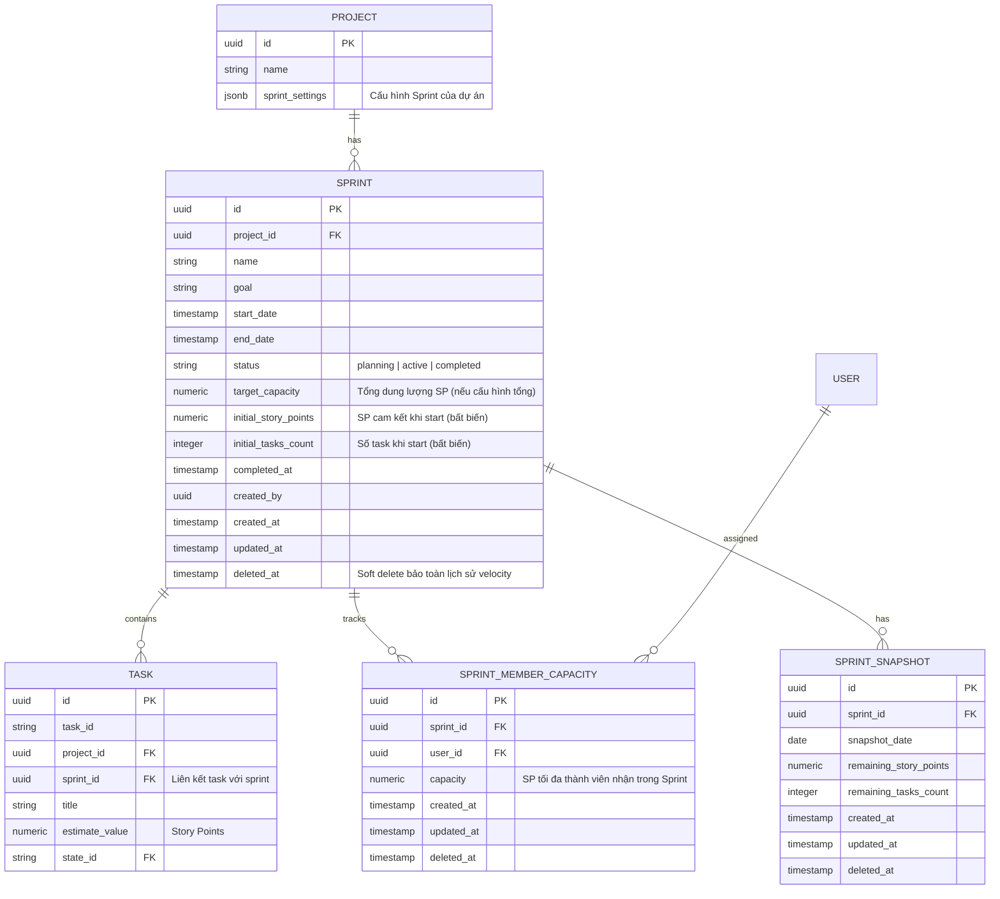
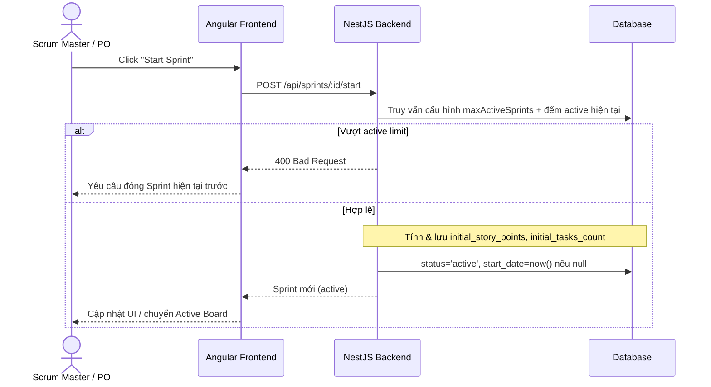
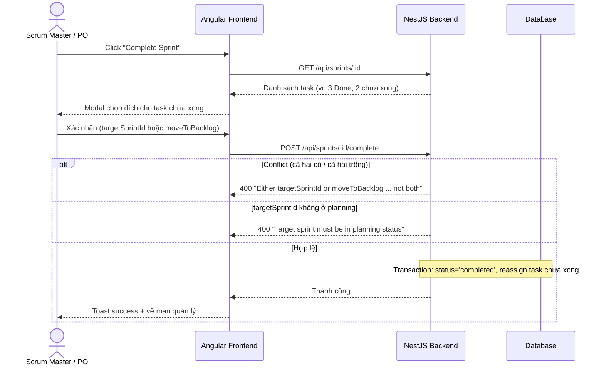

# Design Document: Sprints/Cycles

## Overview

Chức năng **Sprints/Cycles** cung cấp khả năng quản lý chu kỳ làm việc Agile cho ứng dụng Agile PM (MPM), tích hợp chặt chẽ với các module Tasks và Projects hiện có. Mỗi dự án có thể tự cấu hình thuật ngữ hiển thị là **Sprint** (Scrum) hoặc **Cycle** (Kanban/Linear); ở tầng database và backend, dữ liệu được lưu trữ thống nhất trong thực thể `Sprint`.

Về kiến trúc, backend triển khai một module NestJS 11 mới (`SprintModule`) với PostgreSQL 17 làm cơ sở dữ liệu chính. Hệ thống hỗ trợ cấu hình số lượng Sprint active song song (mặc định 1 theo chuẩn Scrum), quản lý dung lượng (capacity) theo tổng hoặc theo từng thành viên, và một Global Cron Job chụp snapshot hàng ngày để dựng biểu đồ Burndown. Frontend Angular 21 (PrimeNG + Tailwind) chia chức năng thành hai khu vực: bộ lọc Sprint tích hợp trên Backlog/Board toolbar và một submenu Sprints độc lập (List, Dashboard, Velocity, Settings).

Tài liệu này gồm hai phần: **High-Level Design** (kiến trúc, sơ đồ hệ thống, thành phần, mô hình dữ liệu) và **Low-Level Design** (pseudocode/TypeScript, thuật toán, chữ ký DTO/hàm với pre/post-conditions).

---

# PHẦN I — HIGH-LEVEL DESIGN

## Architecture

### 1.1 Sơ đồ kiến trúc tổng thể

```mermaid
graph TD
    subgraph Frontend["Angular 21 Frontend"]
        TB[Sprint Filter Dropdown<br/>Backlog/Board Toolbar]
        CAP[Capacity Indicator]
        SM[Sprints Submenu<br/>List / Dashboard / Velocity / Settings]
        SVC[SprintService<br/>HttpClient + Signals]
    end

    subgraph Backend["NestJS 11 SprintModule"]
        CTRL[SprintController]
        SRV[SprintService]
        CAPSRV[CapacityService]
        SNAPSRV[SnapshotService]
        CRON[SnapshotCronJob<br/>NestJS Schedule]
        GUARD[ProjectRolesGuard<br/>@ProjectRoles]
    end

    subgraph Data["PostgreSQL 17"]
        T_SPR[(sprints)]
        T_CAP[(sprint_member_capacities)]
        T_SNAP[(sprint_snapshots)]
        T_TASK[(tasks.sprint_id)]
        T_PROJ[(projects.sprint_settings)]
    end

    TB --> SVC
    CAP --> SVC
    SM --> SVC
    SVC -->|REST /api| CTRL
    CTRL --> GUARD
    CTRL --> SRV
    SRV --> CAPSRV
    SRV --> SNAPSRV
    SRV --> T_SPR
    SRV --> T_TASK
    SRV --> T_PROJ
    CAPSRV --> T_CAP
    SNAPSRV --> T_SNAP
    CRON --> SNAPSRV
    CRON --> T_SPR
    CRON --> T_TASK
```

### 1.2 Quyết định kiến trúc cốt lõi

| # | Quyết định | Mô tả |
|---|-----------|-------|
| 1 | **Thuật ngữ cấu hình theo Project** | `projects.sprint_settings.terminology` quyết định hiển thị "Sprint" hay "Cycle". Toàn bộ UI (sidebar, header, button, tooltip) đổi thuật ngữ theo cấu hình. Backend/DB luôn dùng thực thể `Sprint`. |
| 2 | **Quan hệ sở hữu 1-N** | Mỗi Sprint thuộc duy nhất một Project. |
| 3 | **Active Sprints linh hoạt** | `maxActiveSprints` cho phép 1 (chuẩn Scrum) hoặc nhiều Sprint active song song. |
| 4 | **Xử lý task chưa hoàn thành khi Complete** | Khi đóng Sprint, task chưa `Done` được điều phối về Backlog hoặc một Sprint `planning` tiếp theo. |
| 5 | **Capacity Planning 2 chế độ** | `total` (tổng SP) hoặc `member-based` (theo từng thành viên). Task chưa có SP được tạm tính 1 SP để dự phòng năng lực + cảnh báo. |
| 6 | **Submenu Sprints độc lập** | Collapsible submenu riêng trên sidebar cho không gian quản lý chuyên sâu. |
| 7 | **Burndown 2 chế độ** | Switch giữa Story Points (mặc định) và Task Count. |
| 8 | **Invariant cam kết ban đầu** | `initial_story_points` / `initial_tasks_count` bất biến sau khi Sprint `active`. |

## Data Models

### 2.0 Database Schema (ERD)



### 2.1 Indexes

```sql
-- Composite index: truy vấn danh sách sprint theo project + status (phổ biến nhất)
CREATE INDEX idx_sprints_project_status ON sprints (project_id, status) WHERE deleted_at IS NULL;

-- Partial index: truy vấn task thuộc một sprint
CREATE INDEX idx_tasks_sprint_id ON tasks (sprint_id) WHERE sprint_id IS NOT NULL;

-- Unique composite index: snapshot lịch sử của sprint theo ngày
CREATE UNIQUE INDEX idx_sprint_snapshots_sprint_date ON sprint_snapshots (sprint_id, snapshot_date) WHERE deleted_at IS NULL;
```

### 2.2 Schema `sprint_settings` (JSONB trong bảng `projects`)

```json
{
  "terminology": "sprint",
  "maxActiveSprints": 1,
  "defaultDurationWeeks": 2,
  "capacityMode": "total"
}
```

- `terminology`: `"sprint"` | `"cycle"`
- `maxActiveSprints`: số nguyên từ 1 đến 10 (mặc định 1; giới hạn trên 10 là safety cap phòng tránh overload hệ thống, có thể nới rộng trong phiên bản sau)
- `defaultDurationWeeks`: validate bằng `@IsIn([1, 2, 4])`
- `capacityMode`: `"total"` | `"member-based"`
- *(Lưu ý: Timezone xử lý qua biến môi trường `TZ` ở cấp server theo IANA timezone identifier, ví dụ `Asia/Ho_Chi_Minh`. Không lưu timezone trong `sprint_settings` ở v1.)*

Backend dùng class-validator để kiểm tra JSONB trước khi lưu DB.

### 2.3 Thay đổi bảng `tasks`

- Bổ sung cột `sprint_id` (UUID, nullable, FK → `sprints.id`).
- Thực thể `Task` hiện có cột `cycle_id` (UUID). Khuyến nghị: tạo cột `sprint_id` rõ ràng và migrate dữ liệu từ `cycle_id` cũ.

## Components and Interfaces

### 3.1 Backend Components

| Component | Trách nhiệm |
|-----------|-------------|
| `SprintController` | Khai báo các REST endpoint, gắn `ProjectRolesGuard` + `@ProjectRoles`. |
| `SprintService` | Nghiệp vụ CRUD sprint, start/complete, gán task, dashboard aggregation. |
| `CapacityService` | Tính toán capacity tổng/theo thành viên, actual used, cảnh báo task chưa ước lượng. |
| `SnapshotService` | Tạo/cập nhật snapshot, dựng dữ liệu burndown (actual + ideal line). |
| `SnapshotCronJob` | Global Cron Job (23:59 hàng ngày) quét sprint active, ghi snapshot, logging. |

### 3.2 API Endpoints

Tất cả endpoint dùng `ProjectRolesGuard` + `@ProjectRoles(...)` (Project-level roles: `Scrum_Master`, `Product_Owner`, `Developer`, `QA`, `Stakeholder`).

| HTTP | Route | Mô tả | `@ProjectRoles` |
|------|-------|-------|-----------------|
| POST | `/api/projects/:projectId/sprints` | Tạo Sprint trạng thái `planning` | `Scrum_Master`, `Product_Owner` |
| GET | `/api/projects/:projectId/sprints` | Danh sách Sprint (page, limit, filter status, search name) | Tất cả role |
| GET | `/api/projects/:projectId/sprints/active` | Danh sách Sprint `active` | Tất cả role |
| GET | `/api/projects/:projectId/sprints/dashboard` | Thống kê tổng hợp Dashboard | Tất cả role |
| GET | `/api/projects/:projectId/sprints/velocity` | Dữ liệu báo cáo Velocity (committed vs completed SP) | Tất cả role |
| PATCH | `/api/projects/:projectId/sprints/settings` | Cập nhật `sprint_settings` của dự án | `Scrum_Master`, `Product_Owner` |
| GET | `/api/sprints/:id` | Chi tiết Sprint kèm danh sách task | Tất cả role |
| PATCH | `/api/sprints/:id` | Cập nhật tên/ngày/target capacity | `Scrum_Master`, `Product_Owner` |
| POST | `/api/projects/:projectId/sprints/bulk-delete` | Xóa hàng loạt (task → Backlog) | `Scrum_Master`, `Product_Owner` |
| POST | `/api/sprints/:id/start` | Kích hoạt Sprint, lưu initial SP/tasks | `Scrum_Master`, `Product_Owner` |
| POST | `/api/sprints/:id/complete` | Đóng Sprint, điều phối task chưa xong | `Scrum_Master`, `Product_Owner` |
| PATCH | `/api/sprints/:id/tasks/:taskId` | Gán/đổi Sprint cho 1 task | `SM`, `PO`, `Developer`, `QA` |
| POST | `/api/sprints/:id/tasks` | Thêm hàng loạt task vào Sprint | `SM`, `PO`, `Developer`, `QA` |
| POST | `/api/sprints/:id/tasks/bulk-remove` | Loại task khỏi Sprint (→ Backlog) | `SM`, `PO`, `Developer`, `QA` |
| GET | `/api/sprints/:id/burndown` | Dữ liệu Burndown Chart | Tất cả role |
| PUT | `/api/sprints/:id/capacities` | Cấu hình capacity từng thành viên | `Scrum_Master`, `Product_Owner` |
| GET | `/api/sprints/:id/capacities` | Danh sách capacity + actual used | Tất cả role |

> "Tất cả role" bao gồm `Stakeholder` (read-only).

### 3.3 Tích hợp Authorization hiện tại

Dự án có sẵn `ProjectRolesGuard` + `@ProjectRoles` (định nghĩa tại `apps/backend/src/auth/constants/permission-matrix.ts`):
- **Scrum_Master** & **Product_Owner**: toàn quyền CRUD `sprint`.
- **Developer** & **QA**: read `sprint`, nhưng update `task` → được phép gán task vào Sprint.
- Mọi thao tác đổi trạng thái/cấu hình/xóa Sprint bắt buộc SM hoặc PO.

## 4. Frontend Components (High-Level)

### 4.1 Khu vực 1 — Sprint Filter trên Backlog/Board Toolbar

- **Sprint Filter Dropdown**: All Sprints / Backlog (No Sprint) / [các Sprint Active/Planning] / + Create Sprint.
- **Capacity Indicator**: `Capacity: 36 / 45 SP` + thanh tiến trình.
- **Gán task**: Task Detail Panel (dropdown Sprint), Context Menu ("Move to Sprint..."), Bulk Action.

```
[ View: List ] [ Group: State ] [ Sprint: Sprint 12 ▾ ]  |  Capacity: [█████████░░░] 36 / 45 SP
                                 ┌────────────────────────────────┐
                                 │ Search sprint...               │
                                 ├────────────────────────────────┤
                                 │ ✓ All Sprints                  │
                                 │   Backlog (No Sprint)          │
                                 │   Sprint 12 (Active)           │
                                 │   Sprint 13 (Planning)         │
                                 ├────────────────────────────────┤
                                 │ ✚ Create New Sprint            │
                                 └────────────────────────────────┘
```

### 4.2 Khu vực 2 — Submenu Sprints độc lập trên Sidebar

| Trang | Route | Mô tả |
|-------|-------|-------|
| Sprints List | `/projects/:projectId/sprints/list` | `p-table` server-side pagination, filter search/status, bulk select + delete (confirm dialog). |
| Sprint Dashboard | `/projects/:projectId/sprints/dashboard` | Active Sprint Selector, Burndown Chart (switch SP/Task), thống kê tiến độ. |
| Velocity Reports | `/projects/:projectId/sprints/velocity` | Biểu đồ cột Committed SP vs Completed SP, Average Velocity. |
| Sprint Settings | `/projects/:projectId/sprints/settings` | Terminology, default duration, maxActiveSprints, capacityMode. |

**Tuân thủ UI Standards (bắt buộc):**
- Ngày hiển thị `dd/MM/yyyy`; số phân cách phần nghìn; SP tối đa 1 chữ số thập phân; % tối đa 2 chữ số thập phân.
- Trang danh sách: filter (search debounce 300ms + status, đồng bộ URL query params), multiple select + bulk delete, **confirm dialog** (PrimeNG `ConfirmDialog` + `ConfirmationService`) ghi rõ số lượng trước khi xóa.
- Empty state + loading skeleton; Toast (`MessageService`) sau mutating operation.
- Dùng PrimeNG `p-table`, `p-select`, `p-chart` (Chart.js), `p-skeleton`; layout Tailwind; icon PrimeIcons.

**Quy tắc bắt buộc cấp dự án (từ `CLAUDE.md` và project memory — vi phạm = sai):**

**1. Page Layout — Mọi trang Sprint phải dùng pattern sau, KHÔNG dùng `max-w-* mx-auto p-6`:**
```html
<div class="flex flex-col h-full bg-white dark:bg-surface-900">
  <!-- Toolbar: title + filters + action button -->
  <div class="flex items-center gap-3 px-6 py-3 border-b border-gray-200 dark:border-surface-700 flex-shrink-0">
    <h1 class="text-base font-semibold text-gray-900 dark:text-surface-0">...</h1>
    <div class="flex-1"></div>
    <p-button size="small" [fluid]="false" ...></p-button>
  </div>
  <!-- Scrollable content -->
  <div class="flex-1 overflow-y-auto px-6 py-4">...</div>
</div>
```
*Áp dụng cho: Sprints List, Sprint Dashboard, Velocity, Settings.*

**2. Dark Mode — Mọi class Tailwind có màu phải có `dark:` variant. Bảng quy đổi bắt buộc:**

| Light | Dark |
|-------|------|
| `bg-white` | `dark:bg-surface-900` |
| `bg-gray-50` | `dark:bg-surface-800` |
| `bg-gray-100` | `dark:bg-surface-800` |
| `border-gray-200` | `dark:border-surface-700` |
| `text-gray-900` | `dark:text-surface-0` |
| `text-gray-700` | `dark:text-surface-200` |
| `text-gray-500` | `dark:text-surface-400` |
| `hover:bg-gray-50` | `dark:hover:bg-surface-800` |
| `bg-indigo-50` | `dark:bg-indigo-950/30` |
| `text-indigo-600` | `dark:text-indigo-400` |
| Badge: `bg-gray-100 text-gray-600` | `dark:bg-surface-700 dark:text-surface-300` |

Status badge màu Sprint:
- `planning`: `bg-yellow-50 text-yellow-700 dark:bg-yellow-950/30 dark:text-yellow-400`
- `active`: `bg-green-50 text-green-700 dark:bg-green-950/30 dark:text-green-400`
- `completed`: `bg-gray-100 text-gray-600 dark:bg-surface-700 dark:text-surface-300`

**3. Button Sizing:**
- Mọi `pButton` trong toolbar và action bar: `[fluid]="false"` + `size="small"`.
- KHÔNG dùng `flex-1` hoặc `w-full` cho action/toggle button.
- Ngoại lệ duy nhất: nút submit ở cuối form card (`[fluid]="true"` hoặc `w-full`).

**4. Drag-and-Drop (DnD):**
- Chức năng Sprint v1 **không thêm DnD mới** (gán task qua dropdown/context menu/bulk action).
- Tích hợp Sprint Filter trên Backlog/Board **không được làm hỏng** DnD hiện có của task list.
- Nếu Sprint Dashboard hoặc List cần DnD trong tương lai, **bắt buộc** tuân thủ 100% checklist DnD trong `CLAUDE.md` (ghost div, line indicator, `[cdkDropListSortingDisabled]="true"`, no `cdkDragHandle`, v.v.).

## Error Handling

| Scenario | Điều kiện | Response | Recovery |
|----------|-----------|----------|----------|
| Vượt active limit | Start Sprint khi số active đã = `maxActiveSprints` | `400 Bad Request` | FE yêu cầu đóng Sprint hiện tại trước |
| Complete conflict | `targetSprintId` và `moveToBacklog` cùng có/cùng trống (khi còn task chưa xong) | `400` "Either targetSprintId or moveToBacklog must be specified, but not both" | Hiển thị lỗi inline trên form |
| Target không hợp lệ | `targetSprintId` không ở `planning` | `400` "Target sprint must be in planning status" | Hiển thị lỗi inline |
| Sprint không tồn tại | id không hợp lệ / đã soft delete | `404 Not Found` | Toast error + điều hướng về list |
| Sai trạng thái chuyển tiếp | Start khi không `planning`, Complete khi không `active` | `409 Conflict` | Toast error |
| Thiếu quyền | Role không nằm trong `@ProjectRoles` | `403 Forbidden` | Toast error |

Mọi mutating operation chạy trong transaction; lỗi rollback toàn bộ. Exception filter tập trung; không trả stack trace ở production.

## Testing Strategy

- **Unit (Jest, backend)**: create sprint, start sprint (active limit), complete sprint (mutually exclusive validation + target planning), capacity calculation (1 SP cho task chưa ước lượng), invariant initial SP/tasks bất biến.
- **Property-Based Testing**: thư viện **fast-check** (TypeScript). Tập trung các invariant ở mục Correctness Properties bên dưới.
- **Integration/E2E**: full Scrum flow (create → assign tasks → start → burndown snapshot → complete → velocity).
- **Frontend**: Jest unit (component/service) + Cypress/Playwright e2e cho filter, assignment, dashboard.

## 7. Security Considerations

- Authorization cấp project qua `ProjectRolesGuard` cho mọi endpoint (không endpoint nào unauthenticated).
- Validate toàn bộ input bằng class-validator; parameterized query (TypeORM) — không ghép chuỗi SQL.
- Không log dữ liệu nhạy cảm; không trả stack trace production. OWASP Top 10 compliance.

## 8. Performance Considerations

- Index tối ưu cho truy vấn list/filter và burndown.
- Server-side pagination cho Sprints List và task list.
- Dashboard aggregation tính ở DB (SUM/COUNT) thay vì load toàn bộ task lên app.
- Global Cron snapshot tách khỏi luồng request người dùng.

## 9. Dependencies

- Backend: NestJS 11, `@nestjs/schedule` (cron), TypeORM, class-validator, class-transformer, PostgreSQL 17.
- Frontend: Angular 21, PrimeNG 21 (`p-table`, `p-select`, `p-chart`, `p-dialog`, `p-toast`, `p-skeleton`), Tailwind 4, Chart.js, date-fns (locale vi-VN).
- Module/hệ thống hiện có: ProjectModule (`sprint_settings`), TaskModule (`tasks.sprint_id`), Auth permission-matrix.

---

# PHẦN II — LOW-LEVEL DESIGN

## 10. Core Interfaces / Types

```typescript
// Tập trạng thái task được coi là hoàn thành — phải đồng bộ với schema state hiện có của dự án
// Giá trị chính xác lấy từ stateCategory hoặc tên state thuộc nhóm "done/completed/cancelled"
const DONE_STATES: readonly string[] = ['done', 'completed', 'cancelled'] as const;
// TODO (khi implement): Xác minh với TaskModule/StateModule để lấy đúng tập giá trị

// Trạng thái vòng đời của Sprint
type SprintStatus = 'planning' | 'active' | 'completed';

// Chế độ tính dung lượng
type CapacityMode = 'total' | 'member-based';

// Thuật ngữ hiển thị
type Terminology = 'sprint' | 'cycle';

// Cấu hình Sprint ở cấp Project (lưu trong projects.sprint_settings JSONB)
interface SprintSettings {
  terminology: Terminology;        // 'sprint' | 'cycle'
  maxActiveSprints: number;        // >= 1, mặc định 1
  defaultDurationWeeks: 1 | 2 | 4; // @IsIn([1, 2, 4])
  capacityMode: CapacityMode;      // 'total' | 'member-based'
}

// Thực thể Sprint
interface Sprint {
  id: string;
  projectId: string;
  name: string;
  goal: string | null;
  startDate: Date | null;
  endDate: Date | null;
  status: SprintStatus;
  targetCapacity: number | null;
  initialStoryPoints: number | null; // bất biến sau khi active
  initialTasksCount: number | null;  // bất biến sau khi active
  completedAt: Date | null;
  createdBy: string;
  createdAt: Date;
  updatedAt: Date;
  deletedAt: Date | null; // soft delete
}

// Dung lượng theo thành viên
interface SprintMemberCapacity {
  id: string;
  sprintId: string;
  userId: string;
  capacity: number; // SP tối đa thành viên nhận
}

// Snapshot phục vụ Burndown
interface SprintSnapshot {
  id: string;
  sprintId: string;
  snapshotDate: string; // YYYY-MM-DD
  remainingStoryPoints: number;
  remainingTasksCount: number;
}

// Kết quả tính capacity của một thành viên
interface MemberCapacityResult {
  userId: string;
  capacity: number;          // năng lực cấu hình
  actualUsed: number;        // tổng estimate_value task đã gán
  unestimatedTasksCount: number; // số task chưa có SP (mỗi task tạm tính 1 SP)
}
```

## 11. DTOs với Validation

```typescript
// POST /api/projects/:projectId/sprints
class CreateSprintDto {
  @IsString() @IsNotEmpty()
  name: string;

  @IsString() @IsOptional()
  goal?: string;

  @IsDateString() @IsOptional()
  startDate?: string;

  @IsDateString() @IsOptional()
  endDate?: string;

  @IsNumber() @Min(0) @IsOptional()
  targetCapacity?: number;
}

// PATCH /api/sprints/:id — KHÔNG chứa `status` (tránh bypass validation qua PATCH)
class UpdateSprintDto extends PartialType(CreateSprintDto) {}

// POST /api/sprints/:id/complete
class CompleteSprintDto {
  @IsUUID() @IsOptional()
  targetSprintId?: string;

  @IsBoolean() @IsOptional()
  moveToBacklog?: boolean;
  // Validation loại trừ lẫn nhau xử lý ở service (xem mục 12.2)
}

// PUT /api/sprints/:id/capacities — nhận mảng
class UpdateMemberCapacityDto {
  @IsUUID()
  userId: string;

  @IsNumber() @Min(0)
  capacity: number;
}

// Phần tử dữ liệu Burndown
class BurndownDataPointDto {
  date: string;                          // ISO YYYY-MM-DD (theo IANA TZ của server)
  remainingStoryPoints: number | null;   // null cho ngày tương lai (chưa có snapshot)
  remainingTasksCount: number | null;    // null cho ngày tương lai (chưa có snapshot)
  idealStoryPoints: number;
  idealTasksCount: number;
}

// Phân trang
class SprintPaginationResponseDto {
  data: Sprint[];
  total: number;
  page: number;
  limit: number;
}

// Settings DTO (validate JSONB)
class UpdateSprintSettingsDto {
  @IsIn(['sprint', 'cycle'])
  terminology: Terminology;

  @IsInt() @Min(1)
  maxActiveSprints: number;

  @IsIn([1, 2, 4])
  defaultDurationWeeks: 1 | 2 | 4;

  @IsIn(['total', 'member-based'])
  capacityMode: CapacityMode;
}
```

## 12. Key Functions với Formal Specifications

### 12.1 startSprint()

```typescript
async function startSprint(sprintId: string): Promise<Sprint>
```

**Preconditions:**
- `sprintId` tồn tại (không soft-deleted) và `sprint.status === 'planning'`.
- Số Sprint `active` (không soft-deleted) hiện tại của project `< project.sprintSettings.maxActiveSprints`.

**Postconditions:**
- `sprint.status === 'active'`.
- `sprint.startDate` được set = `now()` nếu trước đó null.
- `sprint.initialStoryPoints` = tổng `estimate_value` của task trong sprint tại thời điểm start (ghi một lần).
- `sprint.initialTasksCount` = số task trong sprint tại thời điểm start (ghi một lần).
- Nếu vi phạm active limit → ném `BadRequestException`, không thay đổi state.

**Loop Invariants:** N/A.

### 12.2 completeSprint()

```typescript
async function completeSprint(sprintId: string, dto: CompleteSprintDto): Promise<Sprint>
```

**Preconditions:**
- `sprint.status === 'active'`.
- Gọi `unfinishedTasks = tasks(sprintId) where state ∉ DONE_STATES`.
- Nếu `unfinishedTasks.length > 0`: bắt buộc đúng MỘT trong `dto.targetSprintId` hoặc `dto.moveToBacklog === true` (loại trừ lẫn nhau).
- Nếu cung cấp `targetSprintId`: sprint đích tồn tại (không soft-deleted), `status === 'planning'`, **và `projectId === sprint.projectId`** (cùng dự án).

**Postconditions:**
- `sprint.status === 'completed'`, `sprint.completedAt = now()`.
- Mỗi task chưa xong: `sprint_id = targetSprintId` (nếu chuyển sprint) HOẶC `sprint_id = null` (nếu về backlog).
- `initialStoryPoints` / `initialTasksCount` KHÔNG thay đổi (invariant velocity).
- Toàn bộ thực hiện trong một transaction; lỗi → rollback.
- Vi phạm validation → `BadRequestException`, không thay đổi state.

**Loop Invariants:**
- Khi lặp reassign task: mọi task đã xử lý có `sprint_id` đúng đích; tổng số task chưa xử lý giảm dần về 0.

### 12.3 calculateMemberCapacity()

```typescript
function calculateMemberCapacity(
  sprint: Sprint,
  tasks: Task[],
  capacities: SprintMemberCapacity[],
): MemberCapacityResult[]
```

**Preconditions:**
- `tasks` đều thuộc `sprint.id`.
- `capacity >= 0` cho mọi phần tử trong `capacities`.

**Postconditions:**
- Mỗi member trả về `actualUsed = Σ effectiveSP(task)` với task gán cho member đó.
- `effectiveSP(task) = task.estimateValue` nếu có, ngược lại = `1` (task chưa ước lượng).
- `unestimatedTasksCount` = số task của member có `estimateValue` null/0.
- Kết quả không chứa giá trị âm.

**Loop Invariants:**
- Sau mỗi task được cộng dồn: `actualUsed` của member là tổng đúng các task đã duyệt của member đó.

### 12.4 buildBurndown()

```typescript
function buildBurndown(sprint: Sprint, snapshots: SprintSnapshot[]): BurndownDataPointDto[]
```

**Preconditions:**
- `sprint.startDate` và `sprint.endDate` không null; `startDate <= endDate`.
- `snapshots` đều thuộc `sprint.id`.

**Postconditions:**
- Trả về mảng theo từng ngày từ `startDate` đến `endDate` (sắp xếp tăng dần theo `date`). Ngày tính theo IANA timezone của server (`process.env.TZ`, ví dụ `Asia/Ho_Chi_Minh`) để nhất quán với `snapshot_date`.
- Ideal line giảm tuyến tính: tại ngày `d` (chỉ số `i`, tổng `n` ngày), `idealStoryPoints = initialStoryPoints * (1 - i/(n-1))`, kẹp về `>= 0`; tương tự `idealTasksCount`.
- Actual line lấy từ snapshot tương ứng ngày; ngày chưa có snapshot → giữ giá trị actual gần nhất (carry-forward) hoặc initial nếu chưa có; ngày tương lai (sau ngày hiện tại theo server IANA TZ) → `remainingStoryPoints = null`, `remainingTasksCount = null`.

## 13. Algorithmic Pseudocode

### 13.1 Thuật toán Start Sprint

```typescript
// ALGORITHM startSprint
async function startSprint(sprintId: string): Promise<Sprint> {
  return await dataSource.transaction(async (trx) => {
    const sprint = await trx.findSprintOrThrow(sprintId);          // 404 nếu không có
    if (sprint.status !== 'planning')
      throw new ConflictException('Sprint must be in planning status');

    const settings = await trx.getSprintSettings(sprint.projectId);
    const activeCount = await trx.countActiveSprints(sprint.projectId);

    // Ràng buộc số sprint active song song
    if (activeCount >= settings.maxActiveSprints)
      throw new BadRequestException('Active sprint limit reached');

    // Tính committed ban đầu (ghi MỘT lần — invariant velocity)
    const tasks = await trx.findTasksBySprint(sprintId);
    const initialSP = sum(tasks, (t) => effectiveSP(t));
    const initialCount = tasks.length;

    sprint.status = 'active';
    sprint.startDate = sprint.startDate ?? now();
    sprint.initialStoryPoints = initialSP;
    sprint.initialTasksCount = initialCount;

    return await trx.save(sprint);
  });
}
```

### 13.2 Thuật toán Complete Sprint (validation loại trừ lẫn nhau)

```typescript
// ALGORITHM completeSprint
async function completeSprint(sprintId: string, dto: CompleteSprintDto): Promise<Sprint> {
  return await dataSource.transaction(async (trx) => {
    const sprint = await trx.findSprintOrThrow(sprintId);
    if (sprint.status !== 'active')
      throw new ConflictException('Sprint must be active to complete');

    const unfinished = await trx.findUnfinishedTasks(sprintId); // state ∉ DONE_STATES

    if (unfinished.length > 0) {
      const hasTarget = dto.targetSprintId != null;
      const hasBacklog = dto.moveToBacklog === true;

      // Loại trừ lẫn nhau: đúng MỘT lựa chọn
      if (hasTarget === hasBacklog) // cả hai true hoặc cả hai false
        throw new BadRequestException(
          'Either targetSprintId or moveToBacklog must be specified, but not both',
        );

      if (hasTarget) {
        const target = await trx.findSprintOrThrow(dto.targetSprintId!); // 404 nếu không tồn tại/đã soft delete
        if (target.projectId !== sprint.projectId)
          throw new NotFoundException('Target sprint not found');          // 404 nếu khác project
        if (target.status !== 'planning')
          throw new BadRequestException('Target sprint must be in planning status');
        // Reassign sang sprint đích
        for (const task of unfinished) {            // INVARIANT: task đã xử lý có sprint_id đúng
          task.sprintId = dto.targetSprintId!;
          await trx.save(task);
        }
      } else {
        // Đưa về Backlog
        for (const task of unfinished) {
          task.sprintId = null;
          await trx.save(task);
        }
      }
    }

    sprint.status = 'completed';
    sprint.completedAt = now();
    // KHÔNG đụng initialStoryPoints / initialTasksCount
    return await trx.save(sprint);
  });
}
```

### 13.3 Thuật toán Capacity (effective SP)

```typescript
// effectiveSP: task chưa ước lượng tạm tính 1 SP để dự phòng năng lực
function effectiveSP(task: Task): number {
  return (task.estimateValue && task.estimateValue > 0) ? task.estimateValue : 1;
}

// ALGORITHM calculateMemberCapacity
function calculateMemberCapacity(sprint, tasks, capacities): MemberCapacityResult[] {
  const byMember = new Map<string, MemberCapacityResult>();

  for (const cap of capacities)
    byMember.set(cap.userId, {
      userId: cap.userId, capacity: cap.capacity,
      actualUsed: 0, unestimatedTasksCount: 0,
    });

  for (const task of tasks) {
    if (!task.assigneeId) continue;
    const m = byMember.get(task.assigneeId)
      ?? { userId: task.assigneeId, capacity: 0, actualUsed: 0, unestimatedTasksCount: 0 };
    m.actualUsed += effectiveSP(task);               // INVARIANT: tổng đúng task đã duyệt
    if (!task.estimateValue || task.estimateValue <= 0) m.unestimatedTasksCount += 1;
    byMember.set(task.assigneeId, m);
  }

  return [...byMember.values()];
}
```

### 13.4 Global Cron Job — Snapshot hàng ngày

```typescript
// Chạy 23:59 mỗi ngày theo IANA timezone của server (biến môi trường TZ, ví dụ: TZ=Asia/Ho_Chi_Minh)
// snapshot_date được tính dựa theo TZ này — đảm bảo nhất quán với burndown date range
@Cron('59 23 * * *')
async function captureDailySnapshots(): Promise<void> {
  logger.log('Snapshot cron started');
  const activeSprints = await sprintRepo.findAllActive(); // mọi project
  let captured = 0;

  for (const sprint of activeSprints) {
    try {
      const tasks = await taskRepo.findUnfinishedBySprint(sprint.id);
      const remainingSP = sum(tasks, effectiveSP);
      const remainingCount = tasks.length;
      // Upsert theo (sprint_id, snapshot_date) — unique index đảm bảo idempotent
      await snapshotRepo.upsert({
        sprintId: sprint.id, snapshotDate: today(),
        remainingStoryPoints: remainingSP, remainingTasksCount: remainingCount,
      });
      captured += 1;
    } catch (err) {
      logger.error(`Snapshot failed for sprint ${sprint.id}`, err);
    }
  }
  logger.log(`Snapshot cron finished: ${captured}/${activeSprints.length} sprints`);
}
```

## 14. Example Usage

```typescript
// 1) Tạo và khởi động Sprint
const sprint = await sprintService.create(projectId, {
  name: 'Sprint 12', goal: 'QR Payment integration',
  startDate: '2026-06-01', endDate: '2026-06-14', targetCapacity: 45,
});
await sprintService.addTasks(sprint.id, [taskA.id, taskB.id]);
const active = await sprintService.start(sprint.id); // lưu initialStoryPoints/initialTasksCount

// 2) Gán task vào Sprint (Developer/QA được phép)
await sprintService.assignTask(sprint.id, task.id);

// 3) Hoàn thành Sprint — chuyển task chưa xong sang Sprint planning kế tiếp
await sprintService.complete(sprint.id, { targetSprintId: nextPlanningSprint.id });

// 4) Hoặc đưa task chưa xong về Backlog
await sprintService.complete(sprint.id, { moveToBacklog: true });

// 5) Burndown
const burndown: BurndownDataPointDto[] = await sprintService.getBurndown(sprint.id);
```

## Correctness Properties

Các invariant cần kiểm chứng (property-based testing với fast-check):

### Property 1: Active limit invariant
∀ project P, tại mọi thời điểm, `count(sprints where projectId=P ∧ status='active') ≤ P.sprintSettings.maxActiveSprints`.

### Property 2: Velocity immutability
∀ sprint S, sau khi `S.status` trở thành `'active'`, mọi thao tác thêm/xóa task mid-sprint KHÔNG làm thay đổi `S.initialStoryPoints` và `S.initialTasksCount`.

### Property 3: Complete mutual exclusion
∀ lời gọi `completeSprint(S, dto)` với `unfinishedTasks(S) ≠ ∅`, thao tác thành công ⟺ đúng MỘT trong `dto.targetSprintId` hoặc `dto.moveToBacklog` được cung cấp (không cả hai, không cả hai trống).

### Property 4: Task reassignment completeness
Sau `completeSprint(S, dto)` thành công, ∀ task chưa xong ban đầu: `task.sprintId = dto.targetSprintId` (nếu chuyển) HOẶC `task.sprintId = null` (nếu backlog); không task nào còn trỏ về `S` nếu chưa `Done`.

### Property 5: Status transition validity
Chuyển trạng thái chỉ hợp lệ theo `planning → active → completed`; mọi chuyển tiếp khác bị từ chối.

### Property 6: Effective SP non-negative & default
∀ task T, `effectiveSP(T) ≥ 1` và `effectiveSP(T) = T.estimateValue` khi `T.estimateValue > 0`, ngược lại `= 1`.

### Property 7: Capacity sum correctness
∀ member m, `actualUsed(m) = Σ effectiveSP(t)` với mọi task t gán cho m trong sprint; kết quả không âm.

### Property 8: Burndown ideal monotonic
Chuỗi `idealStoryPoints` theo ngày là không tăng (monotonically non-increasing), bắt đầu từ `initialStoryPoints` và kết thúc tại `0`.

### Property 9: Snapshot idempotency
Chạy cron nhiều lần trong cùng một ngày cho cùng sprint chỉ tạo/giữ đúng MỘT bản ghi `(sprint_id, snapshot_date)` (đảm bảo bởi unique index).

### Property 10: Soft delete preservation
∀ sprint bị xóa, `deletedAt` được set nhưng bản ghi vẫn tồn tại để bảo toàn dữ liệu velocity lịch sử; task liên quan được giải phóng (`sprint_id = null`).

## 16. Business Workflows

### 16.1 Start Sprint



### 16.2 Complete Sprint



## 17. Implementation Plan (tham khảo cho giai đoạn Tasks)

- **Phase 1 — DB & Backend API (~4 ngày)**: migration tạo bảng + index; `SprintModule` (entities, DTOs, controller, service); endpoint chính; Global Cron snapshot + logging; unit test (start active limit, complete mutual exclusion + target planning).
- **Phase 2 — FE Filter & Assignment (~4 ngày)**: `SprintService`; Sprint Filter Dropdown; Task Detail Panel sprint field; Context Menu assign; Capacity Indicator.
- **Phase 3 — Trang quản trị & báo cáo (~3 ngày)**: route `/projects/:projectId/sprints` + Collapsible Submenu; Sprints List (table, server-side pagination, filter, bulk delete + confirm); Burndown + Velocity chart (`p-chart`); Settings page.
- **Phase 4 — Kiểm thử & tối ưu (~2 ngày)**: E2E full Scrum flow; tối ưu hiệu năng list/filter dữ liệu lớn.
