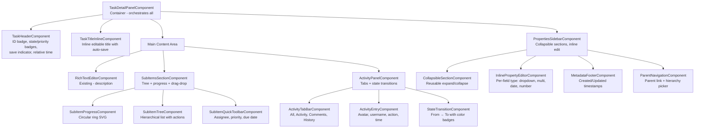
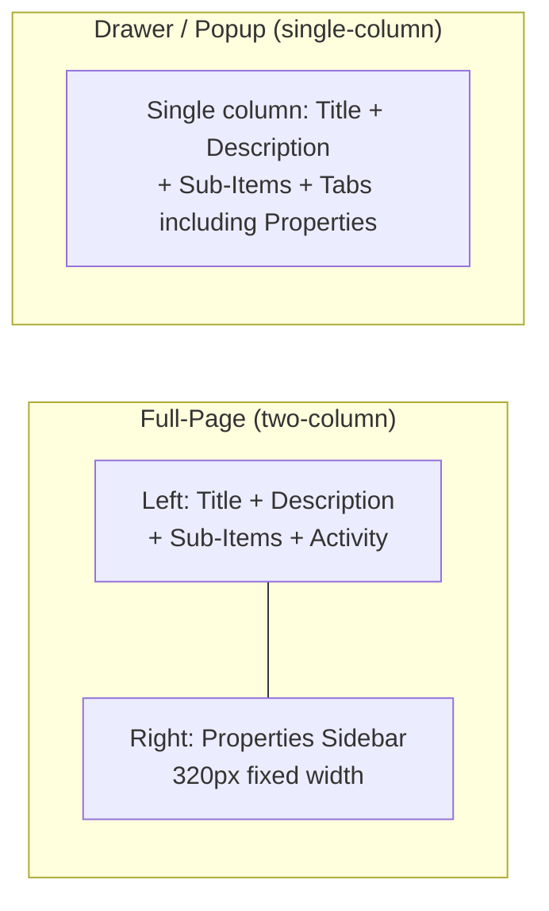

# Design Document: Task Detail UI Optimization

## Overview

Tối ưu hóa Task Detail UI theo mẫu tham khảo Plane, cải thiện trải nghiệm full-page view bằng cách bổ sung: Task Header với ID badge + state/priority badges + save indicator + relative time, inline title editing, collapsible properties sections với session storage persistence, sub-items tree với circular progress indicator, enhanced activity panel với tabs và state transition visualization, inline property editing với auto-save, sub-item quick actions toolbar, responsive layout modes, metadata footer, và parent task navigation.

### Design Decisions

| Quyết định | Lý do |
|-----------|-------|
| Refactor `TaskDetailPanelComponent` thành container + nhiều child components | Giảm complexity, tăng testability, mỗi component < 200 LOC |
| Dùng Angular Signals cho UI state (collapse, save status) | Consistency với existing `TaskStore`, reactive và performant |
| Session storage cho collapse state | Persist per-tab session, tự xóa khi đóng tab — phù hợp requirement |
| SVG-based circular progress | Lightweight, không cần thêm dependency, dễ animate |
| Debounced auto-save (500ms) cho inline edits | UX mượt, giảm API calls, match requirement spec |
| `date-fns` cho relative time | Đã có trong project dependencies, hỗ trợ locale `vi` |
| PrimeNG `p-tree` cho sub-items hierarchy | Có sẵn drag-drop support, consistent với UI library |
| Infinite scroll cho Activity Panel | Load 30 entries/batch, tránh performance issue với history dài |

## Architecture

### Component Hierarchy (Full-Page Mode)



### Layout Modes



## Components and Interfaces

### New Standalone Components

| Component | Responsibility | Location |
|-----------|---------------|----------|
| `TaskHeaderComponent` | Task ID badge, state/priority badges, save indicator, relative time | `tasks/components/task-detail-panel/components/` |
| `TaskTitleInlineComponent` | Inline title editing with Enter/Escape/Blur handlers | `tasks/components/task-detail-panel/components/` |
| `PropertiesSidebarComponent` | Container for collapsible property sections | `tasks/components/task-detail-panel/components/` |
| `CollapsibleSectionComponent` | Reusable section with header toggle, chevron animation | `tasks/components/task-detail-panel/components/` |
| `InlinePropertyEditorComponent` | Field-type-specific inline editor with loading/error states | `tasks/components/task-detail-panel/components/` |
| `SubItemsSectionComponent` | Sub-items container with header, progress, tree, add form | `tasks/components/task-detail-panel/components/` |
| `SubItemProgressComponent` | SVG circular progress ring | `tasks/components/task-detail-panel/components/` |
| `SubItemTreeComponent` | Hierarchical tree rendering with drag-drop | `tasks/components/task-detail-panel/components/` |
| `SubItemQuickToolbarComponent` | Toolbar for setting assignee/priority/due date on new sub-item | `tasks/components/task-detail-panel/components/` |
| `ActivityPanelComponent` | Tabbed activity panel with infinite scroll | `tasks/components/task-detail-panel/components/` |
| `ActivityEntryComponent` | Single activity row: avatar, username, action, relative time | `tasks/components/task-detail-panel/components/` |
| `StateTransitionComponent` | Visual from→to state badge with arrow | `tasks/components/task-detail-panel/components/` |
| `MetadataFooterComponent` | Created/Updated timestamps with creator name | `tasks/components/task-detail-panel/components/` |
| `ParentNavigationComponent` | Parent task link + hierarchy-aware picker | `tasks/components/task-detail-panel/components/` |

### Key Services

| Service | New/Modified | Purpose |
|---------|-------------|---------|
| `TaskDetailStateService` | New | Local signal-based state for task detail panel (save queue, collapse states, active tab) |
| `RelativeTimePipe` | New | Pipe for relative time display with Vietnamese locale |
| `TaskService` | Modified | Add `getSubItemsTree()`, `getActivityFiltered()` endpoints |
| `TaskStore` | Modified | Add sub-items signals, activity pagination signals |

### Component Input/Output Contracts

```typescript
// TaskHeaderComponent
@Input() task: Signal<Task | null>;
@Input() saveStatus: Signal<'idle' | 'saving' | 'saved' | 'error'>;
@Output() taskIdCopied = new EventEmitter<string>();

// TaskTitleInlineComponent
@Input() title: string;
@Input() viewMode: 'full-page' | 'drawer' | 'popup';
@Output() titleSaved = new EventEmitter<string>();

// CollapsibleSectionComponent
@Input() title: string;
@Input() sectionKey: string;  // for session storage
@Input() expanded: boolean;
@Output() expandedChange = new EventEmitter<boolean>();

// SubItemsSectionComponent
@Input() task: Signal<Task | null>;
@Input() projectId: string;
@Input() states: Signal<ProjectState[]>;
@Input() members: Signal<MemberResponse[]>;
@Output() subItemClicked = new EventEmitter<string>();

// ActivityPanelComponent
@Input() task: Signal<Task | null>;
@Input() projectId: string;
@Input() viewMode: 'full-page' | 'drawer' | 'popup';
@Input() showPropertiesTab: boolean;  // true in drawer/popup
```

## Data Models

### Frontend Interfaces (additions to `@mpm/shared-types`)

```typescript
// Sub-item tree node for hierarchical display
export interface SubItemTreeNode {
  id: string;
  taskId: string;          // display ID e.g. "PROJ-6"
  title: string;
  type: TaskType;
  priority: TaskPriority;
  stateId: string;
  state?: TaskStateRef;
  assignees: TaskAssignee[];
  dueDate: string | null;
  children: SubItemTreeNode[];
  childrenCount: number;   // total descendants
  doneCount: number;       // descendants in "completed" state group
  expanded: boolean;       // UI state
}

// Activity filtered response
export interface ActivityFilteredResponse {
  data: TaskActivity[];
  total: number;
  page: number;
  hasMore: boolean;
}

// Activity filter type
export type ActivityFilterType = 'all' | 'activity' | 'comments' | 'history';

// Section collapse state persisted in session storage
export interface SectionCollapseState {
  [sectionKey: string]: boolean;  // true = expanded
}

// Save queue item for inline property editing
export interface PropertySaveQueueItem {
  field: string;
  value: unknown;
  timestamp: number;
}

// Sub-item creation DTO (extends CreateTaskDto)
export interface CreateSubItemDto {
  title: string;
  parentId: string;
  assigneeIds?: string[];
  priority?: TaskPriority;
  dueDate?: string | null;
}
```

### Backend API Response Shapes

```typescript
// GET /api/projects/:projectId/tasks/:taskId/children?depth=5
// Returns hierarchical sub-item tree
interface SubItemsTreeResponse {
  items: SubItemTreeNode[];
  totalCount: number;
  doneCount: number;
}

// GET /api/projects/:projectId/tasks/:taskId/activity?type=all|activity|comments|history&page=1&limit=30
interface ActivityFilteredResponse {
  data: TaskActivity[];
  total: number;
  page: number;
  hasMore: boolean;
}
```

### State Management (Signals)

```typescript
// TaskDetailStateService - local to task detail panel
@Injectable()
export class TaskDetailStateService {
  // Core task state (delegates to TaskStore)
  readonly task = computed(() => this.taskStore.currentTask());
  readonly saveStatus = computed(() => this.taskStore.saveStatus());

  // Sub-items
  readonly subItemsTree = signal<SubItemTreeNode[]>([]);
  readonly subItemsLoading = signal(false);
  readonly subItemsTotalCount = signal(0);
  readonly subItemsDoneCount = signal(0);

  // Activity
  readonly activityEntries = signal<TaskActivity[]>([]);
  readonly activityFilter = signal<ActivityFilterType>('all');
  readonly activityPage = signal(1);
  readonly activityHasMore = signal(true);
  readonly activityLoading = signal(false);

  // Sidebar
  readonly sidebarExpanded = signal(true);
  readonly sectionCollapseState = signal<SectionCollapseState>({
    details: true,
    structure: true,
  });

  // Property save queue
  readonly savingFields = signal<Set<string>>(new Set());
}
```

## API Endpoints

### New Endpoints (NestJS Backend)

| Method | Path | Description | Response |
|--------|------|-------------|----------|
| GET | `/api/projects/:projectId/tasks/:taskId/children` | Get sub-items tree with progress | `SubItemsTreeResponse` |
| GET | `/api/projects/:projectId/tasks/:taskId/activity` | Get filtered activity with pagination | `ActivityFilteredResponse` |

### Modified Endpoints

| Method | Path | Change |
|--------|------|--------|
| GET | `/api/projects/:projectId/tasks/:taskId/activity` | Add `type` query param filter: `all\|activity\|comments\|history` |
| POST | `/api/projects/:projectId/tasks` | Already supports `parentId` — no change needed |
| PATCH | `/api/projects/:projectId/tasks/:taskId` | Already supports all fields — no change needed |

### Endpoint Details

#### GET `/api/projects/:projectId/tasks/:taskId/children`

**Query Params:**
- `depth` (optional, default: 5, max: 5) — maximum nesting level to fetch

**Response:**
```json
{
  "items": [
    {
      "id": "uuid",
      "taskId": "PROJ-7",
      "title": "Sub task title",
      "type": "task",
      "priority": "medium",
      "stateId": "uuid",
      "state": { "id": "uuid", "name": "Done", "color": "#22C55E", "group": "completed" },
      "assignees": [{ "userId": "uuid", "displayName": "Nguyễn Văn A", "avatarUrl": null }],
      "dueDate": "2026-06-15",
      "children": [],
      "childrenCount": 0,
      "doneCount": 0,
      "expanded": true
    }
  ],
  "totalCount": 5,
  "doneCount": 2
}
```

#### GET `/api/projects/:projectId/tasks/:taskId/activity?type=history&page=1&limit=30`

**Query Params:**
- `type`: `all` | `activity` | `comments` | `history`
  - `all` — all entries
  - `activity` — system entries only (state_changed, field updates, assignments)
  - `comments` — comment_added, comment_edited, comment_deleted only
  - `history` — state_changed entries only
- `page` (default: 1)
- `limit` (default: 30)

**Response:**
```json
{
  "data": [
    {
      "id": "uuid",
      "taskId": "uuid",
      "actorId": "uuid",
      "actorName": "Nguyễn Văn A",
      "actorAvatar": null,
      "entryType": "state_changed",
      "field": "stateId",
      "oldValue": "{\"id\":\"uuid\",\"name\":\"Backlog\",\"color\":\"#6B7280\"}",
      "newValue": "{\"id\":\"uuid\",\"name\":\"Todo\",\"color\":\"#3B82F6\"}",
      "comment": null,
      "createdAt": "2026-06-10T14:30:00Z",
      "updatedAt": "2026-06-10T14:30:00Z"
    }
  ],
  "total": 45,
  "page": 1,
  "hasMore": true
}
```

## Key Algorithms

### 1. Relative Time Calculation

```typescript
// Thresholds (Vietnamese locale):
// < 60s: "vài giây trước"
// < 60min: "X phút trước"
// < 24h: "X giờ trước"
// < 30d: "X ngày trước"
// >= 30d: absolute format "dd/MM/yyyy"

function getRelativeTime(date: Date): string {
  const now = new Date();
  const diffMs = now.getTime() - date.getTime();
  const diffSec = Math.floor(diffMs / 1000);
  const diffMin = Math.floor(diffSec / 60);
  const diffHour = Math.floor(diffMin / 60);
  const diffDay = Math.floor(diffHour / 24);

  if (diffSec < 60) return 'vài giây trước';
  if (diffMin < 60) return `${diffMin} phút trước`;
  if (diffHour < 24) return `${diffHour} giờ trước`;
  if (diffDay < 30) return `${diffDay} ngày trước`;
  return formatDate(date, 'dd/MM/yyyy'); // absolute
}
```

### 2. Sub-Item Progress Calculation

```typescript
// Circular progress: ratio of "done" children to total direct children
function calculateProgress(subItems: SubItemTreeNode[]): {
  done: number;
  total: number;
  percentage: number;
} {
  const total = subItems.length; // only direct children
  const done = subItems.filter(
    item => item.state?.group === 'completed'
  ).length;
  const percentage = total > 0 ? (done / total) * 100 : 0;
  return { done, total, percentage };
}

// SVG ring calculation
function getStrokeDashArray(percentage: number, radius: number): string {
  const circumference = 2 * Math.PI * radius;
  const filled = (percentage / 100) * circumference;
  return `${filled} ${circumference - filled}`;
}
```

### 3. Sub-Item Tree Rendering (Recursive)

```typescript
// Build tree from flat list (backend returns hierarchical, but if flat):
function buildTree(items: TaskListItem[], parentId: string | null): SubItemTreeNode[] {
  return items
    .filter(item => item.parentId === parentId)
    .map(item => ({
      ...item,
      children: buildTree(items, item.id),
      expanded: true, // default expanded
      childrenCount: countDescendants(items, item.id),
      doneCount: countDoneDescendants(items, item.id),
    }));
}
```

### 4. Session Storage Collapse Persistence

```typescript
const STORAGE_KEY = 'task-detail-collapse-state';

function persistCollapseState(state: SectionCollapseState): void {
  sessionStorage.setItem(STORAGE_KEY, JSON.stringify(state));
}

function restoreCollapseState(): SectionCollapseState | null {
  const raw = sessionStorage.getItem(STORAGE_KEY);
  return raw ? JSON.parse(raw) : null;
}
```

### 5. Auto-Save with Queue (Inline Property Edit)

```typescript
// Debounced save with queue for same-field rapid edits
class PropertySaveQueue {
  private pending = new Map<string, { value: unknown; timer: number }>();

  enqueue(field: string, value: unknown, saveFn: (f: string, v: unknown) => void): void {
    const existing = this.pending.get(field);
    if (existing) {
      clearTimeout(existing.timer);
    }
    const timer = window.setTimeout(() => {
      saveFn(field, value);
      this.pending.delete(field);
    }, 500);
    this.pending.set(field, { value, timer });
  }
}
```

### 6. Task Hierarchy Validation (Parent Assignment)

```typescript
// Valid parent hierarchy: Epic → Story → Task → Subtask
const HIERARCHY_ORDER: TaskType[] = ['epic', 'story', 'task', 'subtask'];

function getValidParentTypes(childType: TaskType): TaskType[] {
  const childIndex = HIERARCHY_ORDER.indexOf(childType);
  return HIERARCHY_ORDER.slice(0, childIndex); // all types above in hierarchy
}

// Example: task can have parent of type 'epic' or 'story'
// subtask can have parent of type 'epic', 'story', or 'task'
```


## Correctness Properties

*A property is a characteristic or behavior that should hold true across all valid executions of a system — essentially, a formal statement about what the system should do. Properties serve as the bridge between human-readable specifications and machine-verifiable correctness guarantees.*

### Property 1: Relative Time Threshold Correctness

*For any* timestamp `t` where the difference from `now` is `d` seconds:
- If `d < 60`, the output SHALL be `"vài giây trước"`
- If `60 ≤ d < 3600`, the output SHALL be `"X phút trước"` where X = floor(d/60)
- If `3600 ≤ d < 86400`, the output SHALL be `"X giờ trước"` where X = floor(d/3600)
- If `86400 ≤ d < 2592000` (30 days), the output SHALL be `"X ngày trước"` where X = floor(d/86400)
- If `d ≥ 2592000`, the output SHALL be an absolute date string in format `dd/MM/yyyy`

**Validates: Requirements 1.9**

### Property 2: Title Save Validation

*For any* string `s` and original title `original`:
- If `s.trim()` is empty (length 0), the save SHALL NOT be triggered and title SHALL revert to `original`
- If `s.trim()` equals `original`, the save SHALL NOT be triggered
- If `s.trim()` is non-empty AND differs from `original`, the save SHALL be triggered with the trimmed value

**Validates: Requirements 2.3, 2.4**

### Property 3: Section Collapse State Persistence Round-Trip

*For any* valid `SectionCollapseState` object (mapping of section keys to boolean values), serializing it to session storage and then deserializing it SHALL produce an equivalent object with identical key-value pairs.

**Validates: Requirements 3.5, 3.7, 8.7**

### Property 4: Sub-Item Progress Calculation

*For any* list of sub-item tree nodes where each node has a `state.group` property:
- `done` SHALL equal the count of nodes with `state.group === 'completed'`
- `total` SHALL equal the length of the list (direct children only)
- `percentage` SHALL equal `(done / total) * 100` when `total > 0`, or `0` when `total === 0`

**Validates: Requirements 4.2**

### Property 5: Tree Depth Constraint

*For any* hierarchical set of task items with parent-child relationships, the `buildTree` function SHALL produce a tree where no node's depth exceeds 5 levels. Items at depth > 5 SHALL be flattened to the nearest valid ancestor level.

**Validates: Requirements 4.3**

### Property 6: Activity Filter Correctness

*For any* list of `TaskActivity` entries and filter type `f`:
- If `f === 'all'`, ALL entries SHALL be returned sorted by `createdAt` descending
- If `f === 'activity'`, ONLY entries with `entryType` in the system-generated set (state_changed, priority_changed, type_changed, parent_changed, estimate_changed, start_date_changed, due_date_changed, assignee_added, assignee_removed, label_added, label_removed, created, completed, reopened) SHALL be returned
- If `f === 'comments'`, ONLY entries with `entryType` in {comment_added, comment_edited, comment_deleted} SHALL be returned
- If `f === 'history'`, ONLY entries with `entryType === 'state_changed'` SHALL be returned
- In ALL cases, the result SHALL be sorted by `createdAt` descending (newest first)

**Validates: Requirements 5.2, 5.3, 5.4, 5.5**

### Property 7: Property Save Queue Idempotence

*For any* sequence of edit values `[v1, v2, ..., vN]` applied to the same field within a 500ms window, the system SHALL send exactly ONE API call with the value `vN` (the last edit). No intermediate values SHALL be persisted to the server.

**Validates: Requirements 6.2, 6.6**

### Property 8: Sub-Item Creation Payload Completeness

*For any* non-empty title string `t` and any combination of toolbar selections (assigneeId: string | null, priority: TaskPriority, dueDate: string | null), the creation API call payload SHALL contain:
- `title` = `t.trim()`
- `parentId` = current task's ID
- `assigneeIds` = `[assigneeId]` if selected, otherwise omitted
- `priority` = selected priority if not 'none', otherwise omitted
- `dueDate` = selected date if set, otherwise omitted

**Validates: Requirements 7.4**

### Property 9: Display Name Truncation

*For any* display name string `name`:
- If `name.length <= 30`, the output SHALL equal `name` unchanged
- If `name.length > 30`, the output SHALL equal `name.substring(0, 30) + '…'` (first 30 characters followed by ellipsis)

**Validates: Requirements 9.1**

### Property 10: Task Hierarchy Validation

*For any* task type `t` in the hierarchy `[epic, story, task, subtask]`:
- `getValidParentTypes(t)` SHALL return all types that appear before `t` in the hierarchy order
- `getValidParentTypes('epic')` SHALL return `[]` (no valid parents)
- `getValidParentTypes('subtask')` SHALL return `['epic', 'story', 'task']`
- The returned set SHALL never include `t` itself (a task cannot be its own parent type)

**Validates: Requirements 10.3**

## Error Handling

### Frontend Error Strategies

| Scenario | Strategy | User Feedback |
|----------|----------|---------------|
| Title save fails | Revert to previous title, preserve in-memory for retry | Error toast "Không thể lưu tiêu đề" (5000ms) |
| Property inline save fails | Revert field value, re-enable field | Error toast "Không thể cập nhật [field name]" (5000ms) |
| Sub-item creation fails | Preserve title and toolbar selections | Error toast "Không thể tạo sub-item" (5000ms) |
| Parent update fails | Revert parent field to previous value | Error toast "Không thể cập nhật parent" (5000ms) |
| Clipboard copy fails | No revert needed | Error toast "Không thể sao chép" (3000ms) |
| Activity load fails | Show error state in panel | Error toast "Không thể tải hoạt động" (5000ms) |
| Sub-items tree load fails | Show error state with retry button | Error toast "Không thể tải sub-items" (5000ms) |
| Session storage unavailable | Use default expanded state, no persistence | Silent fallback (no toast) |

### Backend Error Responses

| Status | Scenario | Response |
|--------|----------|----------|
| 400 | Invalid parent type (hierarchy violation) | `{ message: "Invalid parent: [type] cannot be parent of [type]" }` |
| 400 | Max depth exceeded | `{ message: "Maximum sub-item depth (5) exceeded" }` |
| 404 | Task or parent not found | `{ message: "Task not found" }` |
| 409 | Concurrent edit conflict | `{ message: "Task has been modified by another user" }` |
| 422 | Empty title | `{ message: "Title must not be empty" }` |

### Optimistic Updates & Rollback

- **Title editing**: No optimistic update — wait for server response, revert on error
- **Property editing**: Optimistic update on UI, revert on server error
- **Sub-item reorder (drag-drop)**: Optimistic reorder on UI, revert if server rejects
- **Parent assignment**: Optimistic update, revert if hierarchy validation fails server-side

## Testing Strategy

### Unit Tests (Jest)

Focus areas:
- Component rendering in different view modes (full-page, drawer, popup)
- Individual component behavior (click, keyboard, focus events)
- Error toast display and auto-dismiss timing
- Empty state rendering
- Loading/skeleton state rendering
- Each editor type in InlinePropertyEditor

### Property-Based Tests (fast-check)

Library: **fast-check** (TypeScript property-based testing library)

Configuration:
- Minimum **100 iterations** per property test
- Each test tagged with design document reference

| Property | Test File | Tag |
|----------|-----------|-----|
| Property 1: Relative Time | `relative-time.pipe.spec.ts` | Feature: task-detail-ui-optimization, Property 1: Relative Time Threshold Correctness |
| Property 2: Title Validation | `task-title-inline.component.spec.ts` | Feature: task-detail-ui-optimization, Property 2: Title Save Validation |
| Property 3: Collapse Persistence | `collapse-persistence.spec.ts` | Feature: task-detail-ui-optimization, Property 3: Section Collapse State Persistence Round-Trip |
| Property 4: Progress Calculation | `sub-item-progress.component.spec.ts` | Feature: task-detail-ui-optimization, Property 4: Sub-Item Progress Calculation |
| Property 5: Tree Depth | `sub-item-tree.component.spec.ts` | Feature: task-detail-ui-optimization, Property 5: Tree Depth Constraint |
| Property 6: Activity Filter | `activity-filter.spec.ts` | Feature: task-detail-ui-optimization, Property 6: Activity Filter Correctness |
| Property 7: Save Queue | `property-save-queue.spec.ts` | Feature: task-detail-ui-optimization, Property 7: Property Save Queue Idempotence |
| Property 8: Creation Payload | `sub-item-creation.spec.ts` | Feature: task-detail-ui-optimization, Property 8: Sub-Item Creation Payload Completeness |
| Property 9: Name Truncation | `metadata-footer.component.spec.ts` | Feature: task-detail-ui-optimization, Property 9: Display Name Truncation |
| Property 10: Hierarchy Validation | `hierarchy-validation.spec.ts` | Feature: task-detail-ui-optimization, Property 10: Task Hierarchy Validation |

### Integration Tests

- Full-page layout with sidebar toggle
- Activity panel infinite scroll loading
- Drag-and-drop reorder of sub-items
- Inline property edit → API call → state update cycle
- Parent task navigation flow

### E2E Tests (Playwright)

- Complete task detail view flow: open → edit title → change priority → add sub-item → view activity
- Responsive layout switching between full-page and drawer modes
- Session persistence: toggle collapse → navigate away → return → verify state restored
