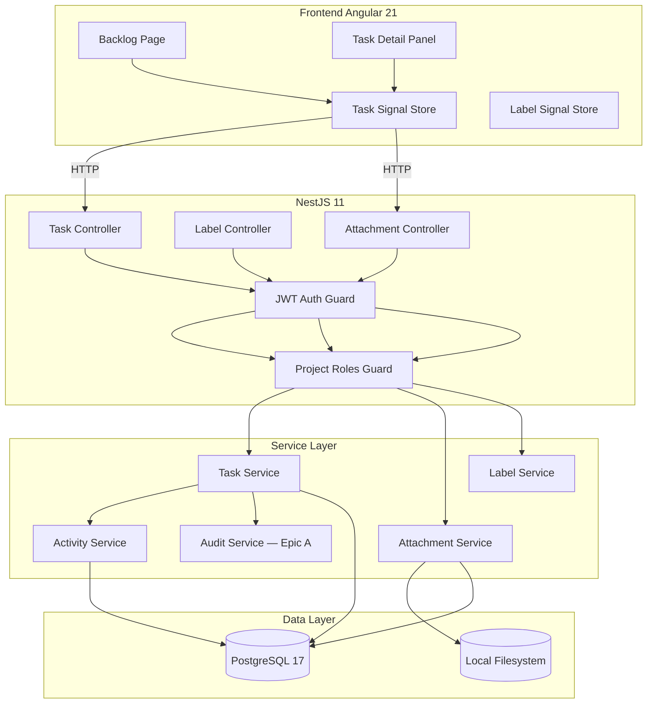

# Design: Task Management (Epic B)

## Overview

Tài liệu thiết kế kỹ thuật cho **Task Management (Epic B)** của Agile PM. Module này cung cấp Work Item đầy đủ tương đương Plane.so: CRUD theo hierarchy, Backlog với drag & drop + Group by + Order by, Task Detail Panel với auto-save, multiple assignees, attachments, external links, task relations và comments.

### Quyết định thiết kế chính

| Quyết định | Lựa chọn | Lý do |
|-----------|----------|-------|
| Assignees | `task_assignees` join table | Multiple assignees như Plane; đảm bảo N:M flexibility |
| Priority naming | `urgent/high/medium/low/none` | Match Plane's naming convention |
| Task storage | Một bảng `tasks` + self-reference `parent_id` | Tránh multi-table join; hierarchy tối đa 4 cấp |
| Backlog ordering | Float `backlog_order` midpoint | Insert O(1); rebalance khi gap < 0.001 |
| Relations | `task_relations` với bidirectional auto-create | blocking↔blocked_by tự động tạo cặp |
| Attachments | Local filesystem (path `uploads/`) | MVP; roadmap Phase 3 → S3 |
| Comments + Activity | Cùng timeline, phân biệt bằng `entry_type` | UX thống nhất như Plane's Activity tab |
| Estimate | `estimate_value NUMERIC` + project-level `estimate_type` | Linh hoạt Points/Categories/Time; Epic B mặc định Points |
| Auto-save | Debounced field-level PATCH, optimistic UI | UX liền mạch, không cần nút Save |
| Search | PostgreSQL GIN index trên `title` | Đủ 5,000 tasks/project; tránh Elasticsearch dependency |

## Architecture

### High-Level Architecture



## Data Model

### Bảng `tasks`

```sql
CREATE TYPE task_type_enum     AS ENUM ('epic', 'story', 'task', 'subtask');
CREATE TYPE task_state_enum    AS ENUM ('backlog', 'todo', 'in_progress', 'in_review', 'done', 'cancelled');
CREATE TYPE task_priority_enum AS ENUM ('urgent', 'high', 'medium', 'low', 'none');

CREATE TABLE tasks (
    id              UUID PRIMARY KEY DEFAULT gen_random_uuid(),
    task_id         VARCHAR(20)  NOT NULL,         -- "MPM-42"
    project_id      UUID         NOT NULL REFERENCES projects(id) ON DELETE CASCADE,
    parent_id       UUID         REFERENCES tasks(id) ON DELETE CASCADE,
    type            task_type_enum  NOT NULL DEFAULT 'task',
    title           VARCHAR(255) NOT NULL,
    description     TEXT,                           -- Markdown
    state           task_state_enum  NOT NULL DEFAULT 'backlog',
    priority        task_priority_enum NOT NULL DEFAULT 'none',
    estimate_value  NUMERIC(6,1),                  -- Points: 0, 0.5, 1, 2, 3, 5, 8, 13, 21
    reporter_id     UUID         NOT NULL REFERENCES users(id) ON DELETE RESTRICT,
    cycle_id        UUID,                           -- NULL = Backlog; FK thêm ở Epic C
    backlog_order   DOUBLE PRECISION NOT NULL DEFAULT 0,
    start_date      DATE,
    due_date        DATE,
    completed_at    TIMESTAMPTZ,
    created_at      TIMESTAMPTZ  NOT NULL DEFAULT now(),
    updated_at      TIMESTAMPTZ  NOT NULL DEFAULT now(),
    CONSTRAINT chk_date_range CHECK (start_date IS NULL OR due_date IS NULL OR start_date <= due_date)
);

CREATE UNIQUE INDEX idx_tasks_task_id_project   ON tasks(project_id, task_id);
CREATE INDEX idx_tasks_project_id              ON tasks(project_id);
CREATE INDEX idx_tasks_parent_id               ON tasks(parent_id);
CREATE INDEX idx_tasks_state                   ON tasks(project_id, state);
CREATE INDEX idx_tasks_priority                ON tasks(project_id, priority);
CREATE INDEX idx_tasks_cycle                   ON tasks(cycle_id);
CREATE INDEX idx_tasks_backlog_order           ON tasks(project_id, backlog_order) WHERE cycle_id IS NULL;
CREATE INDEX idx_tasks_due_date                ON tasks(project_id, due_date);
CREATE INDEX idx_tasks_title_search            ON tasks USING gin(to_tsvector('simple', title));
```

### Bảng `task_assignees`

```sql
CREATE TABLE task_assignees (
    task_id UUID NOT NULL REFERENCES tasks(id) ON DELETE CASCADE,
    user_id UUID NOT NULL REFERENCES users(id) ON DELETE CASCADE,
    assigned_at TIMESTAMPTZ NOT NULL DEFAULT now(),
    PRIMARY KEY (task_id, user_id)
);

CREATE INDEX idx_task_assignees_user ON task_assignees(user_id);
```

### Bảng `labels`

```sql
CREATE TABLE labels (
    id          UUID PRIMARY KEY DEFAULT gen_random_uuid(),
    project_id  UUID        NOT NULL REFERENCES projects(id) ON DELETE CASCADE,
    name        VARCHAR(50) NOT NULL,
    color       CHAR(7)     NOT NULL DEFAULT '#6B7280',  -- hex #RRGGBB
    created_at  TIMESTAMPTZ NOT NULL DEFAULT now(),
    UNIQUE(project_id, name)
);

CREATE INDEX idx_labels_project ON labels(project_id);
```

### Bảng `task_labels`

```sql
CREATE TABLE task_labels (
    task_id  UUID NOT NULL REFERENCES tasks(id) ON DELETE CASCADE,
    label_id UUID NOT NULL REFERENCES labels(id) ON DELETE CASCADE,
    PRIMARY KEY (task_id, label_id)
);
```

### Bảng `task_attachments`

```sql
CREATE TABLE task_attachments (
    id            UUID PRIMARY KEY DEFAULT gen_random_uuid(),
    task_id       UUID          NOT NULL REFERENCES tasks(id) ON DELETE CASCADE,
    file_name     VARCHAR(255)  NOT NULL,
    file_size     BIGINT        NOT NULL,   -- bytes
    mime_type     VARCHAR(100)  NOT NULL,
    storage_path  VARCHAR(1000) NOT NULL,   -- relative path: uploads/projects/{pid}/tasks/{tid}/{uuid}_{name}
    uploaded_by   UUID          NOT NULL REFERENCES users(id) ON DELETE RESTRICT,
    created_at    TIMESTAMPTZ   NOT NULL DEFAULT now()
);

CREATE INDEX idx_task_attachments_task ON task_attachments(task_id);
```

### Bảng `task_links`

```sql
CREATE TABLE task_links (
    id          UUID PRIMARY KEY DEFAULT gen_random_uuid(),
    task_id     UUID          NOT NULL REFERENCES tasks(id) ON DELETE CASCADE,
    url         VARCHAR(2048) NOT NULL,
    title       VARCHAR(255),
    created_by  UUID          NOT NULL REFERENCES users(id) ON DELETE RESTRICT,
    created_at  TIMESTAMPTZ   NOT NULL DEFAULT now()
);

CREATE INDEX idx_task_links_task ON task_links(task_id);
```

### Bảng `task_relations`

```sql
CREATE TYPE task_relation_type_enum AS ENUM ('blocking', 'blocked_by', 'relates_to', 'duplicate_of');

CREATE TABLE task_relations (
    id              UUID PRIMARY KEY DEFAULT gen_random_uuid(),
    source_task_id  UUID NOT NULL REFERENCES tasks(id) ON DELETE CASCADE,
    target_task_id  UUID NOT NULL REFERENCES tasks(id) ON DELETE CASCADE,
    relation_type   task_relation_type_enum NOT NULL,
    created_by      UUID NOT NULL REFERENCES users(id) ON DELETE RESTRICT,
    created_at      TIMESTAMPTZ NOT NULL DEFAULT now(),
    UNIQUE(source_task_id, target_task_id, relation_type)
);

CREATE INDEX idx_task_relations_source ON task_relations(source_task_id);
CREATE INDEX idx_task_relations_target ON task_relations(target_task_id);
```

### Bảng `task_activity` (comments + activity log)

```sql
CREATE TYPE task_activity_type_enum AS ENUM (
    'created', 'state_changed', 'priority_changed', 'title_changed', 'description_changed',
    'type_changed', 'assignee_added', 'assignee_removed', 'label_added', 'label_removed',
    'estimate_changed', 'start_date_changed', 'due_date_changed', 'parent_changed',
    'attachment_added', 'attachment_removed', 'link_added', 'link_removed',
    'relation_added', 'relation_removed', 'comment_added', 'comment_edited', 'comment_deleted',
    'moved_to_cycle', 'removed_from_cycle'
);

CREATE TABLE task_activity (
    id          UUID PRIMARY KEY DEFAULT gen_random_uuid(),
    task_id     UUID NOT NULL REFERENCES tasks(id) ON DELETE CASCADE,
    actor_id    UUID NOT NULL REFERENCES users(id) ON DELETE RESTRICT,
    entry_type  task_activity_type_enum NOT NULL,
    -- Cho activity: field changed
    field       VARCHAR(100),
    old_value   TEXT,
    new_value   TEXT,
    -- Cho comment: content
    comment     TEXT,                  -- NULL nếu là activity, có nội dung nếu là comment
    updated_at  TIMESTAMPTZ,           -- NULL nếu comment chưa bị sửa
    created_at  TIMESTAMPTZ NOT NULL DEFAULT now()
);

CREATE INDEX idx_task_activity_task ON task_activity(task_id, created_at DESC);
CREATE INDEX idx_task_activity_actor ON task_activity(actor_id);
```

### Cập nhật audit_event_type_enum

```sql
ALTER TYPE audit_event_type_enum ADD VALUE IF NOT EXISTS 'task_created';
ALTER TYPE audit_event_type_enum ADD VALUE IF NOT EXISTS 'task_updated';
ALTER TYPE audit_event_type_enum ADD VALUE IF NOT EXISTS 'task_deleted';
ALTER TYPE audit_event_type_enum ADD VALUE IF NOT EXISTS 'task_reordered';
ALTER TYPE audit_event_type_enum ADD VALUE IF NOT EXISTS 'label_created';
ALTER TYPE audit_event_type_enum ADD VALUE IF NOT EXISTS 'label_deleted';
```

## API Contracts

### Task Endpoints

#### `POST /api/projects/:projectId/tasks`

**Guards:** `@JwtAuth`, `@ProjectRoles('Scrum_Master','Product_Owner','Developer','QA')`

**Request:**
```json
{
  "title": "Implement login page",
  "description": "## Mô tả\nChi tiết...",
  "type": "task",
  "state": "backlog",
  "priority": "high",
  "parentId": "uuid-story",
  "assigneeIds": ["uuid-user-1", "uuid-user-2"],
  "labelIds": ["uuid-label"],
  "estimateValue": 3,
  "startDate": "2026-06-10",
  "dueDate": "2026-06-20"
}
```

**Response (201):** TaskDetailResponse (xem schema bên dưới)

**Errors:**
| Code | Error | Khi nào |
|------|-------|---------|
| 400 | validation errors | Title rỗng, field không hợp lệ |
| 403 | FORBIDDEN | Stakeholder hoặc non-member |
| 422 | INVALID_PARENT | parent_id không tồn tại hoặc khác project |
| 422 | INVALID_HIERARCHY | Vi phạm hierarchy rules |
| 422 | ASSIGNEE_NOT_MEMBER | Assignee không phải member |
| 422 | INVALID_DATE_RANGE | start_date > due_date |

---

#### `GET /api/projects/:projectId/tasks`

**Guards:** `@JwtAuth`, member check

**Query params:**
| Param | Type | Mô tả |
|-------|------|-------|
| `cycleId` | `uuid\|null` | `null` = backlog |
| `type` | `epic,story,task,subtask` | comma-separated |
| `state` | `backlog,todo,...` | comma-separated |
| `priority` | `urgent,high,...` | comma-separated |
| `assigneeId` | `uuid` | comma-separated |
| `labelId` | `uuid` | comma-separated |
| `search` | `string` | GIN search trên title |
| `groupBy` | `state,priority,label,assignee,none` | — |
| `orderBy` | `rank,created_at,updated_at,start_date,due_date,priority` | — |
| `page` | `number` | default 1 |
| `limit` | `number` | default 50, max 200 |

**Response (200):**
```json
{
  "data": [
    {
      "id": "uuid",
      "taskId": "MPM-42",
      "type": "task",
      "title": "Implement login page",
      "state": "in_progress",
      "priority": "high",
      "assignees": [
        { "id": "uuid", "displayName": "Alice", "avatarUrl": "..." }
      ],
      "labels": [{ "id": "uuid", "name": "frontend", "color": "#3B82F6" }],
      "estimateValue": 3,
      "startDate": "2026-06-10",
      "dueDate": "2026-06-20",
      "parentId": "uuid",
      "backlogOrder": 1024.0,
      "subItemCount": 2,
      "attachmentCount": 1,
      "linkCount": 0,
      "createdAt": "2026-06-02T10:00:00Z",
      "updatedAt": "2026-06-02T10:00:00Z"
    }
  ],
  "total": 124,
  "page": 1,
  "limit": 50
}
```

---

#### `GET /api/projects/:projectId/tasks/:taskId`

Resolve UUID hoặc Task_ID dạng `MPM-42`.

**Response (200):** TaskDetailResponse với đầy đủ relations, assignees, labels, attachments, links.

---

#### `PATCH /api/projects/:projectId/tasks/:taskId`

Partial update — dùng cho auto-save.

**Guards:** `@JwtAuth`, `@ProjectRoles('Scrum_Master','Product_Owner','Developer','QA')`

**Request:** Subset của CreateTaskDto (tất cả optional)

**Response (200):** TaskDetailResponse updated

---

#### `PATCH /api/projects/:projectId/tasks/reorder`

**Guards:** `@JwtAuth`, `@ProjectRoles('Scrum_Master','Product_Owner')`

**Request:** `{ "items": [{ "taskId": "uuid", "backlogOrder": 512.0 }] }`

**Response (200):** `{ "updated": 3 }`

---

#### `DELETE /api/projects/:projectId/tasks/:taskId`

**Guards:** `@JwtAuth`, `@ProjectRoles('Scrum_Master','Product_Owner')`

**Response (200):** `{ "deletedCount": 5, "deletedTaskIds": ["MPM-42", "MPM-43"] }`

---

#### `DELETE /api/projects/:projectId/tasks` (bulk)

**Request:** `{ "taskIds": ["uuid-1", "uuid-2"] }`

**Response (200):** `{ "succeeded": ["MPM-1"], "failed": [{"taskId": "MPM-2", "reason": "NOT_FOUND"}] }`

---

### Attachment Endpoints

#### `POST /api/projects/:projectId/tasks/:taskId/attachments`

Multipart form-data upload.

**Guards:** `@JwtAuth`, `@ProjectRoles('Scrum_Master','Product_Owner','Developer','QA')`

**Request:** `Content-Type: multipart/form-data` với field `file`

**Response (201):**
```json
{
  "id": "uuid",
  "fileName": "design.pdf",
  "fileSize": 204800,
  "mimeType": "application/pdf",
  "url": "/api/projects/:projectId/tasks/:taskId/attachments/uuid",
  "uploadedBy": { "id": "uuid", "displayName": "Alice" },
  "createdAt": "2026-06-02T10:00:00Z"
}
```

**Errors:** 413 (file > 20MB), 415 (unsupported type), 422 (đã đủ 20 attachments)

---

#### `GET /api/projects/:projectId/tasks/:taskId/attachments/:attachmentId`

Trả về file binary (stream).

---

#### `DELETE /api/projects/:projectId/tasks/:taskId/attachments/:attachmentId`

---

### Link Endpoints

#### `POST /api/projects/:projectId/tasks/:taskId/links`

**Request:** `{ "url": "https://figma.com/...", "title": "Figma Design" }`

**Response (201):** LinkResponse

---

#### `DELETE /api/projects/:projectId/tasks/:taskId/links/:linkId`

---

### Relation Endpoints

#### `POST /api/projects/:projectId/tasks/:taskId/relations`

**Request:** `{ "targetTaskId": "uuid", "relationType": "blocking" }`

**Response (201):** `{ "id": "uuid", "sourceTaskId": "...", "targetTaskId": "...", "relationType": "blocking" }`

**Errors:** 422 CIRCULAR_DEPENDENCY, 409 RELATION_EXISTS

---

#### `DELETE /api/projects/:projectId/tasks/:taskId/relations/:relationId`

Xóa cả relation ngược tự động.

---

### Comment Endpoints

#### `POST /api/projects/:projectId/tasks/:taskId/comments`

**Guards:** `@JwtAuth`, member check (tất cả roles kể cả Stakeholder)

**Request:** `{ "content": "Markdown content..." }`

**Response (201):** ActivityEntry với `entry_type: 'comment_added'`

---

#### `PATCH /api/projects/:projectId/tasks/:taskId/comments/:commentId`

Chỉ actor hoặc Scrum_Master/Admin.

**Request:** `{ "content": "Updated content..." }`

---

#### `DELETE /api/projects/:projectId/tasks/:taskId/comments/:commentId`

---

### Activity Endpoint

#### `GET /api/projects/:projectId/tasks/:taskId/activity`

Trả về timeline kết hợp activities + comments theo thứ tự `created_at DESC`.

**Query:** `page`, `limit` (default 50)

**Response (200):**
```json
{
  "data": [
    {
      "id": "uuid",
      "entryType": "state_changed",
      "actor": { "id": "uuid", "displayName": "Alice", "avatarUrl": "..." },
      "field": "state",
      "oldValue": "todo",
      "newValue": "in_progress",
      "comment": null,
      "createdAt": "2026-06-02T11:00:00Z"
    },
    {
      "id": "uuid",
      "entryType": "comment_added",
      "actor": { "id": "uuid", "displayName": "Bob", "avatarUrl": "..." },
      "comment": "Đã xem xét yêu cầu, sẽ bắt đầu ngay.",
      "updatedAt": null,
      "createdAt": "2026-06-02T10:30:00Z"
    }
  ],
  "total": 23
}
```

---

### Label Endpoints

#### `GET /api/projects/:projectId/labels`
#### `POST /api/projects/:projectId/labels` — `{ "name": "bug", "color": "#EF4444" }`
#### `PATCH /api/projects/:projectId/labels/:labelId` — update name/color
#### `DELETE /api/projects/:projectId/labels/:labelId`

## Business Logic

### Hierarchy Validation

```
epic    → parent: NULL only
story   → parent: epic | NULL (top-level story allowed)
task    → parent: story | NULL (top-level task allowed)
subtask → parent: task only
```

Detect cycle: khi set `parent_id = X`, traverse ancestors của X tối đa 4 cấp; nếu gặp chính task hiện tại → HTTP 422 `CIRCULAR_REFERENCE`.

### Bidirectional Relations

```
blocking   ↔ blocked_by  (tự động tạo cặp)
duplicate_of ↔ duplicate_of  (tự động tạo cặp)
relates_to   → NOT bidirectional (A relates_to B ≠ B relates_to A)
```

Khi xóa một relation trong cặp bidirectional → xóa cả relation còn lại.

### Atomic Task_ID Generation

```typescript
await this.dataSource.transaction(async (em) => {
  const project = await em.findOne(Project, {
    where: { id: projectId },
    lock: { mode: 'pessimistic_write' },
  });
  const newCounter = project.taskCounter + 1;
  await em.update(Project, projectId, { taskCounter: newCounter });
  const task = em.create(Task, {
    ...dto,
    taskId: `${project.key}-${newCounter}`,
  });
  return em.save(task);
});
```

### Backlog Order — Midpoint Strategy

```
Thêm task mới vào cuối:  new_order = MAX(backlog_order) + 1024
Insert giữa prev và next: new_order = (prev + next) / 2
Rebalance khi gap < 0.001: renumber toàn bộ bước 1024, async (không block response)
```

### Auto-save — Frontend Pattern

```typescript
// Mỗi field trong TaskDetailPanel
this.fieldControl.valueChanges.pipe(
  debounceTime(field === 'description' ? 1000 : 500),
  distinctUntilChanged(),
  switchMap(value =>
    this.taskService.updateTask(this.taskId, { [fieldName]: value })
  ),
  takeUntilDestroyed(this.destroyRef),
).subscribe({
  next: () => this.saveStatus.set('saved'),
  error: (err) => {
    this.saveStatus.set('error');
    this.fieldControl.setValue(this.previousValue, { emitEvent: false });
    this.toastService.error('Không lưu được thay đổi');
  }
});
```

## Security Considerations

- **IDOR**: Mọi query task đều filter `project_id = :projectId` để tránh cross-project access
- **File upload**: Validate MIME type bằng magic bytes (không chỉ extension), giới hạn 20MB, store ngoài web root
- **Path traversal**: Storage path được generate bằng UUID, không dùng filename gốc làm path
- **Comment XSS**: Content được render Markdown phía client; sanitize HTML output bằng DOMPurify trước khi insert vào DOM
- **URL validation**: Task links phải pass URL parse + scheme whitelist `['http', 'https']`

## Performance Considerations

- **Backlog query**: Partial index `WHERE cycle_id IS NULL` cho backlog load
- **Eager load**: Mỗi task list item eager-load assignees và labels (JOIN) — tránh N+1
- **Attachment streaming**: Dùng `res.sendFile()` hoặc stream để không load toàn bộ file vào memory
- **Activity pagination**: Default 50 per page, không load toàn bộ history
- **GIN search**: Index `to_tsvector('simple', title)` — đủ nhanh cho 5,000 tasks

## Dependencies

- **Epic A**: `ProjectModule`, `AuditModule`, `AuthModule` (JwtAuthGuard, ProjectRolesGuard, User entity)
- **Frontend libs mới**: `ngx-markdown` + `marked` (Markdown render), `dompurify` (XSS sanitize), Angular CDK DragDrop (built-in trong `@angular/cdk`)
- **Backend libs mới**: `multer` (file upload trong NestJS), `file-type` (validate magic bytes)
- **PrimeNG components**: `p-drawer` (slide-over panel), `p-fileUpload`, `p-timeline` (activity stream), `p-mention` (comment @mention)

## Migration Plan

Một file migration mới: `CreateTaskManagementTables`

```
Order tạo tables:
  1. task_type_enum, task_state_enum, task_priority_enum
  2. task_relation_type_enum, task_activity_type_enum
  3. tasks (self-reference parent_id → defer FK hoặc dùng DEFERRABLE)
  4. task_assignees
  5. labels
  6. task_labels
  7. task_attachments
  8. task_links
  9. task_relations
  10. task_activity
  11. ALTER TYPE audit_event_type_enum ADD VALUE ... (6 events)
  12. CREATE all indexes
```

`down()` drop ngược: indexes → activity → relations → links → attachments → task_labels → labels → task_assignees → tasks → enums.

Không breaking change với Epic A. Cột `cycle_id` trong `tasks` chưa có FK constraint (sẽ thêm ở Epic C — Sprint/Cycle Management).
