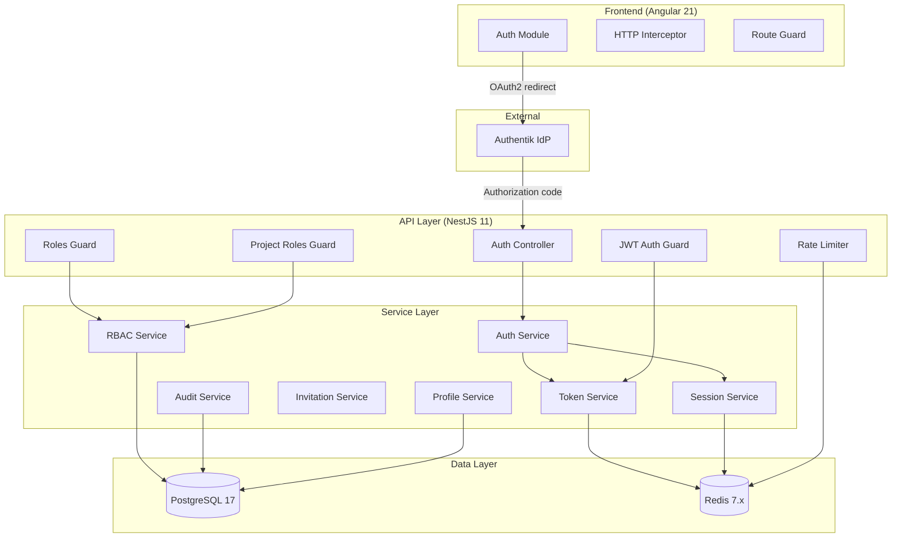
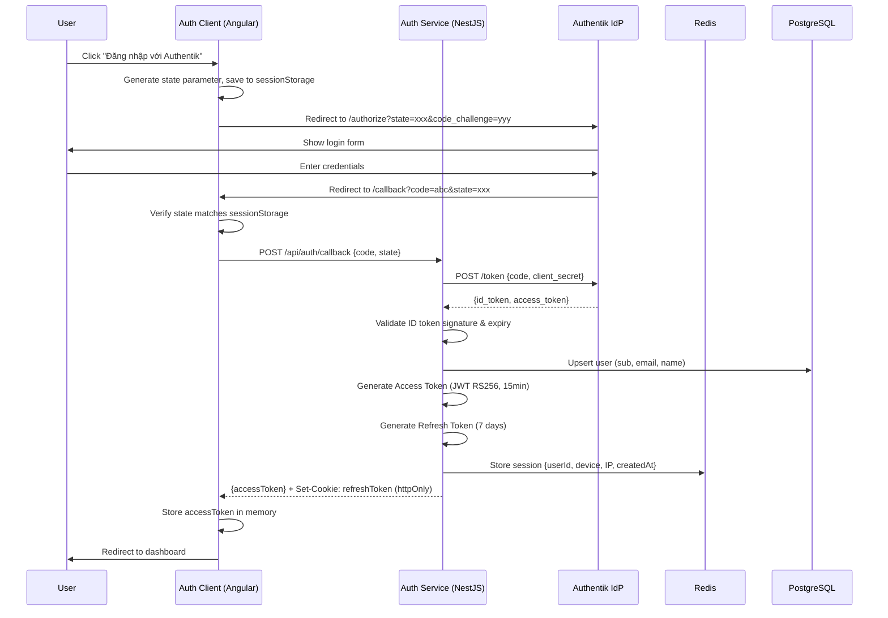
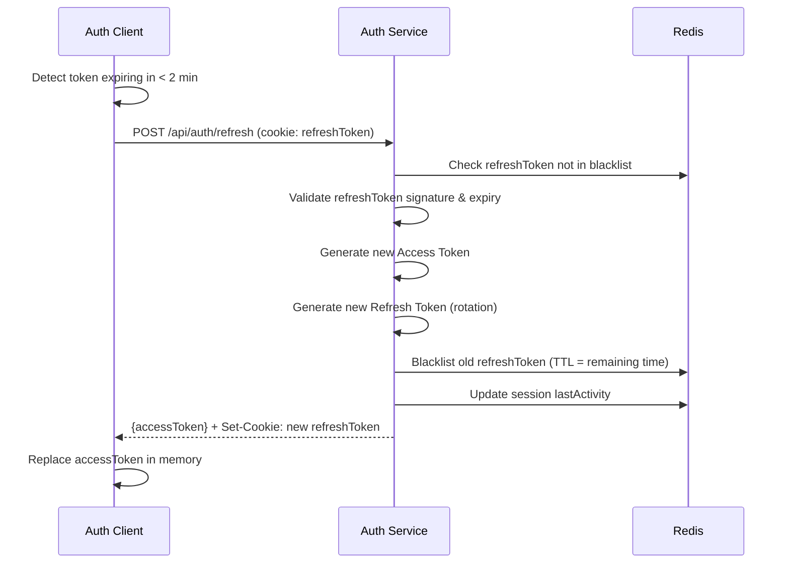
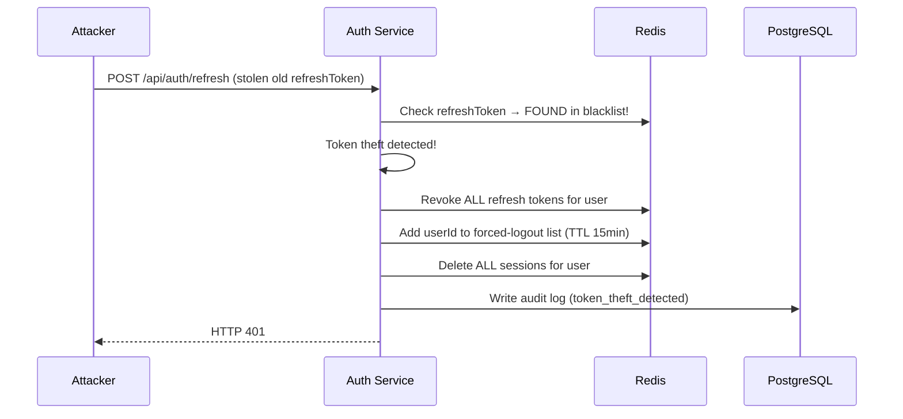
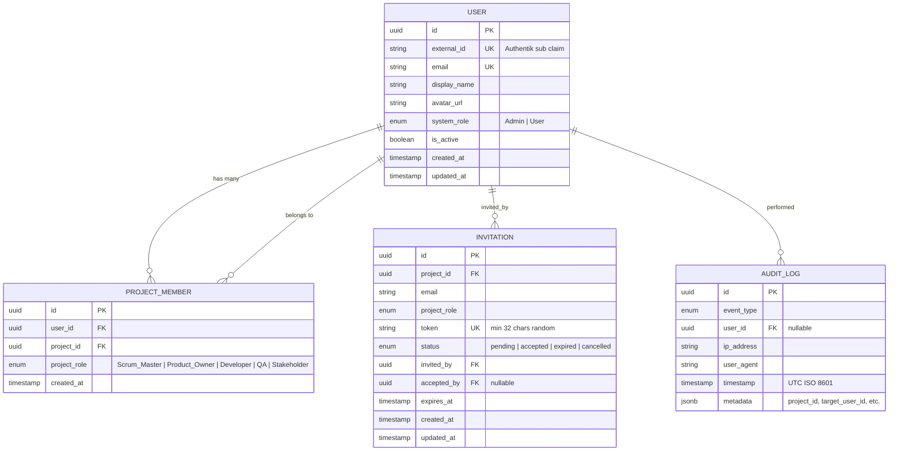

# Design Document: User Authentication & Authorization

## Overview

Tài liệu thiết kế kỹ thuật cho tính năng **User Authentication & Authorization** của Agile PM. Hệ thống sử dụng Authentik làm Identity Provider (OAuth2/OIDC), NestJS backend xử lý token management và authorization, Angular frontend quản lý session phía client.

### Mục tiêu thiết kế

- **Single Sign-On**: Xác thực tập trung qua Authentik, không quản lý password trong ứng dụng
- **Stateless API**: JWT Access Token cho phép xác thực mỗi request mà không cần tra cứu database
- **Token Rotation**: Refresh Token rotation với phát hiện token theft
- **RBAC hai cấp**: System-level (Admin/User) và Project-level (5 roles với permission matrix)
- **Defense in Depth**: Rate limiting, audit logging, secure token storage, CORS, HSTS

### Quyết định thiết kế chính

| Quyết định | Lựa chọn | Lý do |
|-----------|----------|-------|
| Token signing | RS256 (asymmetric) | Cho phép verify token mà không cần private key; hỗ trợ key rotation |
| Session storage | Redis | TTL tự động, performance cao cho lookup, hỗ trợ pub/sub cho invalidation |
| Token storage (client) | Memory + httpOnly cookie | Chống XSS (memory), chống CSRF (SameSite=Strict) |
| RBAC model | Permission matrix | Linh hoạt, dễ mở rộng thêm role/resource mà không đổi code |
| Audit log storage | PostgreSQL | Cần query phức tạp (filter, pagination), retention policy, ACID |
| Rate limiting | Redis counter (sliding window) | Atomic operations, TTL tự động, shared state giữa instances |

## Architecture

### High-Level Architecture



### Sequence Diagram: Login Flow (OAuth2 Authorization Code)



### Sequence Diagram: Token Refresh



### Sequence Diagram: Session Invalidation (Token Theft Detection)



## Components and Interfaces

### Backend Modules (NestJS)

```
apps/backend/src/
├── auth/
│   ├── auth.module.ts
│   ├── auth.controller.ts          # Login, callback, refresh, logout endpoints
│   ├── auth.service.ts             # Orchestrates auth flow
│   ├── token.service.ts            # JWT sign/verify, token generation
│   ├── session.service.ts          # Redis session management
│   ├── strategies/
│   │   └── jwt.strategy.ts         # Passport JWT strategy (RS256)
│   ├── guards/
│   │   ├── jwt-auth.guard.ts       # Validates Access Token
│   │   ├── roles.guard.ts          # System role check
│   │   └── project-roles.guard.ts  # Project role + permission matrix check
│   ├── decorators/
│   │   ├── roles.decorator.ts      # @Roles('Admin')
│   │   ├── project-roles.decorator.ts  # @ProjectRoles('Scrum_Master')
│   │   ├── public.decorator.ts     # @Public()
│   │   └── current-user.decorator.ts   # @CurrentUser()
│   ├── dto/
│   │   ├── auth-callback.dto.ts
│   │   ├── login-response.dto.ts
│   │   └── session-list.dto.ts
│   ├── entities/
│   │   ├── user.entity.ts
│   │   ├── project-member.entity.ts
│   │   └── audit-log.entity.ts
│   ├── interfaces/
│   │   ├── jwt-payload.interface.ts
│   │   ├── session-data.interface.ts
│   │   └── permission-matrix.interface.ts
│   └── constants/
│       ├── permission-matrix.ts     # Role → Resource → Actions mapping
│       └── auth-events.ts           # Audit event types
├── invitation/
│   ├── invitation.module.ts
│   ├── invitation.controller.ts
│   ├── invitation.service.ts
│   ├── dto/
│   │   ├── create-invitation.dto.ts
│   │   └── invitation-response.dto.ts
│   └── entities/
│       └── invitation.entity.ts
├── profile/
│   ├── profile.module.ts
│   ├── profile.controller.ts
│   ├── profile.service.ts
│   └── dto/
│       ├── update-profile.dto.ts
│       └── profile-response.dto.ts
├── audit/
│   ├── audit.module.ts
│   ├── audit.controller.ts
│   ├── audit.service.ts
│   └── dto/
│       └── audit-query.dto.ts
└── rate-limit/
    ├── rate-limit.module.ts
    ├── rate-limit.guard.ts
    └── rate-limit.service.ts
```

### Frontend Components (Angular)

```
apps/frontend/src/app/
├── auth/
│   ├── auth.routes.ts               # Lazy-loaded routes
│   ├── pages/
│   │   ├── login/
│   │   │   └── login.component.ts   # Login page with SSO button
│   │   └── callback/
│   │       └── callback.component.ts # OAuth callback handler
│   ├── services/
│   │   ├── auth.service.ts          # Auth state, login/logout
│   │   ├── token.service.ts         # Token storage (memory), refresh logic
│   │   └── session.service.ts       # Session list management
│   ├── interceptors/
│   │   └── auth.interceptor.ts      # Attach Bearer token, handle 401
│   ├── guards/
│   │   ├── auth.guard.ts            # Route protection
│   │   └── role.guard.ts            # Role-based route protection
│   └── state/
│       └── auth.store.ts            # Signal-based auth state
```

### API Endpoints

#### Auth Controller (`/api/auth`)

| Method | Path | Auth | Description |
|--------|------|------|-------------|
| GET | `/api/auth/login` | Public | Redirect to Authentik authorize URL |
| POST | `/api/auth/callback` | Public | Exchange authorization code for tokens |
| POST | `/api/auth/refresh` | Cookie | Refresh token rotation |
| POST | `/api/auth/logout` | Bearer | Logout, revoke session |
| GET | `/api/auth/sessions` | Bearer | List active sessions |
| DELETE | `/api/auth/sessions/:sessionId` | Bearer | Revoke specific session |

#### Profile Controller (`/api/profile`)

| Method | Path | Auth | Description |
|--------|------|------|-------------|
| GET | `/api/profile` | Bearer | Get current user profile |
| PATCH | `/api/profile` | Bearer | Update display name / avatar |

#### Invitation Controller (`/api/projects/:projectId/invitations`)

| Method | Path | Auth | Roles |
|--------|------|------|-------|
| POST | `/api/projects/:projectId/invitations` | Bearer | Admin, Scrum_Master |
| GET | `/api/projects/:projectId/invitations` | Bearer | Admin, Scrum_Master, Product_Owner |
| POST | `/api/invitations/:token/accept` | Bearer | Any authenticated |
| DELETE | `/api/projects/:projectId/invitations/:id` | Bearer | Admin, Scrum_Master |

#### Admin Controller (`/api/admin`)

| Method | Path | Auth | Roles |
|--------|------|------|-------|
| GET | `/api/admin/users` | Bearer | Admin |
| PATCH | `/api/admin/users/:id/role` | Bearer | Admin |
| POST | `/api/admin/users/:id/disable` | Bearer | Admin |
| GET | `/api/admin/audit-logs` | Bearer | Admin |

### Key Interfaces

```typescript
// JWT Payload
interface JwtPayload {
  sub: string;          // User ID (UUID)
  email: string;
  systemRole: SystemRole;
  projectRoles: ProjectRoleEntry[];
  iat: number;
  exp: number;
}

interface ProjectRoleEntry {
  projectId: string;
  role: ProjectRole;
}

// Session Data (stored in Redis)
interface SessionData {
  sessionId: string;
  userId: string;
  deviceInfo: string;
  ipAddress: string;
  createdAt: string;      // ISO 8601
  lastActivity: string;   // ISO 8601
  refreshTokenHash: string;
}

// Permission Matrix
type PermissionMatrix = Record<ProjectRole, Record<Resource, Action[]>>;

type ProjectRole = 'Scrum_Master' | 'Product_Owner' | 'Developer' | 'QA' | 'Stakeholder';
type SystemRole = 'Admin' | 'User';
type Resource = 'task' | 'sprint' | 'document' | 'member';
type Action = 'create' | 'read' | 'update' | 'delete';
```

### Permission Matrix

| Role | Task | Sprint | Document | Member |
|------|------|--------|----------|--------|
| Scrum_Master | CRUD | CRUD | CRUD | CRUD |
| Product_Owner | CRUD | CRUD | CRUD | R |
| Developer | CRU | R | CRU | R |
| QA | CRU | R | CRU | R |
| Stakeholder | R | R | R | R |

## Data Models

### Entity Relationship Diagram



### Redis Data Structures

| Key Pattern | Type | TTL | Description |
|-------------|------|-----|-------------|
| `session:{userId}:{sessionId}` | Hash | 7 days | Session data |
| `refresh_blacklist:{tokenHash}` | String | Remaining token TTL | Revoked refresh tokens |
| `forced_logout:{userId}` | String | 15 min | Force-logout flag |
| `rate:login:{ip}` | String (counter) | 15 min | Login attempt counter |
| `rate:refresh:{userId}` | String (counter) | 1 min | Refresh attempt counter |

### PostgreSQL Indexes

```sql
-- User table
CREATE UNIQUE INDEX idx_user_external_id ON users(external_id);
CREATE UNIQUE INDEX idx_user_email ON users(email);

-- Project Member table
CREATE UNIQUE INDEX idx_project_member_unique ON project_members(user_id, project_id);
CREATE INDEX idx_project_member_project ON project_members(project_id);

-- Invitation table
CREATE UNIQUE INDEX idx_invitation_token ON invitations(token);
CREATE INDEX idx_invitation_project_status ON invitations(project_id, status);
CREATE INDEX idx_invitation_email_project ON invitations(email, project_id);

-- Audit Log table
CREATE INDEX idx_audit_log_user ON audit_logs(user_id);
CREATE INDEX idx_audit_log_event_type ON audit_logs(event_type);
CREATE INDEX idx_audit_log_timestamp ON audit_logs(timestamp);
CREATE INDEX idx_audit_log_composite ON audit_logs(user_id, event_type, timestamp);
```


## Correctness Properties

*A property is a characteristic or behavior that should hold true across all valid executions of a system — essentially, a formal statement about what the system should do. Properties serve as the bridge between human-readable specifications and machine-verifiable correctness guarantees.*

### Property 1: JWT Payload Round-Trip

*For any* valid JWT payload (containing sub, email, systemRole, projectRoles, iat, exp), signing the payload with RS256 then verifying and decoding the token should produce claims identical to the original payload.

**Validates: Requirements 3.7**

### Property 2: JWT Contains All Required Claims

*For any* valid user with a systemRole and zero or more projectRoles, the generated Access Token should contain exactly the fields: sub (matching user ID), email, systemRole, projectRoles (array of {projectId, role}), iat (issuance timestamp), and exp (expiration timestamp = iat + 15 minutes).

**Validates: Requirements 1.5, 3.2**

### Property 3: Invalid Token Rejection

*For any* JWT where the signature has been tampered with, or the exp claim is in the past, or the token is malformed, the token validation function should return a failure result (never succeed).

**Validates: Requirements 1.8, 8.3**

### Property 4: Token Rotation Produces New Valid Pair and Blacklists Old

*For any* valid refresh token that is not expired and not blacklisted, performing a refresh operation should: (a) produce a new valid access token with updated iat/exp, (b) produce a new refresh token different from the old one, and (c) add the old refresh token to the blacklist.

**Validates: Requirements 3.4**

### Property 5: Revoked Refresh Token Reuse Triggers Full Invalidation

*For any* refresh token that has been revoked (exists in blacklist), attempting to use it should result in: all sessions for that user being deleted, the user being added to the forced-logout list, and an audit log entry with event_type "token_theft_detected".

**Validates: Requirements 3.5, 11.3**

### Property 6: Permission Matrix Correctness

*For any* (projectRole, resource, action) tuple, the permission check function should return true if and only if the action is in the allowed actions list for that role and resource as defined in the matrix: Stakeholder has only read on all resources; Developer and QA have create/read/update on task and document, read on sprint and member; Product_Owner has CRUD on task/sprint/document and read on member; Scrum_Master has CRUD on all resources.

**Validates: Requirements 5.4, 5.5**

### Property 7: System Role Guard Enforcement

*For any* (user, endpoint) pair where the endpoint requires Admin role, access should be granted if and only if user.systemRole equals Admin. A user with systemRole=User should always be denied with HTTP 403.

**Validates: Requirements 4.1, 4.5**

### Property 8: Project Role Guard Enforcement

*For any* authenticated user and project-scoped endpoint requiring specific ProjectRoles, access should be granted if and only if the user has one of the required roles in the specified project. Users without any role in the project should be denied with HTTP 403.

**Validates: Requirements 5.6, 8.4, 8.8**

### Property 9: @Public Decorator Bypasses Authentication

*For any* endpoint decorated with @Public(), requests should be allowed regardless of whether an Authorization header is present, absent, or contains an invalid token.

**Validates: Requirements 8.7**

### Property 10: Session Revocation Removes Access

*For any* active session, after revocation (whether by user logout, admin action, or specific session delete), the session should no longer exist in Redis and the associated refresh token should be in the blacklist.

**Validates: Requirements 2.1, 2.5**

### Property 11: Security Event Triggers Full Session Invalidation

*For any* user with N active sessions (N ≥ 1), when a security event occurs (password change, account disable, or token theft), all N sessions should be removed from Redis, the user should be added to the forced-logout list, and all refresh tokens should be blacklisted — within 5 seconds.

**Validates: Requirements 11.1, 11.2**

### Property 12: Forced-Logout Flag Blocks All Requests

*For any* user whose ID exists in the forced-logout Redis set, the JWT guard should reject all requests from that user with HTTP 401, even if their Access Token has a valid signature and has not expired.

**Validates: Requirements 11.5**

### Property 13: Rate Limiter Enforces Configured Limits

*For any* IP address that has made N failed login attempts (N ≥ 5) within a 15-minute window, the (N+1)th attempt should be rejected with HTTP 429 and a Retry-After header containing the remaining seconds in the window. Similarly, for any user making more than 10 refresh requests within 1 minute.

**Validates: Requirements 9.1, 9.2, 9.3**

### Property 14: Profile Validation Accepts Valid and Rejects Invalid Input

*For any* display_name string of length 1 to 100 characters, the profile update should accept it. *For any* string that is empty or exceeds 100 characters, the update should be rejected with HTTP 400. *For any* avatar URL with scheme http or https and length ≤ 2048, it should be accepted; otherwise rejected.

**Validates: Requirements 6.2, 6.4**

### Property 15: Invitation Lifecycle State Machine

*For any* invitation in status "pending": (a) accepting before expires_at should transition to "accepted" and assign the role; (b) accepting after expires_at should fail with HTTP 410; (c) accepting when already "accepted" should fail with HTTP 409; (d) cancelling should transition to "cancelled" and invalidate the token.

**Validates: Requirements 7.3, 7.5, 7.6, 7.9**

### Property 16: Duplicate Invitation Prevention

*For any* (email, project) pair where the email is already a project member or has a pending invitation for that project, creating a new invitation should fail with HTTP 409.

**Validates: Requirements 7.7**

### Property 17: Audit Log Record Completeness

*For any* audit event (of any defined event_type), the created audit log record should contain: a valid event_type, user_id (if applicable), ip_address, user_agent, timestamp in UTC ISO 8601 format, and relevant metadata.

**Validates: Requirements 10.1, 10.2**

### Property 18: Audit Log Query Filtering and Pagination

*For any* combination of filters (user_id, event_type, time_range) and pagination parameters (page, page_size where 1 ≤ page_size ≤ 100), the query should return only records matching all filters, ordered by timestamp descending, with result count ≤ page_size.

**Validates: Requirements 10.4**

### Property 19: OAuth State Parameter Validation

*For any* OAuth callback where the state parameter does not match the value stored in session, the callback should be rejected and the authorization code should not be exchanged.

**Validates: Requirements 1.9**

### Property 20: CORS Policy Enforcement

*For any* HTTP request, if the Origin header value is in the configured allowed origins list, the response should include Access-Control-Allow-Origin. If the Origin is not in the list, the response should not include Access-Control-Allow-Origin and should return HTTP 403.

**Validates: Requirements 12.5, 12.6**

### Property 21: Security Headers Present in All Responses

*For any* API response from the server, the response headers should include: X-Content-Type-Options with value "nosniff", X-Frame-Options with value "DENY", and Strict-Transport-Security with value "max-age=31536000; includeSubDomains".

**Validates: Requirements 12.4**

### Property 22: Default Role Assignment for New Users

*For any* new user created from Authentik ID token claims (where no existing user matches the sub claim), the created user should have systemRole set to "User".

**Validates: Requirements 4.2**

### Property 23: Email Sync from Authentik on Login

*For any* existing user whose stored email differs from the email claim in the Authentik ID token, after successful login the user's email in PostgreSQL should be updated to match the Authentik email claim.

**Validates: Requirements 6.3**


## Error Handling

### Error Response Format

Tất cả error response tuân theo cấu trúc thống nhất:

```typescript
interface ErrorResponse {
  statusCode: number;
  error: string;        // HTTP status text
  message: string;      // Human-readable message
  errorCode: string;    // Machine-readable error code
  timestamp: string;    // ISO 8601
}
```

### Error Code Catalog

| HTTP Status | Error Code | Trigger | Action |
|-------------|-----------|---------|--------|
| 400 | `MISSING_PROJECT_ID` | Project-scoped endpoint without projectId | Return error, no retry |
| 400 | `INVALID_INPUT` | DTO validation failure | Return field-level errors |
| 401 | `TOKEN_MISSING` | No Authorization header | Client redirects to login |
| 401 | `TOKEN_EXPIRED` | Access token past exp | Client triggers refresh |
| 401 | `TOKEN_INVALID` | Bad signature or format | Client clears tokens, redirect to login |
| 401 | `SESSION_REVOKED` | User in forced-logout list | Client clears tokens, redirect to login |
| 401 | `INVALID_CODE` | OAuth code exchange failed | Show error on login page |
| 403 | `INSUFFICIENT_ROLE` | User lacks required system role | Show "access denied" |
| 403 | `INSUFFICIENT_PROJECT_ROLE` | User lacks required project role | Show "access denied" |
| 403 | `CORS_REJECTED` | Origin not in allowed list | Browser blocks request |
| 409 | `INVITATION_ALREADY_ACCEPTED` | Invitation already used | Show info message |
| 409 | `DUPLICATE_INVITATION` | Email already member or has pending invite | Show info message |
| 410 | `INVITATION_EXPIRED` | Invitation past expires_at | Show expired message |
| 429 | `RATE_LIMIT_LOGIN` | Login attempts exceeded | Show retry timer |
| 429 | `RATE_LIMIT_REFRESH` | Refresh attempts exceeded | Wait and retry |
| 502 | `PROVIDER_TIMEOUT` | Authentik not responding within 10s | Show provider error |
| 503 | `REDIS_UNAVAILABLE` | Redis connection lost | Reject auth requests |

### Error Handling Strategy

1. **NestJS Exception Filter**: Centralized `HttpExceptionFilter` catches all exceptions and formats them consistently
2. **Audit Log on Security Events**: All 401/403 responses trigger audit log entries (non-blocking)
3. **Graceful Degradation**: 
   - Authentik timeout during logout → complete local logout anyway
   - Audit log write failure → log to file system, don't block operation
   - Redis unavailable → fail-closed (reject all auth requests)
4. **Client-Side Error Handling**:
   - 401 with `TOKEN_EXPIRED` → auto-refresh
   - 401 with other codes → clear state, redirect to login
   - 429 → show countdown timer from Retry-After header
   - 5xx → show generic error with retry option


## Testing Strategy

### Dual Testing Approach

Hệ thống authentication sử dụng kết hợp **unit tests** (example-based) và **property-based tests** để đảm bảo correctness toàn diện.

### Property-Based Testing

**Library**: [fast-check](https://github.com/dubzzz/fast-check) (TypeScript PBT library)

**Configuration**:
- Minimum 100 iterations per property test
- Each test tagged with property reference: `Feature: user-authentication, Property {N}: {title}`
- Generators for: valid JWT payloads, user entities, project roles, invitation states, rate limit scenarios

**Properties to implement** (from Correctness Properties section):
1. JWT Payload Round-Trip (Property 1)
2. JWT Contains All Required Claims (Property 2)
3. Invalid Token Rejection (Property 3)
4. Token Rotation (Property 4)
5. Revoked Token Reuse Detection (Property 5)
6. Permission Matrix Correctness (Property 6)
7. System Role Guard (Property 7)
8. Project Role Guard (Property 8)
9. @Public Bypass (Property 9)
10. Session Revocation (Property 10)
11. Full Session Invalidation (Property 11)
12. Forced-Logout Blocking (Property 12)
13. Rate Limiter (Property 13)
14. Profile Validation (Property 14)
15. Invitation Lifecycle (Property 15)
16. Duplicate Invitation Prevention (Property 16)
17. Audit Log Completeness (Property 17)
18. Audit Log Query (Property 18)
19. OAuth State Validation (Property 19)
20. CORS Enforcement (Property 20)
21. Security Headers (Property 21)
22. Default Role Assignment (Property 22)
23. Email Sync (Property 23)

### Unit Tests (Example-Based)

Focus on specific scenarios and integration points:

| Area | Test Cases |
|------|-----------|
| Login flow | Happy path, Authentik error, timeout, invalid state |
| Client token storage | Memory storage, cookie flags, no localStorage |
| Logout | Successful logout, Authentik timeout graceful |
| Concurrent refresh | Only one request sent |
| Last admin protection | Cannot demote last admin |
| Invitation redirect | Unauthenticated user redirected to login |
| Empty audit results | Returns empty array with total=0 |
| Redis failure | Returns 503 for all auth requests |

### Integration Tests

| Area | Test Cases |
|------|-----------|
| Full OAuth flow | End-to-end with mocked Authentik |
| Token refresh cycle | Multiple refresh rotations |
| Session management | Create, list, revoke across devices |
| RBAC enforcement | Full request through guard chain |
| Rate limiting | Counter increment and reset with Redis |
| Audit log persistence | Write and query with filters |

### Test File Organization

```
apps/backend/test/
├── unit/
│   ├── auth/
│   │   ├── token.service.spec.ts
│   │   ├── session.service.spec.ts
│   │   ├── auth.service.spec.ts
│   │   └── guards/
│   │       ├── jwt-auth.guard.spec.ts
│   │       ├── roles.guard.spec.ts
│   │       └── project-roles.guard.spec.ts
│   ├── invitation/
│   │   └── invitation.service.spec.ts
│   ├── profile/
│   │   └── profile.service.spec.ts
│   ├── audit/
│   │   └── audit.service.spec.ts
│   └── rate-limit/
│       └── rate-limit.service.spec.ts
├── property/
│   ├── jwt-roundtrip.property.spec.ts
│   ├── jwt-claims.property.spec.ts
│   ├── token-validation.property.spec.ts
│   ├── token-rotation.property.spec.ts
│   ├── token-theft.property.spec.ts
│   ├── permission-matrix.property.spec.ts
│   ├── system-role-guard.property.spec.ts
│   ├── project-role-guard.property.spec.ts
│   ├── public-decorator.property.spec.ts
│   ├── session-revocation.property.spec.ts
│   ├── session-invalidation.property.spec.ts
│   ├── forced-logout.property.spec.ts
│   ├── rate-limiter.property.spec.ts
│   ├── profile-validation.property.spec.ts
│   ├── invitation-lifecycle.property.spec.ts
│   ├── duplicate-invitation.property.spec.ts
│   ├── audit-log.property.spec.ts
│   ├── audit-query.property.spec.ts
│   ├── oauth-state.property.spec.ts
│   ├── cors-policy.property.spec.ts
│   ├── security-headers.property.spec.ts
│   ├── default-role.property.spec.ts
│   └── email-sync.property.spec.ts
└── e2e/
    ├── auth-flow.e2e-spec.ts
    ├── session-management.e2e-spec.ts
    ├── rbac.e2e-spec.ts
    └── invitation-flow.e2e-spec.ts
```

### Test Environment

- **Unit/Property tests**: Jest with mocked Redis (ioredis-mock) and mocked PostgreSQL (TypeORM repository mocks)
- **E2E tests**: Docker Compose with real Redis and PostgreSQL, mocked Authentik (custom mock server)
- **Coverage target**: ≥ 90% line coverage for auth module, 100% branch coverage for guards and permission matrix
