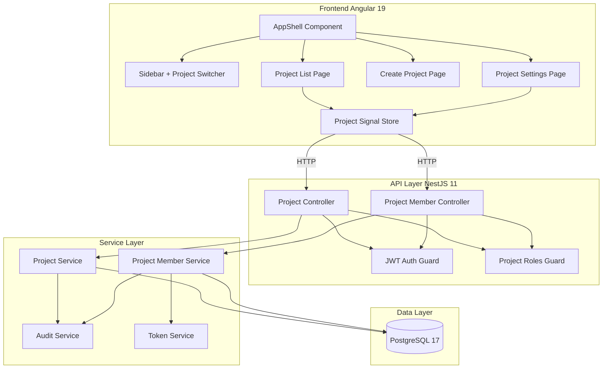
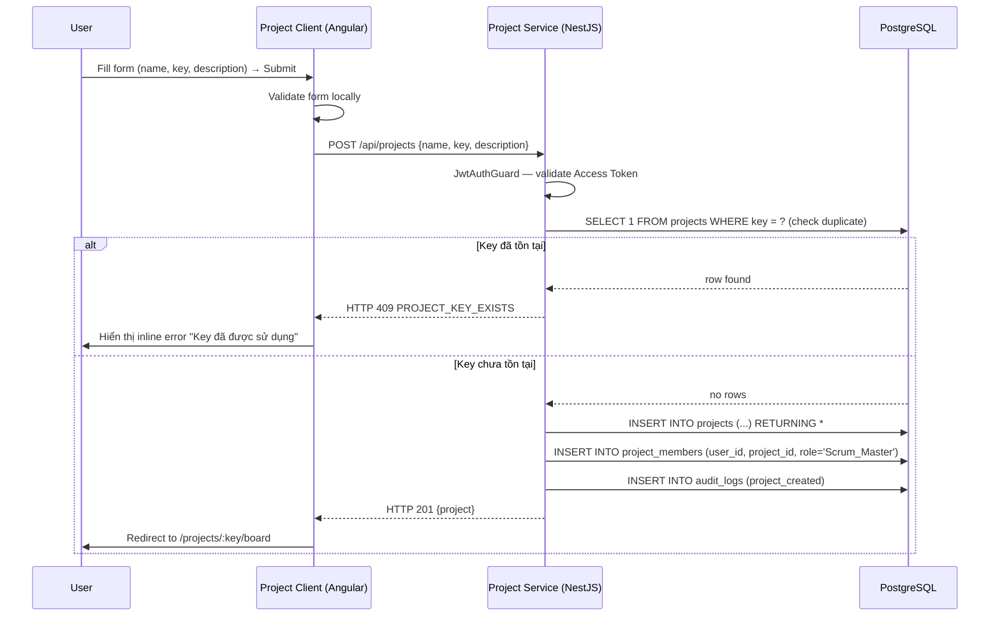
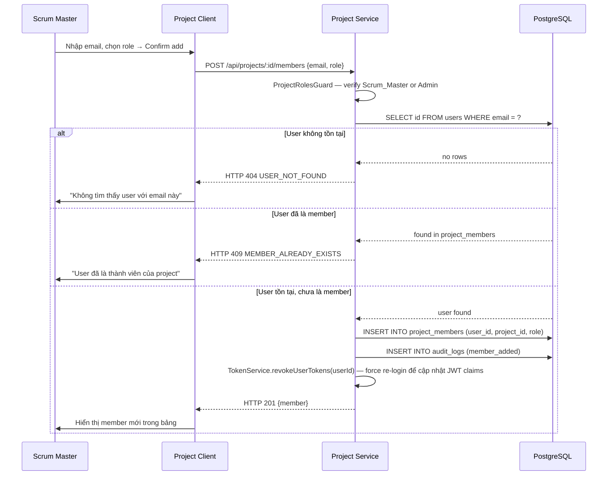
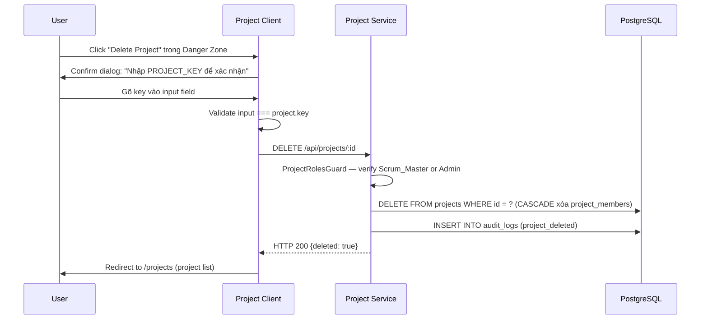
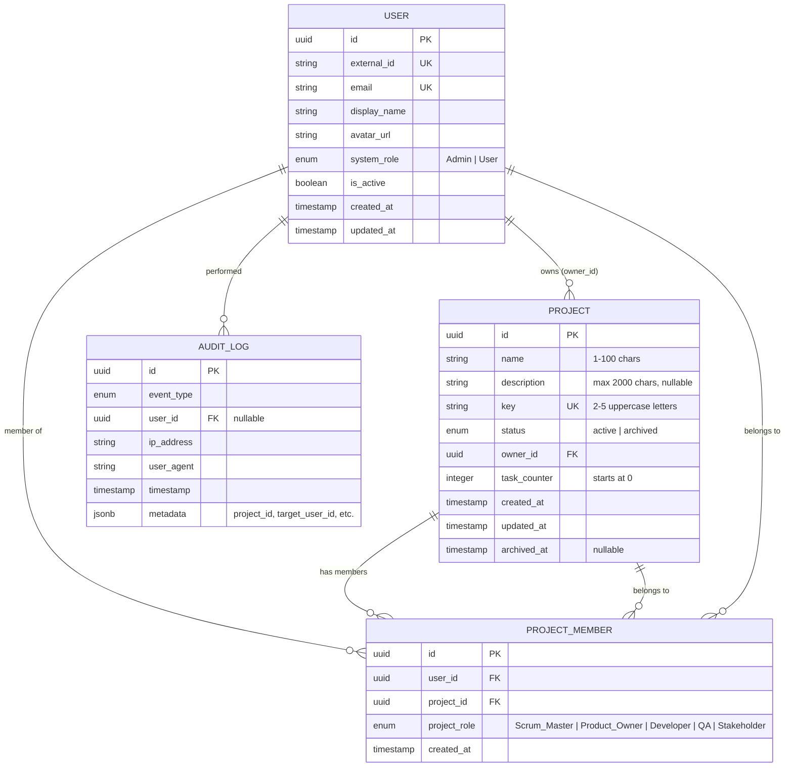

# Design Document: Project Management

## Overview

Tài liệu thiết kế kỹ thuật cho tính năng **Project Management** (Epic A) của Agile PM. Module này cung cấp CRUD project, quản lý thành viên theo Project_Role (direct-add), project settings UI với General/Members/Danger Zone tabs, và AppShell layout có collapsible sidebar.

### Mục tiêu thiết kế

- **Tách biệt module**: `ProjectModule` hoàn toàn độc lập với `AuthModule`; InvitationModule cũ bị loại bỏ
- **Direct Add**: Thêm thành viên bằng email, không cần email confirmation; phù hợp với internal tool (Authentik SSO)
- **Project Key immutable**: Key chỉ được đặt khi tạo, không thể thay đổi — đảm bảo tính ổn định của task IDs
- **Guard tái sử dụng**: Tận dụng `JwtAuthGuard` và `ProjectRolesGuard` đã có từ Auth module
- **UI consistency**: Áp dụng thống nhất UI standards (format ngày/số, filter, confirm dialog) trên mọi trang list

### Quyết định thiết kế chính

| Quyết định | Lựa chọn | Lý do |
|-----------|----------|-------|
| Member invitation | Direct add bằng email | Internal tool, tất cả users đã có account qua Authentik; email invite thêm complexity không cần thiết |
| InvitationModule | Xóa | Không dùng trong Epic A; tránh dead code; Epic sau có thể thêm lại nếu cần external invite |
| Project Key | Unique toàn hệ thống, immutable | Đảm bảo task IDs dạng KEY-N không bị conflic; thay đổi key sau khi tạo sẽ break tất cả existing task IDs |
| Sidebar state | localStorage | Persist qua page reload; không cần server-side storage |
| Route by key | `/projects/:key` | Human-readable URL; user dễ nhớ và chia sẻ hơn UUID |
| Bulk delete | Transaction với rollback | Đảm bảo atomicity; không để trạng thái nửa vời |

## Architecture

### High-Level Architecture



### Sequence Diagram: Tạo Project



### Sequence Diagram: Thêm Member (Direct Add)



### Sequence Diagram: Xóa Project (Danger Zone)



## Components and Interfaces

### Backend Modules (NestJS)

```
apps/backend/src/
├── project/
│   ├── project.module.ts                     # Wires ProjectController, ProjectService, entities
│   ├── project.controller.ts                  # REST endpoints cho project CRUD
│   ├── project.service.ts                     # Business logic: create, list, update, archive, delete
│   ├── members/
│   │   ├── project-member.controller.ts       # REST endpoints cho member management
│   │   └── project-member.service.ts          # Business logic: add, remove, change role
│   ├── dto/
│   │   ├── create-project.dto.ts              # name, key, description
│   │   ├── update-project.dto.ts              # name, description (key excluded)
│   │   ├── project-response.dto.ts            # Full project response shape
│   │   ├── project-list-item.dto.ts           # Lightweight list item
│   │   ├── add-member.dto.ts                  # email, projectRole
│   │   ├── update-member-role.dto.ts          # projectRole
│   │   └── member-response.dto.ts             # userId, displayName, email, projectRole, joinedAt
│   └── entities/
│       └── project.entity.ts                  # TypeORM entity cho bảng projects
```

**Xóa sau khi ProjectMemberModule hoạt động:**
```
apps/backend/src/
└── invitation/                                # Toàn bộ folder này bị xóa
```

### Frontend Components (Angular)

```
apps/frontend/src/app/
├── layout/
│   └── app-shell/
│       ├── app-shell.component.ts             # Layout chính: sidebar + router-outlet
│       └── sidebar/
│           └── sidebar.component.ts           # Collapsible sidebar + project switcher
├── projects/
│   ├── projects.routes.ts                     # Lazy-loaded routes
│   ├── pages/
│   │   ├── project-list/
│   │   │   └── project-list.component.ts      # Table + filter + bulk select
│   │   ├── create-project/
│   │   │   └── create-project.component.ts    # Form tạo project mới
│   │   └── project-settings/
│   │       ├── project-settings.component.ts  # Container với 3 tabs
│   │       ├── general-tab/
│   │       │   └── general-tab.component.ts   # Sửa name, description
│   │       ├── members-tab/
│   │       │   └── members-tab.component.ts   # Danh sách + add/remove/change role
│   │       └── danger-zone-tab/
│   │           └── danger-zone-tab.component.ts  # Archive + Delete
│   ├── services/
│   │   └── project.service.ts                 # HTTP calls đến /api/projects
│   └── state/
│       └── project.store.ts                   # Signal-based store: currentProject, projects list
```

### API Endpoints

#### Project Controller (`/api/projects`)

| Method | Path | Auth | Roles | Mô tả |
|--------|------|------|-------|-------|
| `GET` | `/api/projects` | Bearer | Any member | Danh sách projects của user |
| `POST` | `/api/projects` | Bearer | Any authenticated | Tạo project mới |
| `GET` | `/api/projects/:id` | Bearer | Member of project | Chi tiết project |
| `GET` | `/api/projects/by-key/:key` | Bearer | Member of project | Resolve bằng Project Key |
| `PATCH` | `/api/projects/:id` | Bearer | Scrum_Master / Admin | Sửa name, description |
| `PATCH` | `/api/projects/:id/archive` | Bearer | Scrum_Master / Admin | Archive project |
| `DELETE` | `/api/projects/:id` | Bearer | Scrum_Master / Admin | Xóa vĩnh viễn |
| `DELETE` | `/api/projects` | Bearer | Scrum_Master / Admin | Bulk delete (body: ids[]) |

#### Project Member Controller (`/api/projects/:projectId/members`)

| Method | Path | Auth | Roles | Mô tả |
|--------|------|------|-------|-------|
| `GET` | `/api/projects/:projectId/members` | Bearer | Member of project | Danh sách members |
| `POST` | `/api/projects/:projectId/members` | Bearer | Scrum_Master / Admin | Add member bằng email |
| `PATCH` | `/api/projects/:projectId/members/:userId` | Bearer | Scrum_Master / Admin | Đổi project role |
| `DELETE` | `/api/projects/:projectId/members/:userId` | Bearer | Scrum_Master / Admin | Xóa member |

### Frontend Routes

```
/projects                              → ProjectListPage (default redirect sau login)
/projects/new                          → CreateProjectPage
/projects/:key                         → redirect → /projects/:key/board (placeholder)
/projects/:key/*                       → AppShell (layout) + nội dung theo route con
  /projects/:key/board                 → BoardPage (placeholder — Epic B)
  /projects/:key/backlog               → BacklogPage (placeholder — Epic B)
  /projects/:key/settings              → ProjectSettingsPage (General tab mặc định)
  /projects/:key/settings/members      → ProjectSettingsPage (Members tab)
  /projects/:key/settings/danger       → ProjectSettingsPage (Danger Zone tab)
```

### Key Interfaces

```typescript
// Project entity
interface Project {
  id: string;
  name: string;
  description: string | null;
  key: string;                    // 2-5 uppercase letters
  status: 'active' | 'archived';
  ownerId: string;
  taskCounter: number;
  createdAt: Date;
  updatedAt: Date;
  archivedAt: Date | null;
}

// Project list item (lightweight)
interface ProjectListItem {
  id: string;
  name: string;
  key: string;
  status: 'active' | 'archived';
  myRole: ProjectRole;            // vai trò của current user
  createdAt: Date;
}

// Member response
interface MemberResponse {
  userId: string;
  displayName: string;
  email: string;
  avatarUrl: string | null;
  projectRole: ProjectRole;
  joinedAt: Date;
}

// Create project DTO
interface CreateProjectDto {
  name: string;          // 1-100 chars
  key: string;           // /^[A-Z]{2,5}$/
  description?: string;  // max 2000 chars
}

// Audit events mới
type ProjectAuditEvent =
  | 'project_created'
  | 'project_updated'
  | 'project_archived'
  | 'project_deleted'
  | 'member_added'
  | 'member_removed'
  | 'member_role_changed';
```

### Project Signal Store (Angular)

```typescript
// Minimal interface — Signal-based (Angular Signals)
interface ProjectState {
  projects: ProjectListItem[];           // danh sách projects của user
  currentProject: Project | null;        // project đang làm việc
  members: MemberResponse[];             // members của currentProject
  isLoading: boolean;
  error: string | null;
}
```

## Data Models

### Entity Relationship Diagram



### PostgreSQL Schema — Migration mới

```sql
-- Enum mới
CREATE TYPE "project_status_enum" AS ENUM ('active', 'archived');

-- Bảng projects
CREATE TABLE "projects" (
  "id"           UUID NOT NULL DEFAULT gen_random_uuid(),
  "name"         VARCHAR(100) NOT NULL,
  "description"  VARCHAR(2000),
  "key"          VARCHAR(5) NOT NULL,
  "status"       "project_status_enum" NOT NULL DEFAULT 'active',
  "owner_id"     UUID NOT NULL,
  "task_counter" INTEGER NOT NULL DEFAULT 0,
  "created_at"   TIMESTAMP WITH TIME ZONE NOT NULL DEFAULT now(),
  "updated_at"   TIMESTAMP WITH TIME ZONE NOT NULL DEFAULT now(),
  "archived_at"  TIMESTAMP WITH TIME ZONE,
  CONSTRAINT "pk_projects" PRIMARY KEY ("id"),
  CONSTRAINT "uq_project_key" UNIQUE ("key"),
  CONSTRAINT "fk_project_owner" FOREIGN KEY ("owner_id")
    REFERENCES "users"("id") ON DELETE RESTRICT
);

-- FK bổ sung cho project_members (hiện tại chưa có FK đến projects)
ALTER TABLE "project_members"
  ADD CONSTRAINT "fk_pm_project"
  FOREIGN KEY ("project_id") REFERENCES "projects"("id") ON DELETE CASCADE;

-- Audit events mới (ALTER TYPE để thêm vào enum hiện có)
ALTER TYPE "audit_event_type_enum"
  ADD VALUE IF NOT EXISTS 'project_created';
ALTER TYPE "audit_event_type_enum"
  ADD VALUE IF NOT EXISTS 'project_updated';
ALTER TYPE "audit_event_type_enum"
  ADD VALUE IF NOT EXISTS 'project_archived';
ALTER TYPE "audit_event_type_enum"
  ADD VALUE IF NOT EXISTS 'project_deleted';
ALTER TYPE "audit_event_type_enum"
  ADD VALUE IF NOT EXISTS 'member_added';
ALTER TYPE "audit_event_type_enum"
  ADD VALUE IF NOT EXISTS 'member_removed';
ALTER TYPE "audit_event_type_enum"
  ADD VALUE IF NOT EXISTS 'member_role_changed';
```

### PostgreSQL Indexes

```sql
-- Projects table
CREATE UNIQUE INDEX "idx_project_key"    ON "projects"("key");
CREATE INDEX        "idx_project_owner"  ON "projects"("owner_id");
CREATE INDEX        "idx_project_status" ON "projects"("status");
CREATE INDEX        "idx_project_created" ON "projects"("created_at");
```

## Correctness Properties

### Property 1: Project Key Uniqueness

*For any* two projects in the system, their `key` values must be different. Attempting to create a project with a key that already exists must fail with HTTP 409 and error code `PROJECT_KEY_EXISTS`.

**Validates: Requirements 1.3**

### Property 2: Project Key Format

*For any* project `key`, it must match the regex `/^[A-Z]{2,5}$/` — consisting of 2 to 5 uppercase Latin letters only. Any key failing this pattern must be rejected with HTTP 400.

**Validates: Requirements 1.4**

### Property 3: Creator Auto-Assignment as Scrum_Master

*For any* successfully created project, the creator's userId must exist in `project_members` with `project_role = 'Scrum_Master'` and the same `project_id`.

**Validates: Requirements 1.2**

### Property 4: Last Scrum_Master Protection

*For any* project with exactly one member having `project_role = 'Scrum_Master'`, any attempt to change that member's role to a different role or remove them must fail with HTTP 422 and error code `LAST_SCRUM_MASTER`.

**Validates: Requirements 5.5, 5.7**

### Property 5: Member Uniqueness per Project

*For any* (userId, projectId) pair, there must be at most one record in `project_members`. Adding a user who is already a member must fail with HTTP 409 and error code `MEMBER_ALREADY_EXISTS`.

**Validates: Requirements 5.3**

### Property 6: Project Key Immutability

*For any* project after creation, the `key` field must never change regardless of PATCH operations. A PATCH request including a `key` field must either ignore it or reject it — the stored key must remain unchanged.

**Validates: Requirements 3.3**

### Property 7: Task Counter Monotonicity

*For any* project, `task_counter` only increments (never decrements). After N tasks are created in a project, `task_counter = N`. Deleting a task must not decrement the counter.

**Validates: Requirements — foundation for Epic B task IDs**

### Property 8: Direct Add Rejects Unknown Email

*For any* POST to `/api/projects/:id/members` with an email that does not exist in the `users` table, the response must be HTTP 404 with error code `USER_NOT_FOUND`.

**Validates: Requirements 5.2**

### Property 9: Project Visibility Scoped to Membership

*For any* non-Admin user, `GET /api/projects` must return only projects where the user has a record in `project_members`. Projects where the user has no membership record must not appear.

**Validates: Requirements 2.1, 2.5**

### Property 10: Archive Preserves Data

*For any* archived project, all `project_members` records must remain intact. Archiving must only update `status = 'archived'` and `archived_at = now()` — no cascading deletes.

**Validates: Requirements 4.1, 4.2**

### Property 11: Delete Cascades Members

*For any* deleted project, all associated `project_members` records must also be deleted (CASCADE). After deletion, no orphaned `project_members` rows with that `project_id` may exist.

**Validates: Requirements 4.3**

### Property 12: Audit Log on Every Mutating Operation

*For any* successful mutating operation (create, update, archive, delete project; add, remove, change role member), an audit log entry with the corresponding event_type must be created containing user_id, project_id in metadata, and a valid timestamp.

**Validates: Requirements 1.5, 3.2, 4.1, 4.3, 5.1, 5.6**

### Property 13: Sidebar State Persistence

*For any* sidebar collapsed/expanded action, the new state must be written to `localStorage` key `sidebar_collapsed`. On page reload, the sidebar must restore to the last saved state.

**Validates: Requirements 6.4**

### Property 14: Member Role Change Triggers Token Revocation

*For any* successful member role change or member removal, the target user's active Access Token must be invalidated (via forced-logout flag or session revocation) so the next API call forces a token refresh with updated JWT claims.

**Validates: Requirements 5.4, 5.6**

## Error Handling

### Error Code Catalog

| HTTP Status | Error Code | Trigger | Client Action |
|-------------|-----------|---------|---------------|
| 400 | `INVALID_INPUT` | DTO validation failure | Show field-level errors |
| 400 | `INVALID_PROJECT_KEY_FORMAT` | Key không match `/^[A-Z]{2,5}$/` | Show inline error |
| 403 | `INSUFFICIENT_PROJECT_ROLE` | User thiếu role cần thiết | Show "access denied" |
| 404 | `PROJECT_NOT_FOUND` | Project không tồn tại hoặc user không có quyền | Show 404 page |
| 404 | `USER_NOT_FOUND` | Email không có trong hệ thống | Show "User không tồn tại" |
| 409 | `PROJECT_KEY_EXISTS` | Key đã được sử dụng bởi project khác | Show inline error trên field key |
| 409 | `MEMBER_ALREADY_EXISTS` | User đã là thành viên của project | Show info message |
| 422 | `LAST_SCRUM_MASTER` | Xóa/đổi role Scrum_Master duy nhất | Show warning message |

### Error Handling Strategy

1. **Global Exception Filter** (tái sử dụng từ Auth module): Tất cả errors được format theo cấu trúc `{statusCode, error, message, errorCode, timestamp}`
2. **Audit log on 403**: Mọi access denied đều ghi audit log (non-blocking)
3. **Bulk delete partial failure**: Trả về danh sách `{ deleted: string[], failed: {id, reason}[] }` — client hiển thị kết quả chi tiết
4. **Key uniqueness race condition**: Sử dụng database unique constraint làm tầng cuối; application-level check chỉ để hiển thị lỗi sớm hơn

## Testing Strategy

### Dual Testing Approach

Tương tự Auth module, sử dụng kết hợp **property-based tests** (fast-check) cho correctness properties và **unit tests** cho specific scenarios.

### Property-Based Tests

| File | Property |
|------|---------|
| `project-key.property.spec.ts` | Property 1: Key Uniqueness, Property 2: Key Format |
| `project-creator.property.spec.ts` | Property 3: Creator Auto-Assignment |
| `last-scrum-master.property.spec.ts` | Property 4: Last Scrum_Master Protection |
| `member-uniqueness.property.spec.ts` | Property 5: Member Uniqueness |
| `project-key-immutable.property.spec.ts` | Property 6: Key Immutability |
| `task-counter.property.spec.ts` | Property 7: Counter Monotonicity |
| `member-add.property.spec.ts` | Property 8: Direct Add Unknown Email |
| `project-visibility.property.spec.ts` | Property 9: Visibility Scoped to Membership |
| `project-archive.property.spec.ts` | Property 10: Archive Preserves Data |
| `project-delete.property.spec.ts` | Property 11: Delete Cascades Members |
| `audit-log.property.spec.ts` | Property 12: Audit on Mutating Ops |
| `member-role-change.property.spec.ts` | Property 14: Role Change Token Revocation |

### Unit Tests (Example-Based)

| Area | Test Cases |
|------|-----------|
| Project creation | Happy path, duplicate key, invalid format, empty name |
| Member add | User exists, user not found, already member |
| Member remove | Happy path, last Scrum_Master protection |
| Archive | Happy path, already archived |
| Delete | Happy path, confirm key mismatch |
| Bulk delete | All success, partial failure, rollback |
| Sidebar | Collapse/expand, localStorage persistence |

### Test File Organization

```
apps/backend/test/
├── unit/
│   └── project/
│       ├── project.service.spec.ts
│       └── project-member.service.spec.ts
├── property/
│   ├── project-key.property.spec.ts
│   ├── project-creator.property.spec.ts
│   ├── last-scrum-master.property.spec.ts
│   ├── member-uniqueness.property.spec.ts
│   ├── project-key-immutable.property.spec.ts
│   ├── task-counter.property.spec.ts
│   ├── member-add.property.spec.ts
│   ├── project-visibility.property.spec.ts
│   ├── project-archive.property.spec.ts
│   ├── project-delete.property.spec.ts
│   ├── audit-log.property.spec.ts
│   └── member-role-change.property.spec.ts
└── e2e/
    ├── project-crud.e2e-spec.ts
    └── project-members.e2e-spec.ts
```

### Test Environment

- **Unit/Property tests**: Jest với mocked TypeORM repositories
- **E2E tests**: Docker Compose với real PostgreSQL; tái sử dụng mocked Authentik từ Auth module tests
- **Coverage target**: ≥ 90% line coverage cho project module, 100% branch coverage cho guards và business rules (last Scrum_Master, key uniqueness)
