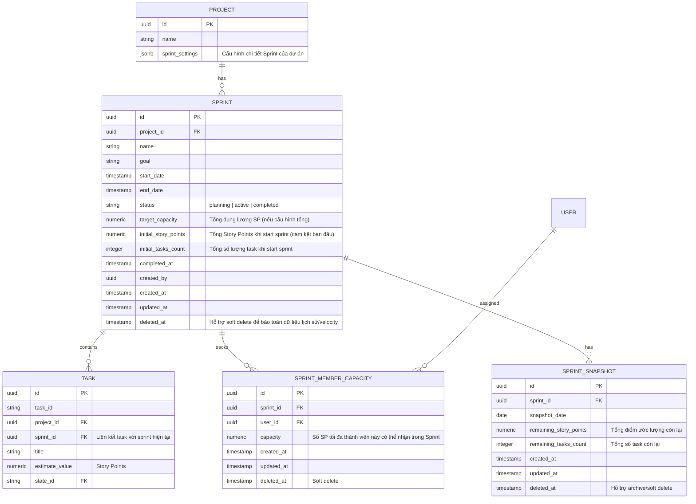
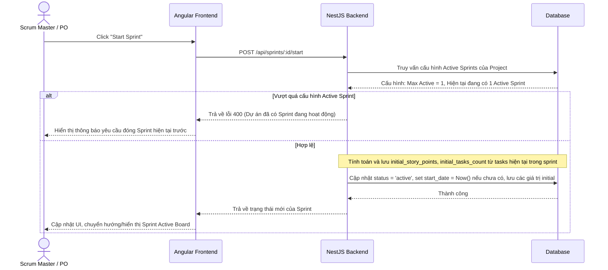
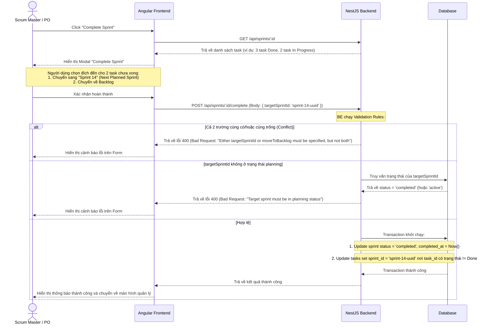

# TÀI LIỆU PHÂN TÍCH VÀ GIẢI PHÁP XÂY DỰNG CHỨC NĂNG SPRINTS/CYCLES

## 1. Giới thiệu tổng quan
Tài liệu này trình bày phân tích nghiệp vụ, thiết kế hệ thống và giải pháp chi tiết cho chức năng **Sprints/Cycles** trong ứng dụng Quản lý Dự án Agile (MPM). 

Mục tiêu là cung cấp một giải pháp quản lý thời gian và chu kỳ làm việc linh hoạt, cho phép cấu hình chọn chế độ sử dụng thuật ngữ **Sprints** (phương pháp Scrum) hoặc **Cycles** (phương pháp Kanban/Linear) cho từng dự án (Project), tích hợp chặt chẽ với hệ thống Tasks và Projects hiện có.

---

## 2. Các quyết định thiết kế cốt lõi (Từ kết quả khảo sát)
1. **Định nghĩa thuật ngữ và Cấu hình theo Project**: Hệ thống hỗ trợ cấu hình ở cấp độ Dự án (Project settings) để lựa chọn sử dụng thuật ngữ hiển thị là **Sprints** hoặc **Cycles**. Toàn bộ giao diện tương ứng của dự án đó (Sidebar, Header, Button, Tooltip,...) sẽ tự động thay đổi thuật ngữ theo cấu hình này. Dưới database và backend, ta thống nhất lưu trữ chung trong thực thể dữ liệu `Sprint`.
2. **Phạm vi sở hữu**: Mỗi Sprint thuộc về duy nhất một Project (Quan hệ 1-N giữa Project và Sprint).
3. **Cấu hình Active Sprints**: Hệ thống cho phép cấu hình dự án chạy duy nhất **1 Sprint active** tại một thời điểm (chuẩn Scrum truyền thống) HOẶC chạy **nhiều Sprint active song song** (phù hợp với dự án lớn có nhiều sub-team).
4. **Xử lý Task chưa hoàn thành**: Khi thực hiện đóng một Sprint (Complete/Close Sprint), hệ thống sẽ hiển thị một hộp thoại xác nhận cho phép điều phối các task chưa hoàn thành (chưa ở trạng thái `Done`) về:
   - Backlog của dự án.
   - Một Sprint cụ thể tiếp theo (Sprint mới được lên kế hoạch).
5. **Quản lý Dung lượng (Capacity Planning)**: Hỗ trợ linh hoạt 2 chế độ (Tổng hoặc Chi tiết thành viên). Trong đó:
   - **Thực tế sử dụng (Actual Used)** của thành viên = Tổng `estimate_value` (Story Points) của các task gán cho người đó trong Sprint.
   - **Xử lý Task chưa có ước lượng**: Nếu task chưa được điền Story Points, hệ thống tạm tính là **1 SP** cho mục đích dự phòng năng lực (capacity safety) và hiển thị cảnh báo cho SM/PO (ví dụ: `+ 3 tasks unestimated`).
6. **Không gian làm việc riêng**: Thiết lập một Menu Item riêng biệt cho Sprints dưới dạng Collapsible Submenu trên Sidebar để quản lý danh sách, xem báo cáo hiệu năng chuyên sâu.
7. **Biểu đồ Burndown Chart**: Hỗ trợ 2 chế độ hiển thị linh hoạt (chuyển đổi qua lại bằng switch): mặc định vẽ theo **Story Points** (nỗ lực công việc) và có thể chuyển sang vẽ theo **Task Count** (số lượng task).

---

## 3. Thiết kế Cơ sở dữ liệu (Database Schema)

Chúng ta sẽ sử dụng PostgreSQL làm cơ sở dữ liệu chính. Dưới đây là các bảng mới và các thay đổi đối với bảng hiện tại:



### 3.1 Chi tiết Chỉ mục (Indexes)
Để tối ưu hóa hiệu năng truy vấn dữ liệu lớn, các index sau sẽ được tạo:
```sql
-- Composite index phục vụ truy vấn danh sách sprint theo project và trạng thái (phổ biến nhất)
CREATE INDEX idx_sprints_project_status ON sprints (project_id, status) WHERE deleted_at IS NULL;

-- Partial index phục vụ truy vấn các task thuộc về một sprint cụ thể
CREATE INDEX idx_tasks_sprint_id ON tasks (sprint_id) WHERE sprint_id IS NOT NULL;

-- Composite index phục vụ truy vấn snapshot lịch sử của một sprint theo ngày
CREATE UNIQUE INDEX idx_sprint_snapshots_sprint_date ON sprint_snapshots (sprint_id, snapshot_date) WHERE deleted_at IS NULL;
```

### 3.2 Cấu trúc Schema trường `sprint_settings` trong bảng `projects`
Trường `sprint_settings` lưu trữ cấu hình dưới dạng JSONB với schema được quy định cụ thể như sau:
```json
{
  "terminology": "sprint",         // Hoặc "cycle"
  "maxActiveSprints": 1,           // Số lượng sprint active tối đa chạy song song (mặc định: 1)
  "defaultDurationWeeks": 2,       // Độ dài chu kỳ mặc định (1 | 2 | 4 tuần)
  "capacityMode": "total"          // "total" (Tổng điểm) hoặc "member-based" (Theo thành viên)
}
```
*Backend sẽ sử dụng class-validator để kiểm tra tính hợp lệ của JSONB này trước khi lưu xuống DB. Trong DTO, trường defaultDurationWeeks phải được validate cụ thể bằng decorator `@IsIn([1, 2, 4])`.*

### 3.3 Cơ chế Global Cron Job cho Sprints Snapshots
Để đơn giản hóa và tối ưu hóa hệ thống trong phiên bản v1, chúng ta không cấu hình thời gian chạy theo từng dự án. Thay vào đó:
- Hệ thống chạy duy nhất một **Global Cron Job** cố định ở mức ứng dụng (ví dụ: chạy vào lúc `23:59` hàng ngày).
- **Lưu ý về Timezone**: Server phải được cấu hình chạy ở timezone phù hợp với địa lý hoạt động của team phát triển (ví dụ cấu hình biến môi trường `TZ=Asia/Ho_Chi_Minh` cho container/server), hoặc các snapshot sẽ được ghi nhận và lưu trữ tương ứng với timezone cấu hình của dự án (mặc định theo timezone server phù hợp).
- Cron job này sẽ thực hiện quét qua toàn bộ các Sprint đang hoạt động (`status = 'active'`) của tất cả các dự án, tính toán tổng số Story Points còn lại và số lượng task còn lại, sau đó chèn/cập nhật dữ liệu vào bảng `sprint_snapshots` để làm dữ liệu vẽ Burndown Chart.
- Tiến trình cron sẽ ghi log (Logging) đầy đủ trạng thái bắt đầu, kết thúc, số lượng sprint đã chụp snapshot, và các lỗi phát sinh (nếu có).

### 3.4 Chi tiết thay đổi bảng `tasks`
- Bổ sung trường `sprint_id` (UUID, nullable, Foreign Key liên kết tới bảng `sprints`).
- (Lưu ý: Trong thực tế thực thể `Task` hiện có cột `cycle_id` dùng kiểu dữ liệu UUID. Chúng ta sẽ ánh xạ cột này hoặc tạo cột mới `sprint_id` rõ ràng để tương thích tốt nhất với hệ thống. Khuyên dùng: dùng cột `sprint_id` và migrate dữ liệu từ `cycle_id` cũ).

---

## 4. Thiết kế API Backend (NestJS)

Chức năng Sprint sẽ được hiện thực hóa qua một module mới `SprintModule`.

### 4.1 Sprint DTOs
- `CreateSprintDto`: `name` (string), `goal` (string, optional), `startDate` (date, optional), `endDate` (date, optional), `targetCapacity` (number, optional).
- `UpdateSprintDto`: Kế thừa `CreateSprintDto` (partial). *Lưu ý: Không bao gồm trường `status` ở đây để tránh bypass validation thông qua PATCH endpoint. Mọi thay đổi trạng thái bắt buộc phải đi qua các endpoint chuyên biệt như `/start` và `/complete`.*
- `CompleteSprintDto`:
  - `targetSprintId` (string, optional)
  - `moveToBacklog` (boolean, optional)
  - **Validation Rules**:
    1. **Loại trừ lẫn nhau (Mutually Exclusive)**: Phải gửi lên duy nhất một trong hai lựa chọn. Nếu cả hai cùng có giá trị hoặc cả hai cùng trống (trong trường hợp Sprint có task chưa hoàn thành), backend trả về lỗi `400 Bad Request` (ví dụ: `"Either targetSprintId or moveToBacklog must be specified, but not both"`).
    2. **Trường hợp ngoại lệ (Exception)**: Nếu sprint không có task nào ở trạng thái chưa hoàn thành, cả hai trường đều có thể bỏ qua (không required).
    3. **Kiểm tra trạng thái Sprint đích**: Nếu truyền lên `targetSprintId`, backend phải xác thực Sprint đó tồn tại và đang ở trạng thái `planning`. Nếu Sprint đích đã ở trạng thái `active` hoặc `completed`, backend trả về lỗi `400 Bad Request` (ví dụ: `"Target sprint must be in planning status"`).
- `UpdateMemberCapacityDto`: `userId` (string), `capacity` (number).
- `SprintPaginationResponseDto`: `{ data: Sprint[], total: number, page: number, limit: number }`.
- `BurndownDataPointDto`:
  - `date`: string (ISO format `YYYY-MM-DD`)
  - `remainingStoryPoints`: number
  - `remainingTasksCount`: number
  - `idealStoryPoints`: number
  - `idealTasksCount`: number
- `BurndownResponseDto`: `BurndownDataPointDto[]` (Mảng dữ liệu điểm thời gian phục vụ vẽ chart).

### 4.2 Các API Endpoint chính
Tất cả các API dưới đây sẽ sử dụng `ProjectRolesGuard` và decorator `@ProjectRoles(...)` được kế thừa từ hệ thống phân quyền sẵn có của dự án để kiểm tra quyền truy cập ở cấp độ Dự án (Project-level roles: `Scrum_Master`, `Product_Owner`, `Developer`, `QA`, `Stakeholder`).

| HTTP Method | Route | Mô tả | Phân quyền kiểm tra (`@ProjectRoles`) |
|---|---|---|---|
| **POST** | `/api/projects/:projectId/sprints` | Tạo mới một Sprint ở trạng thái `planning` | `Scrum_Master`, `Product_Owner` |
| **GET** | `/api/projects/:projectId/sprints` | Lấy danh sách Sprints của dự án (phân trang `page`, `limit`, filter `status`, search `name`) | Tất cả các role |
| **GET** | `/api/projects/:projectId/sprints/active` | Lấy nhanh danh sách các Sprints đang hoạt động (`active`) của dự án | Tất cả các role |
| **GET** | `/api/projects/:projectId/sprints/dashboard` | Lấy dữ liệu thống kê tổng hợp (aggregated) cho Dashboard | Tất cả các role |
| **GET** | `/api/sprints/:id` | Xem chi tiết 1 Sprint kèm theo danh sách task | Tất cả các role |
| **PATCH** | `/api/sprints/:id` | Cập nhật thông tin Sprint (Tên, ngày, target capacity) | `Scrum_Master`, `Product_Owner` |
| **POST** | `/api/projects/:projectId/sprints/bulk-delete` | Xóa hàng loạt Sprints (nhận mảng `ids` trong body). Các task liên quan sẽ được đưa về Backlog. | `Scrum_Master`, `Product_Owner` |
| **POST** | `/api/sprints/:id/start` | Kích hoạt Sprint (chuyển sang `active`). Đồng thời tính toán tổng số Story Points và Task hiện tại để lưu vào `initial_story_points` và `initial_tasks_count` (để tính toán committed SP cho biểu đồ Velocity). | `Scrum_Master`, `Product_Owner` |
| **POST** | `/api/sprints/:id/complete` | Đóng Sprint (chuyển sang `completed`), thực hiện chuyển dịch các task chưa xong theo body data gửi lên. | `Scrum_Master`, `Product_Owner` |
| **PATCH** | `/api/sprints/:id/tasks/:taskId` | Gán hoặc thay đổi Sprint cho một Task duy nhất | `Scrum_Master`, `Product_Owner`, `Developer`, `QA` |
| **POST** | `/api/sprints/:id/tasks` | Thêm hàng loạt tasks vào Sprint (hoặc cập nhật trường `sprintId` của task) | `Scrum_Master`, `Product_Owner`, `Developer`, `QA` |
| **POST** | `/api/sprints/:id/tasks/bulk-remove` | Loại bỏ hàng loạt tasks ra khỏi Sprint (đưa về Backlog) | `Scrum_Master`, `Product_Owner`, `Developer`, `QA` |
| **GET** | `/api/sprints/:id/burndown` | Lấy dữ liệu biểu đồ Burndown Chart (số lượng SP/Task giảm dần qua các ngày) | Tất cả các role |
| **PUT** | `/api/sprints/:id/capacities` | Cấu hình dung lượng chi tiết cho từng thành viên tham gia Sprint | `Scrum_Master`, `Product_Owner` |
| **GET** | `/api/sprints/:id/capacities` | Lấy danh sách dung lượng các thành viên kèm theo số SP thực tế đã gán cho họ | Tất cả các role |

*Lưu ý: "Tất cả các role" ở bảng trên bao gồm cả **Stakeholder** (với quyền chỉ đọc - Read only), cụ thể là: `Scrum_Master`, `Product_Owner`, `Developer`, `QA`, `Stakeholder`.*

### 4.3 Tích hợp với Hệ thống Phân quyền (Authorization) hiện tại
Dự án đã có sẵn hệ thống phân quyền cấp project dựa trên `ProjectRolesGuard` và `@ProjectRoles` decorator (định nghĩa tại [permission-matrix.ts](file:///Users/ptud/Documents/Labs/github/mpm/apps/backend/src/auth/constants/permission-matrix.ts)):
- **Scrum_Master** & **Product_Owner**: Có toàn quyền (CRUD) đối với tài nguyên `sprint`.
- **Developer** & **QA**: Chỉ có quyền đọc (`read`) đối với `sprint`, tuy nhiên có quyền cập nhật (`update`) đối với `task`.
- **Ánh xạ thực tế**:
  - Các thao tác thay đổi trạng thái, cấu hình hoặc xóa Sprint (Create, Start, Complete, Delete, Settings) bắt buộc phải do SM hoặc PO thực hiện (kiểm tra `@ProjectRoles('Scrum_Master', 'Product_Owner')`).
  - Thao tác gán task vào Sprint (`PATCH /api/sprints/:id/tasks/:taskId`) thực chất là cập nhật trường `sprintId` của task, do đó cho phép cả Developer và QA thực hiện (kiểm tra `@ProjectRoles('Scrum_Master', 'Product_Owner', 'Developer', 'QA')`).

### 4.4 Ràng buộc bất biến của Cam kết ban đầu (Initial/Committed Invariant)
Các trường `initial_story_points` và `initial_tasks_count` trong bảng `sprints` là **bất biến (immutable)** sau khi Sprint đã chuyển sang trạng thái `active`. Backend chỉ ghi nhận giá trị này một lần duy nhất tại thời điểm bắt đầu Sprint và **tuyệt đối không được cập nhật lại** các trường này khi có bất kỳ thay đổi nào liên quan đến task trong Sprint (như thêm/xóa task mid-sprint) để tránh làm sai lệch biểu đồ báo cáo Velocity.

---

## 5. Thiết kế Giao diện Người dùng (Angular Frontend)

Giao diện Sprint sẽ được chia làm hai khu vực chính để tối ưu hóa trải nghiệm người dùng:

### 5.1 Khu vực 1: Tích hợp bộ lọc Sprint trên Backlog Toolbar và Kanban Board
*Nằm tại tab `Backlog` và `Board` của dự án.*

- **Thiết kế & Bộ lọc (Filter)**:
  - Giữ nguyên cấu trúc hiển thị phân nhóm theo Trạng thái (State) của danh sách công việc hiện tại.
  - Bổ sung một **Sprint Filter Dropdown** trên thanh công cụ (Toolbar) ở góc trên. Dropdown này chứa các tùy chọn:
    - *All Sprints* (Mặc định - Hiển thị tất cả).
    - *Backlog (No Sprint)* (Chỉ hiển thị các task chưa được gán vào Sprint nào).
    - *[Tên các Sprint Active/Planning]* (Ví dụ: Sprint 12, Sprint 13).
    - **+ Create Sprint** (hoặc **+ Create Cycle**): Lựa chọn nhanh dưới cùng để mở dialog tạo mới Sprint trực tiếp từ Toolbar.
  - Khi chọn một Sprint, danh sách Task (và Kanban Board) sẽ chỉ lọc các task thuộc Sprint đó, và các task này vẫn được hiển thị và gom nhóm theo các State (`backlog`, `unstarted`, `started`, `completed`, `cancelled`) bình thường.
- **Cơ chế gán Task vào Sprint (Assignment)**:
  - **Task Detail Panel**: Bổ sung trường chọn `Sprint` (hoặc `Cycle` tùy cấu hình) dạng dropdown trong sidebar chi tiết của task (như Assignee, Priority, Labels).
  - **Context Menu**: Thêm nút "Move to Sprint..." trong menu ba chấm hoặc khi click chuột phải vào task row để gán nhanh task vào Sprint mong muốn.
  - **Bulk Action**: Hỗ trợ chọn nhiều task và gán hàng loạt vào một Sprint thông qua thanh công cụ khi tích chọn.
- **Capacity Indicator**:
  - Hiển thị thông số dung lượng của Sprint được chọn trên Toolbar (ví dụ: `Capacity: 32 / 40 SP` kèm thanh tiến trình nhỏ) để SM/PO theo dõi nhanh mà không cần chuyển trang.

### 5.2 Khu vực 2: Cấu trúc Submenu "Sprints" độc lập trên Sidebar
*Nằm trên thanh Sidebar điều hướng.*

Chức năng Sprints được thiết kế thành một **Collapsible Submenu** (Nhóm menu có thể đóng/mở) trên thanh điều hướng bên (Sidebar) của dự án. Khi người dùng click vào mục chính **Sprints** (hoặc **Cycles** tùy cấu hình), menu con sẽ mở rộng hiển thị các liên kết trực tiếp tới các trang độc lập sau:

#### 1. Sprints List (Danh sách Sprints) - Route: `/projects/:projectId/sprints/list`
- **Giao diện dạng bảng (Table view)** liệt kê toàn bộ các Sprints/Cycles của dự án.
- **Phân trang (Pagination)**: Tích hợp bộ phân trang (Paginator) ở chân bảng, hỗ trợ phân trang phía Server (Server-side pagination) với các cấu hình hiển thị số dòng trên trang (ví dụ: 10, 20, 50 dòng/trang).
- **Bộ lọc (Filter & Search)**:
  - Ô tìm kiếm theo tên Sprint.
  - Bộ lọc trạng thái: *All*, *Planning*, *Active*, *Completed*.
- **Hành động hàng loạt (Bulk Actions)**:
  - Checkbox ở từng dòng và ở header bảng để chọn nhiều Sprint cùng lúc (Bulk Select).
  - Nút **"Delete Selected"** xuất hiện khi có ít nhất một Sprint được chọn.
  - **Hành vi khi xoá**: Hệ thống sẽ hiển thị cảnh báo xác nhận. Khi xoá các Sprint này, backend sẽ giải phóng các task thuộc về chúng (cập nhật `sprint_id = null`), đưa các task này quay trở lại Backlog của dự án mà không xoá task.
- **Nút "+ Create Sprint" (hoặc "+ Create Cycle")**: Bố trí ở góc trên cùng bên phải trang danh sách để tạo nhanh.

#### 2. Sprint Dashboard (Bảng điều khiển) - Route: `/projects/:projectId/sprints/dashboard`
- **Xử lý khi có nhiều active sprints (maxActiveSprints > 1)**:
  - Trên Dashboard sẽ có một **Active Sprint Selector** (Dropdown) cho phép người dùng chuyển đổi hiển thị giữa các Sprint đang chạy song song, mặc định chọn Sprint có `start_date` gần nhất.
  - Cung cấp tùy chọn **"All Active Sprints"** trong dropdown để hiển thị bảng số liệu tổng hợp (consolidated metrics) của tất cả các Sprint đang chạy cùng lúc.
- Biểu đồ **Burndown Chart**:
  - Tích hợp nút **Switch/Toggle** để thay đổi đơn vị hiển thị giữa **Story Points** (Mặc định) và **Task Count**.
  - Khi xem chế độ **"All Active Sprints"**, Burndown Chart sẽ hiển thị **nhiều đường burndown song song trên cùng một chart** (mỗi sprint có màu sắc phân biệt khác nhau). Đồng thời, cung cấp giao diện lọc/chú thích để người dùng click ẩn/hiện các đường của từng active sprint cụ thể theo nhu cầu.
  - Đường lý thuyết (Ideal Line - màu xám): Đường thẳng chéo đi từ góc trên bên trái (Tổng số SP hoặc tổng số Task ban đầu của Sprint) xuống góc dưới bên phải (0 SP hoặc 0 Task tại ngày kết thúc Sprint).
  - Đường thực tế (Actual Line - màu xanh dương/đỏ): Thể hiện nỗ lực còn lại cuối mỗi ngày. Khi task được chuyển sang trạng thái `completed`, số SP hoặc số task của task đó sẽ được trừ khỏi tổng số lượng nỗ lực còn lại.
- Danh sách các task trong Sprint hiện tại phân theo trạng thái và người thực hiện.
- Thống kê tiến độ: `% Task hoàn thành`, `% SP hoàn thành`, `Thời gian còn lại`.

#### 3. Velocity Reports (Báo cáo Velocity) - Route: `/projects/:projectId/sprints/velocity`
- Biểu đồ cột thể hiện **Velocity** (Vận tốc trung bình của team qua các sprint đã qua).
  - Trục X: Tên các Sprint đã hoàn thành.
  - Trục Y: Số lượng Story Points.
  - Mỗi cột chia thành 2 phần:
    - **Số SP cam kết ban đầu (Committed SP)**: Lấy trực tiếp từ giá trị bất biến `initial_story_points` lưu trong bảng `sprints` tại thời điểm start sprint.
    - **Số SP thực tế hoàn thành (Completed SP)**: Được định nghĩa bằng **Tổng `estimate_value` của các task thuộc Sprint có trạng thái thuộc nhóm hoàn thành (Done/Completed) tại thời điểm đóng Sprint (Complete Sprint)**.
- Thống kê vận tốc trung bình (Average Velocity) để hỗ trợ PO lên kế hoạch cho các sprint tiếp theo.

#### 4. Sprint Settings (Cấu hình) - Route: `/projects/:projectId/sprints/settings`
- Cấu hình chung cho dự án:
  - Tên hiển thị mặc định: "Sprint" hay "Cycle".
  - Thời gian mặc định của một chu kỳ (ví dụ: 1 tuần, 2 tuần, 4 tuần).
  - Số lượng Sprint Active tối đa đồng thời (1 hoặc nhiều hơn).
  - Cách tính dung lượng mặc định (Total Sprint Capacity hay Member-based Capacity).

### 5.3 Demo Minh họa Giao diện (ASCII Mockups)

#### A. Sprint Filter Dropdown trên Backlog/Board Toolbar
```
[ View: List ] [ Group: State ] [ Sprint: Sprint 12 ▾ ]  |  Capacity: [█████████░░░] 36 / 45 SP
                                 ┌────────────────────────────────┐
                                 │ Search sprint...               │
                                 ├────────────────────────────────┤
                                 │ ✓ All Sprints                  │
                                 │   Backlog (No Sprint)          │
                                 │   Sprint 12 (Active)           │
                                 │   Sprint 13 (Planning)         │
                                 │   Sprint 11 (Completed)        │
                                 ├────────────────────────────────┤
                                 │ ✚ Create New Sprint            │
                                 └────────────────────────────────┘
```

#### B. Sidebar Submenu & Trang Danh sách Sprints (Sprints List)
```
+------------------+-------------------------------------------------------------------------+
| [ MPM Logo ]     | [ Project: EBiz Payment ]                                               |
|                  +-------------------------------------------------------------------------+
| ☰ Sidebar        | [ Sprints / Danh sách Sprints ]                                         |
|                  |                                                                         |
| • Tasks          | Search: [ Tìm kiếm...      ]  Status: [ Active/Planning ▾ ]  [ ✚ Create ]|
| • Board          |                                                                         |
| ▼ Sprints ▾      | [ ✓ ] 1 Sprint selected                              [ 🗑 Delete Selected ]|
|   - Danh sách    | +---------------------------------------------------------------------+ |
|   - Bảng ĐK      | | [ ] | Tên Sprint | Trạng thái | Ngày bắt đầu | Ngày kết thúc | Dung lượng   | |
|   - Báo cáo      | +-----+------------+------------+--------------+---------------+--------------+ |
|   - Cấu hình     | | [x] | Sprint 12  | 🟢 Active  | 01/06/2026   | 14/06/2026    | 36/45 SP     | |
| • Documents      | | [ ] | Sprint 13  | 🟡 Planning| 15/06/2026   | 28/06/2026    | 08/45 SP     | |
| • Settings       | | [ ] | Sprint 11  | ⚪ Complete| 18/05/2026   | 31/05/2026    | 40/40 SP     | |
|                  | +-----+------------+------------+--------------+---------------+--------------+ |
|                  | | ◀  1  2  3  ▶   10 dòng/trang ▾                    Hiển thị 1-3 / 25     | |
|                  | +---------------------------------------------------------------------+ |
+------------------+-------------------------------------------------------------------------+
```

#### C. Trường Sprint trong Task Detail Panel (Sidebar)
```
┌──────────────────────────────────────────┐
│ #EBZ-035 · Tích hợp API QR Payment       │
│ ──────────────────────────────────────── │
│  Assignee:   [ Tuan Thanh           ▾ ]  │
│  State:      [ In progress          ▾ ]  │
│  Priority:   [ Critical             ▾ ]  │
│  Estimate:   [ 8 SP                 ▾ ]  │
│  Sprint:     [ Sprint 12 (Active)   ▾ ]  │ <--- Dropdown chọn nhanh
│  Labels:     [ backend ] [ payment ]     │
└──────────────────────────────────────────┘
```

---

## 6. Luồng Nghiệp vụ chính (Business Workflows)

### 6.1 Luồng bắt đầu Sprint (Start Sprint)


### 6.2 Luồng đóng/hoàn thành Sprint (Complete Sprint)


---

## 7. Kế hoạch Triển khai (Implementation Plan)

### Phase 1: Cơ sở dữ liệu và API Backend (Dự kiến 4 ngày)
- [ ] Thiết kế và chạy migration tạo các bảng `sprints`, `sprint_member_capacities`, `sprint_snapshots`, và cập nhật bảng `tasks`. Tạo các chỉ mục tối ưu hóa (`idx_sprints_project_status`, `idx_tasks_sprint_id`, `idx_sprint_snapshots_sprint_date`).
- [ ] Xây dựng module `sprint` trong NestJS (Entities, DTOs, Controllers, Services).
- [ ] Implement các API Endpoint chính, bao gồm GET active sprint, dashboard aggregated statistics, bulk delete Sprints (POST), và gán đơn lẻ task.
- [ ] Xây dựng bộ lập lịch NestJS Schedule chạy Global Fixed Cron Job chụp snapshot hàng ngày (ví dụ: 23:59 UTC/Local) và ghi log tiến trình chi tiết.
- [ ] Viết Unit Test cho các nghiệp vụ đặc thù: Tạo sprint, start sprint (ràng buộc active limit), complete sprint (validation loại trừ lẫn nhau và kiểm tra trạng thái planning của sprint đích).

### Phase 2: Logic Frontend và Tích hợp Bộ lọc & Gán Sprint (Dự kiến 4 ngày)
- [ ] Xây dựng các Service trên Angular để gọi API của Sprint.
- [ ] Tích hợp **Sprint Filter Dropdown** lên Toolbar của Backlog và Kanban Board.
- [ ] Cập nhật **Task Detail Panel** để hiển thị và lưu thông tin Sprint/Cycle cho Task.
- [ ] Thêm chức năng gán nhanh Sprint thông qua **Context Menu** (Menu ba chấm) của Task Row.
- [ ] Triển khai hiển thị **Capacity Indicator** trên Toolbar tương ứng với Sprint được chọn.

### Phase 3: Trang Quản trị & Báo cáo độc lập (Dự kiến 3 ngày)
- [ ] Tạo module Route mới cho `/projects/:projectId/sprints` và cấu trúc Collapsible Submenu trên Sidebar.
  - [ ] Xây dựng trang Danh sách Sprints (bảng, phân trang server-side, bộ lọc tìm kiếm/trạng thái, bulk delete).
- [ ] Tích hợp thư viện biểu đồ vẽ Burndown Chart (có nút chuyển đổi Story Points vs Task Count) và Velocity Chart.
- [ ] Xây dựng màn hình cấu hình thiết lập Sprints cho dự án (bao gồm cấu hình terminology, default duration, và capacityMode).

### Phase 4: Kiểm thử và Tối ưu hóa (Dự kiến 2 ngày)
- [ ] Kiểm tra tích hợp End-to-End luồng làm việc Scrum đầy đủ.
- [ ] Tối ưu hóa hiệu năng tải danh sách task lớn khi thực hiện lọc và cập nhật.
